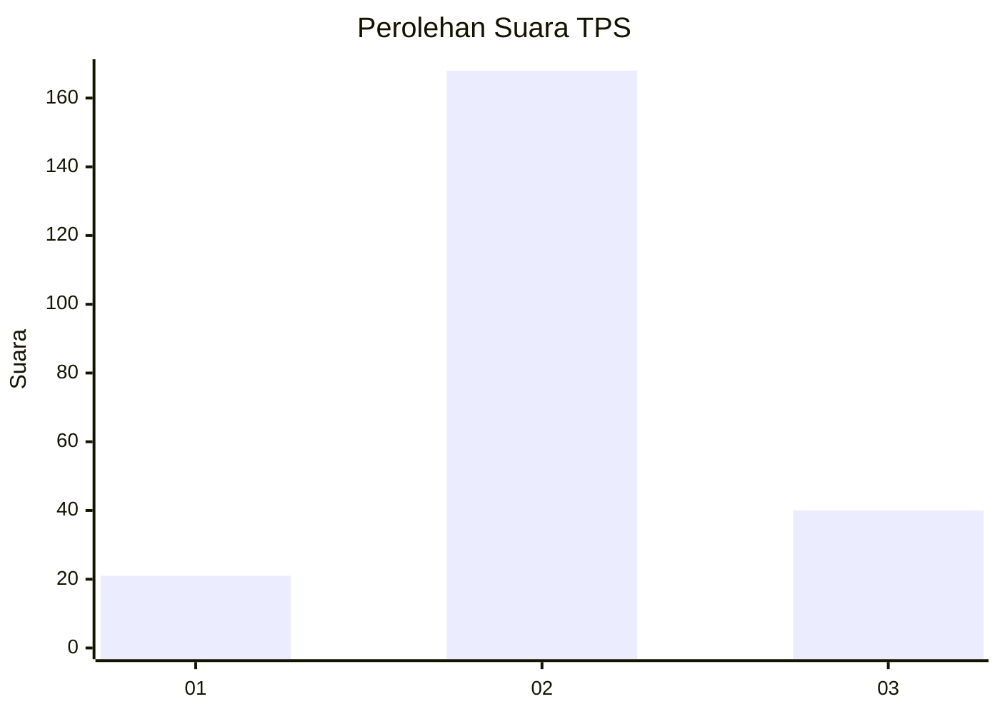
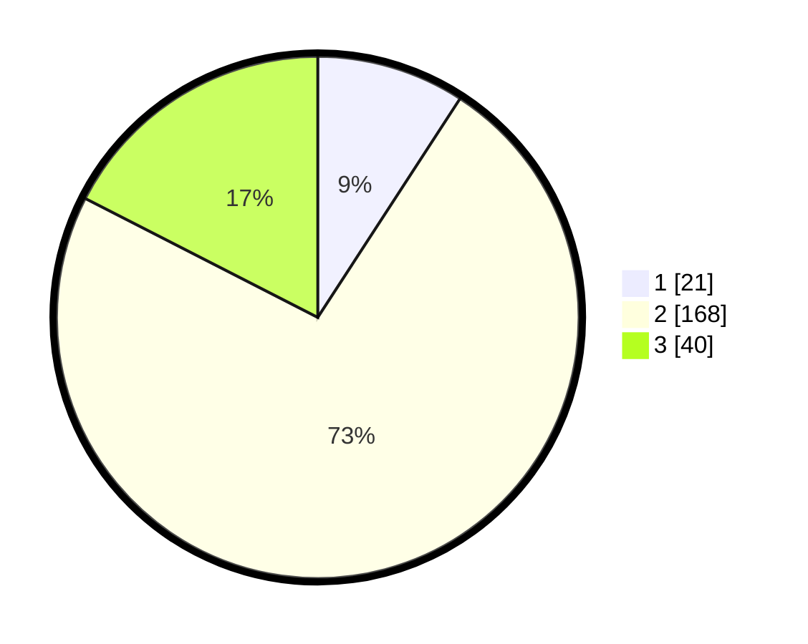

# Hasil

## Grafik

## Tabel

| No. | Nama Paslon    | Suara | Suara (raw) | Persentase |
|:--- |:-------------- | -----:| -----------:| ----------:|
| 1   | ANIES MUHAIMIN | 21    | [21][p-1]   | 9,17       |
| 2   | PRABOWO GIBRAN | 168   | [168][p-2]  | 73,36      |
| 3   | GANJAR MAHFUD  | 40    | [40][p-3]   | 17,47      |

[p-1]: https://github.com/gigit-pemilu/pemilu-2024/blob/main/pilpres/hitung-suara/sub/35-jawa-timur/sub/05-blitar/sub/11-garum/sub/1004-garum/sub/011-tps/sub/paslon-1.txt
[p-2]: https://github.com/gigit-pemilu/pemilu-2024/blob/main/pilpres/hitung-suara/sub/35-jawa-timur/sub/05-blitar/sub/11-garum/sub/1004-garum/sub/011-tps/sub/paslon-2.txt
[p-3]: https://github.com/gigit-pemilu/pemilu-2024/blob/main/pilpres/hitung-suara/sub/35-jawa-timur/sub/05-blitar/sub/11-garum/sub/1004-garum/sub/011-tps/sub/paslon-3.txt

## Foto C Plano

https://sirekap-obj-formc.kpu.go.id/39c3/pemilu/ppwp/35/05/11/10/04/3505111004011-20240215-022043--d32e6dce-fdbe-4407-ae7e-01e51283aaaf.jpg

https://sirekap-obj-formc.kpu.go.id/39c3/pemilu/ppwp/35/05/11/10/04/3505111004011-20240215-022129--7c36002a-ed44-484c-a44e-9f9838516204.jpg

https://sirekap-obj-formc.kpu.go.id/39c3/pemilu/ppwp/35/05/11/10/04/3505111004011-20240215-022225--758d1651-2cb5-4cb1-9a83-07c62ec86fb8.jpg

## Metadata

| Key        | Value               |
| ---------- | ------------------- |
| Time Stamp | 2024-02-15 12:00:28 |

