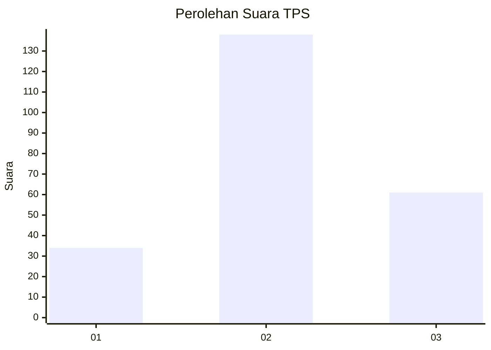
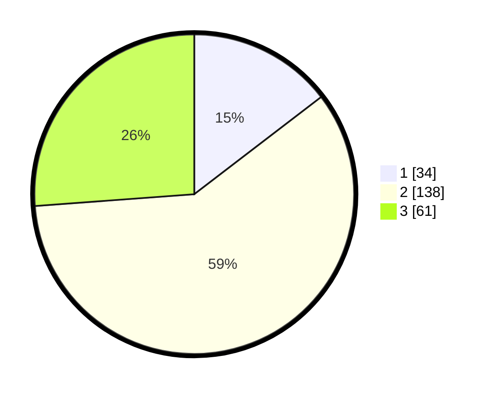

# Hasil

## Grafik

## Tabel

| No. | Nama Paslon    | Suara | Suara (raw) | Persentase |
|:--- |:-------------- | -----:| -----------:| ----------:|
| 1   | ANIES MUHAIMIN | 34    | [34][p-1]   | 14,59      |
| 2   | PRABOWO GIBRAN | 138   | [138][p-2]  | 59,23      |
| 3   | GANJAR MAHFUD  | 61    | [61][p-3]   | 26,18      |

[p-1]: https://github.com/gigit-pemilu/pemilu-2024/blob/main/pilpres/hitung-suara/sub/35-jawa-timur/sub/05-blitar/sub/11-garum/sub/1004-garum/sub/014-tps/sub/paslon-1.txt
[p-2]: https://github.com/gigit-pemilu/pemilu-2024/blob/main/pilpres/hitung-suara/sub/35-jawa-timur/sub/05-blitar/sub/11-garum/sub/1004-garum/sub/014-tps/sub/paslon-2.txt
[p-3]: https://github.com/gigit-pemilu/pemilu-2024/blob/main/pilpres/hitung-suara/sub/35-jawa-timur/sub/05-blitar/sub/11-garum/sub/1004-garum/sub/014-tps/sub/paslon-3.txt

## Foto C Plano

https://sirekap-obj-formc.kpu.go.id/cb78/pemilu/ppwp/35/05/11/10/04/3505111004014-20240219-041531--f1b7f9eb-7b97-41ba-91d4-c79922babc89.jpg

https://sirekap-obj-formc.kpu.go.id/cb78/pemilu/ppwp/35/05/11/10/04/3505111004014-20240219-041608--26ad49e3-dfb3-4de8-b6b6-a2aea5beb1c9.jpg

https://sirekap-obj-formc.kpu.go.id/cb78/pemilu/ppwp/35/05/11/10/04/3505111004014-20240219-041705--6e9d27ab-7c0b-452f-8d10-de5a2e8736b1.jpg

## Metadata

| Key        | Value               |
| ---------- | ------------------- |
| Time Stamp | 2024-02-25 17:00:00 |

