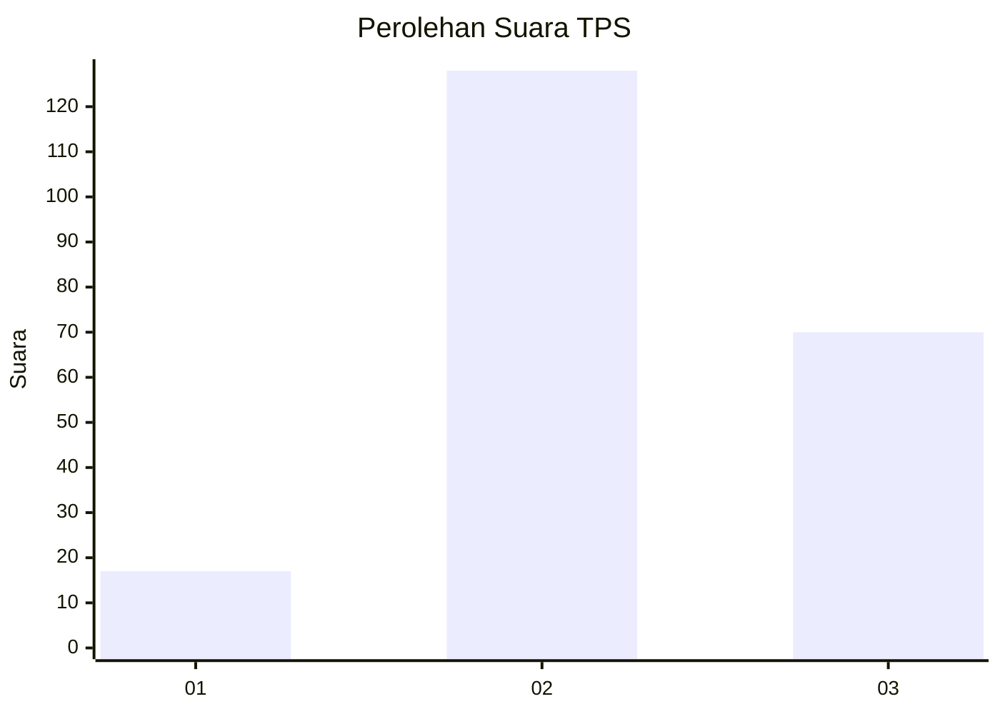
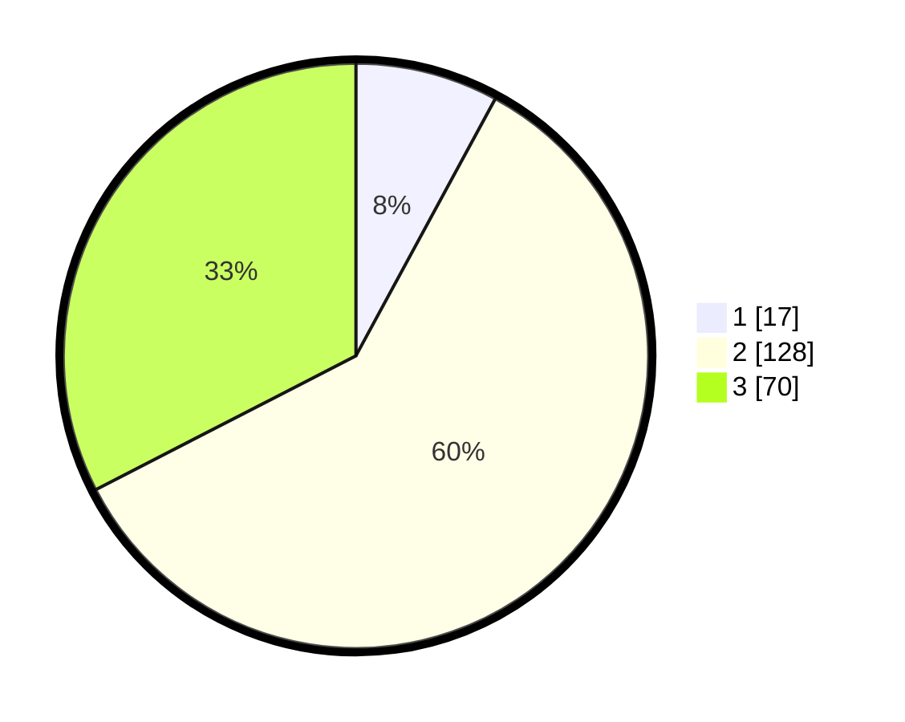

# Hasil

## Grafik

## Tabel

| No. | Nama Paslon    | Suara | Suara (raw) | Persentase |
|:--- |:-------------- | -----:| -----------:| ----------:|
| 1   | ANIES MUHAIMIN | 17    | [17][p-1]   | 7,91       |
| 2   | PRABOWO GIBRAN | 128   | [128][p-2]  | 59,53      |
| 3   | GANJAR MAHFUD  | 70    | [70][p-3]   | 32,56      |

[p-1]: https://github.com/gigit-pemilu/pemilu-2024/blob/main/pilpres/hitung-suara/sub/35-jawa-timur/sub/05-blitar/sub/11-garum/sub/1006-bence/sub/006-tps/sub/paslon-1.txt
[p-2]: https://github.com/gigit-pemilu/pemilu-2024/blob/main/pilpres/hitung-suara/sub/35-jawa-timur/sub/05-blitar/sub/11-garum/sub/1006-bence/sub/006-tps/sub/paslon-2.txt
[p-3]: https://github.com/gigit-pemilu/pemilu-2024/blob/main/pilpres/hitung-suara/sub/35-jawa-timur/sub/05-blitar/sub/11-garum/sub/1006-bence/sub/006-tps/sub/paslon-3.txt

## Foto C Plano

https://sirekap-obj-formc.kpu.go.id/259a/pemilu/ppwp/35/05/11/10/06/3505111006006-20240222-115415--e0c5c1f4-f7a9-416c-a592-76e88a2d60a1.jpg

https://sirekap-obj-formc.kpu.go.id/259a/pemilu/ppwp/35/05/11/10/06/3505111006006-20240222-115427--0ac778db-0c47-43f9-9239-c8accbd28392.jpg

https://sirekap-obj-formc.kpu.go.id/259a/pemilu/ppwp/35/05/11/10/06/3505111006006-20240222-115438--679d821e-8e7f-464e-a7bd-7cafbd61798f.jpg

## Metadata

| Key        | Value               |
| ---------- | ------------------- |
| Time Stamp | 2024-02-24 22:31:28 |

