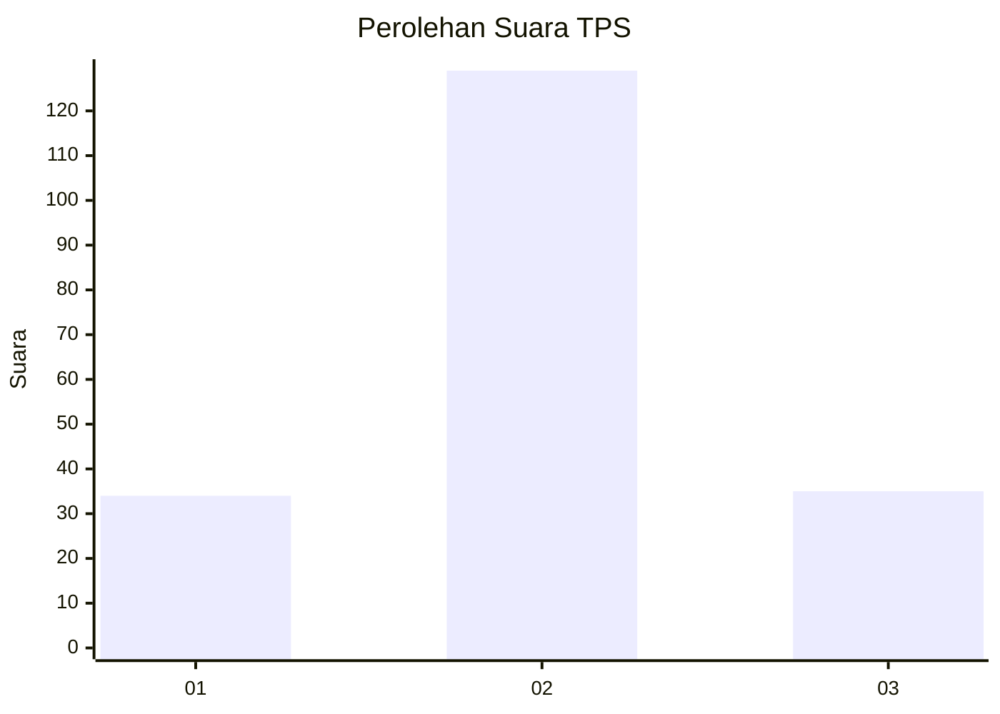
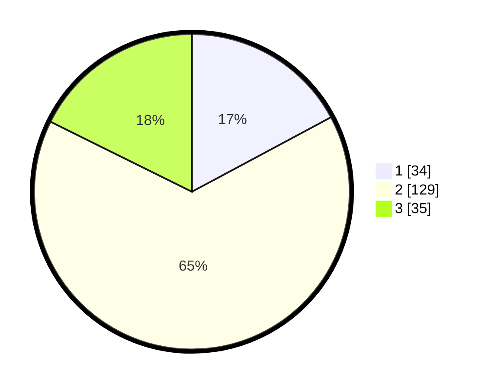

# Hasil

## Grafik

## Tabel

| No. | Nama Paslon    | Suara | Suara (raw) | Persentase |
|:--- |:-------------- | -----:| -----------:| ----------:|
| 1   | ANIES MUHAIMIN | 34    | [34][p-1]   | 17,17      |
| 2   | PRABOWO GIBRAN | 129   | [129][p-2]  | 65,15      |
| 3   | GANJAR MAHFUD  | 35    | [35][p-3]   | 17,68      |

[p-1]: https://github.com/gigit-pemilu/pemilu-2024-35-jawa-timur/blob/main/pilpres/hitung-suara/sub/35-jawa-timur/sub/05-blitar/sub/11-garum/sub/2001-pojok/sub/008-tps/sub/paslon-1.txt
[p-2]: https://github.com/gigit-pemilu/pemilu-2024-35-jawa-timur/blob/main/pilpres/hitung-suara/sub/35-jawa-timur/sub/05-blitar/sub/11-garum/sub/2001-pojok/sub/008-tps/sub/paslon-2.txt
[p-3]: https://github.com/gigit-pemilu/pemilu-2024-35-jawa-timur/blob/main/pilpres/hitung-suara/sub/35-jawa-timur/sub/05-blitar/sub/11-garum/sub/2001-pojok/sub/008-tps/sub/paslon-3.txt

## Foto C Plano

https://sirekap-obj-formc.kpu.go.id/63e7/pemilu/ppwp/35/05/11/20/01/3505112001008-20240217-103549--178b2b8d-deb7-40e2-9de0-bffe471206ba.jpg

https://sirekap-obj-formc.kpu.go.id/63e7/pemilu/ppwp/35/05/11/20/01/3505112001008-20240214-205024--4c0f9c34-bb69-4a46-aaf9-944dce710a9a.jpg

https://sirekap-obj-formc.kpu.go.id/63e7/pemilu/ppwp/35/05/11/20/01/3505112001008-20240214-205121--37d619ab-c1ab-4bf1-b30c-79d24edb9b1a.jpg

## Metadata

| Key        | Value               |
| ---------- | ------------------- |
| Time Stamp | 2024-02-17 11:00:02 |

