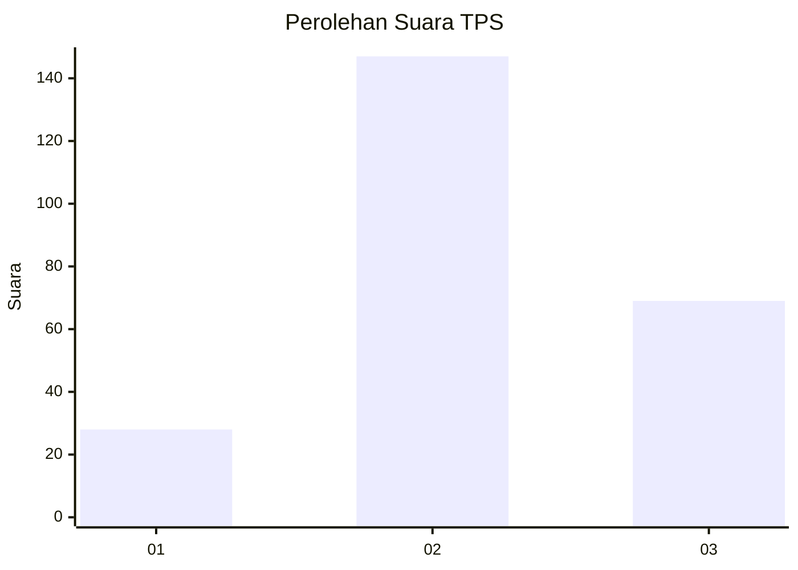
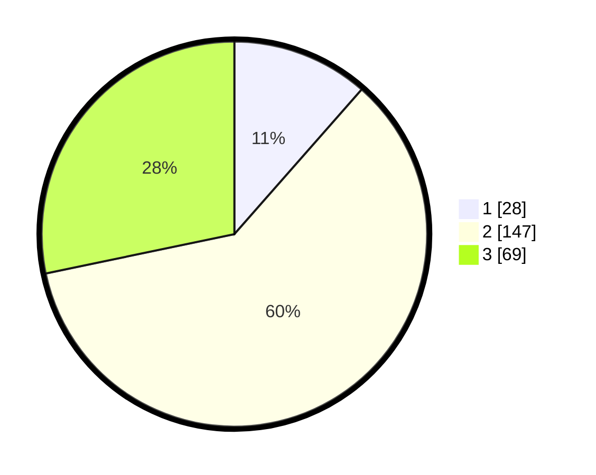

# Hasil

## Grafik

## Tabel

| No. | Nama Paslon    | Suara | Suara (raw) | Persentase |
|:--- |:-------------- | -----:| -----------:| ----------:|
| 1   | ANIES MUHAIMIN | 28    | [28][p-1]   | 11,48      |
| 2   | PRABOWO GIBRAN | 147   | [147][p-2]  | 60,25      |
| 3   | GANJAR MAHFUD  | 69    | [69][p-3]   | 28,28      |

[p-1]: https://github.com/gigit-pemilu/pemilu-2024-35-jawa-timur/blob/main/pilpres/hitung-suara/sub/35-jawa-timur/sub/05-blitar/sub/11-garum/sub/2001-pojok/sub/017-tps/sub/paslon-1.txt
[p-2]: https://github.com/gigit-pemilu/pemilu-2024-35-jawa-timur/blob/main/pilpres/hitung-suara/sub/35-jawa-timur/sub/05-blitar/sub/11-garum/sub/2001-pojok/sub/017-tps/sub/paslon-2.txt
[p-3]: https://github.com/gigit-pemilu/pemilu-2024-35-jawa-timur/blob/main/pilpres/hitung-suara/sub/35-jawa-timur/sub/05-blitar/sub/11-garum/sub/2001-pojok/sub/017-tps/sub/paslon-3.txt

## Foto C Plano

https://sirekap-obj-formc.kpu.go.id/08a4/pemilu/ppwp/35/05/11/20/01/3505112001017-20240216-140409--15121d76-740f-46a8-85c0-a016e45a4056.jpg

https://sirekap-obj-formc.kpu.go.id/08a4/pemilu/ppwp/35/05/11/20/01/3505112001017-20240216-131345--8c7fa7fd-44ed-4d83-a4e7-5ace2b5277df.jpg

https://sirekap-obj-formc.kpu.go.id/08a4/pemilu/ppwp/35/05/11/20/01/3505112001017-20240216-204911--42f361b8-33b5-4b12-9c28-59beec3f930f.jpg

## Metadata

| Key        | Value               |
| ---------- | ------------------- |
| Time Stamp | 2024-02-17 13:37:34 |

