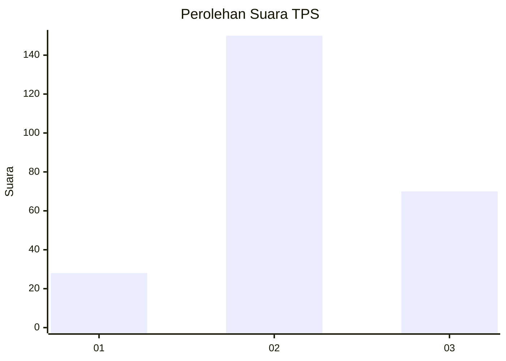
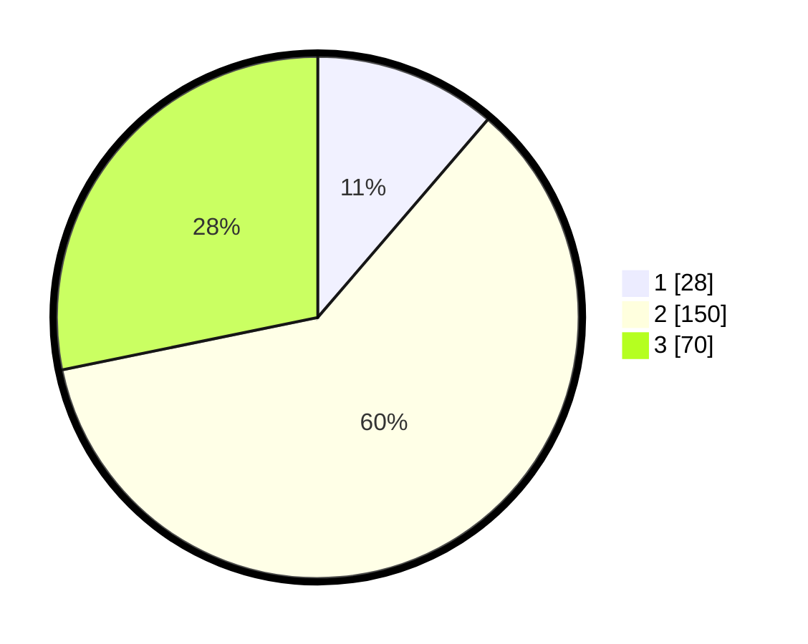

# Hasil

## Grafik

## Tabel

| No. | Nama Paslon    | Suara | Suara (raw) | Persentase |
|:--- |:-------------- | -----:| -----------:| ----------:|
| 1   | ANIES MUHAIMIN | 28    | [28][p-1]   | 11,29      |
| 2   | PRABOWO GIBRAN | 150   | [150][p-2]  | 60,48      |
| 3   | GANJAR MAHFUD  | 70    | [70][p-3]   | 28,23      |

[p-1]: https://github.com/gigit-pemilu/pemilu-2024/blob/main/pilpres/hitung-suara/sub/35-jawa-timur/sub/05-blitar/sub/11-garum/sub/2001-pojok/sub/020-tps/sub/paslon-1.txt
[p-2]: https://github.com/gigit-pemilu/pemilu-2024/blob/main/pilpres/hitung-suara/sub/35-jawa-timur/sub/05-blitar/sub/11-garum/sub/2001-pojok/sub/020-tps/sub/paslon-2.txt
[p-3]: https://github.com/gigit-pemilu/pemilu-2024/blob/main/pilpres/hitung-suara/sub/35-jawa-timur/sub/05-blitar/sub/11-garum/sub/2001-pojok/sub/020-tps/sub/paslon-3.txt

## Foto C Plano

https://sirekap-obj-formc.kpu.go.id/6743/pemilu/ppwp/35/05/11/20/01/3505112001020-20240214-205042--efe4719f-4294-4da0-a38d-4d700edca604.jpg

https://sirekap-obj-formc.kpu.go.id/6743/pemilu/ppwp/35/05/11/20/01/3505112001020-20240214-205135--31cabd5b-aa0f-4680-b575-30b947fb2e2f.jpg

https://sirekap-obj-formc.kpu.go.id/6743/pemilu/ppwp/35/05/11/20/01/3505112001020-20240214-205250--b549dee1-e19b-45a9-bf33-004e67a97de6.jpg

## Metadata

| Key        | Value               |
| ---------- | ------------------- |
| Time Stamp | 2024-02-15 12:00:28 |

