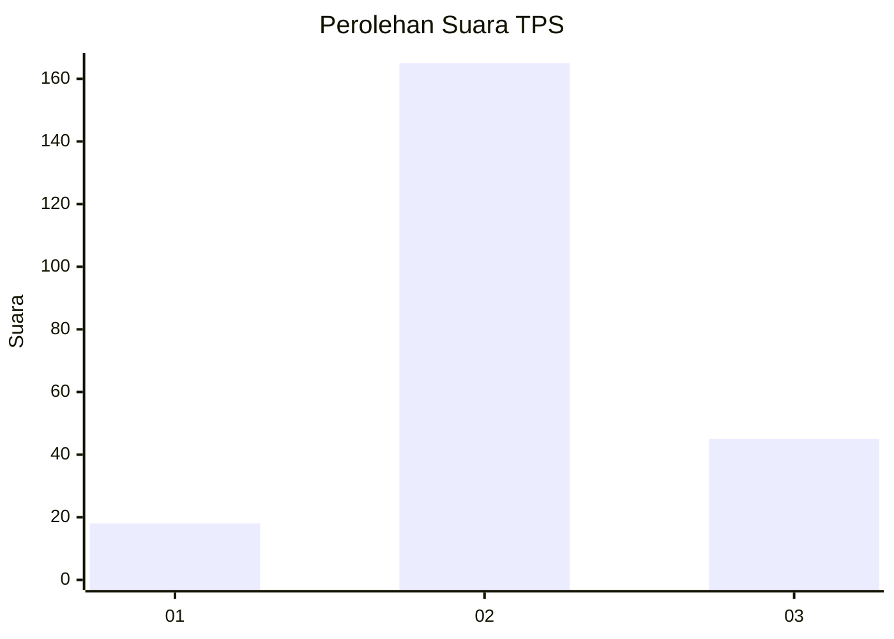
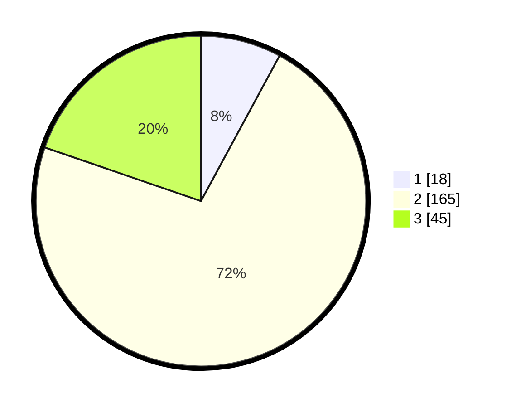

# Hasil

## Grafik

## Tabel

| No. | Nama Paslon    | Suara | Suara (raw) | Persentase |
|:--- |:-------------- | -----:| -----------:| ----------:|
| 1   | ANIES MUHAIMIN | 18    | [18][p-1]   | 7,89       |
| 2   | PRABOWO GIBRAN | 165   | [165][p-2]  | 72,37      |
| 3   | GANJAR MAHFUD  | 45    | [45][p-3]   | 19,74      |

[p-1]: https://github.com/gigit-pemilu/pemilu-2024/blob/main/pilpres/hitung-suara/sub/35-jawa-timur/sub/05-blitar/sub/11-garum/sub/2007-slorok/sub/005-tps/sub/paslon-1.txt
[p-2]: https://github.com/gigit-pemilu/pemilu-2024/blob/main/pilpres/hitung-suara/sub/35-jawa-timur/sub/05-blitar/sub/11-garum/sub/2007-slorok/sub/005-tps/sub/paslon-2.txt
[p-3]: https://github.com/gigit-pemilu/pemilu-2024/blob/main/pilpres/hitung-suara/sub/35-jawa-timur/sub/05-blitar/sub/11-garum/sub/2007-slorok/sub/005-tps/sub/paslon-3.txt

## Foto C Plano

https://sirekap-obj-formc.kpu.go.id/2bd8/pemilu/ppwp/35/05/11/20/07/3505112007005-20240214-195340--5e813689-4e6d-48eb-9bcd-c57d1c231e02.jpg

https://sirekap-obj-formc.kpu.go.id/2bd8/pemilu/ppwp/35/05/11/20/07/3505112007005-20240214-191953--3b90d599-9fec-4eb2-9fd6-4d682d6fb699.jpg

https://sirekap-obj-formc.kpu.go.id/2bd8/pemilu/ppwp/35/05/11/20/07/3505112007005-20240214-192237--a61f02e1-459a-4f0c-b41e-22bcce161e6a.jpg

## Metadata

| Key        | Value               |
| ---------- | ------------------- |
| Time Stamp | 2024-02-15 12:00:28 |

