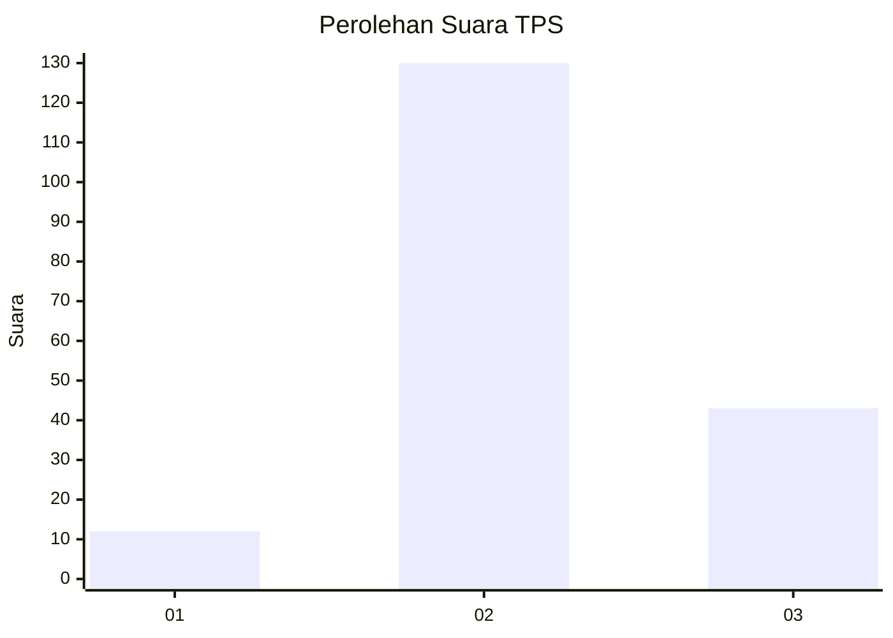
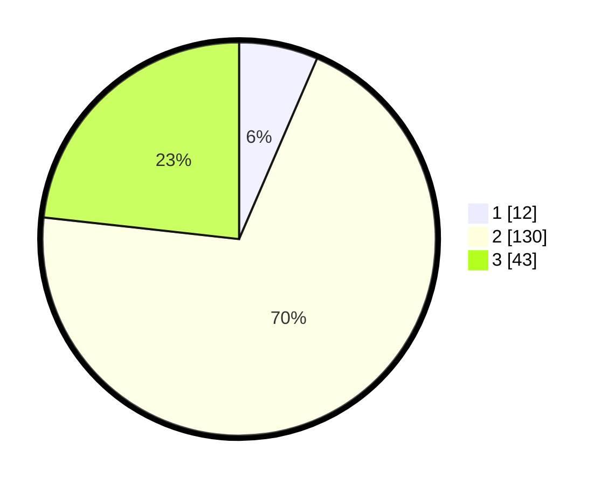

# Hasil

## Grafik

## Tabel

| No. | Nama Paslon    | Suara | Suara (raw) | Persentase |
|:--- |:-------------- | -----:| -----------:| ----------:|
| 1   | ANIES MUHAIMIN | 12    | [12][p-1]   | 6,49       |
| 2   | PRABOWO GIBRAN | 130   | [130][p-2]  | 70,27      |
| 3   | GANJAR MAHFUD  | 43    | [43][p-3]   | 23,24      |

[p-1]: https://github.com/gigit-pemilu/pemilu-2024-35-jawa-timur/blob/main/pilpres/hitung-suara/sub/35-jawa-timur/sub/05-blitar/sub/11-garum/sub/2008-sidodadi/sub/016-tps/sub/paslon-1.txt
[p-2]: https://github.com/gigit-pemilu/pemilu-2024-35-jawa-timur/blob/main/pilpres/hitung-suara/sub/35-jawa-timur/sub/05-blitar/sub/11-garum/sub/2008-sidodadi/sub/016-tps/sub/paslon-2.txt
[p-3]: https://github.com/gigit-pemilu/pemilu-2024-35-jawa-timur/blob/main/pilpres/hitung-suara/sub/35-jawa-timur/sub/05-blitar/sub/11-garum/sub/2008-sidodadi/sub/016-tps/sub/paslon-3.txt

## Foto C Plano

https://sirekap-obj-formc.kpu.go.id/04a9/pemilu/ppwp/35/05/11/20/08/3505112008016-20240215-011053--0515a007-b6a2-40a7-99c4-6b0a8e32d7b2.jpg

https://sirekap-obj-formc.kpu.go.id/04a9/pemilu/ppwp/35/05/11/20/08/3505112008016-20240215-011127--bcdf0044-04f6-4a67-8864-afa9f4cd6734.jpg

https://sirekap-obj-formc.kpu.go.id/04a9/pemilu/ppwp/35/05/11/20/08/3505112008016-20240215-011139--9425b2b1-b66e-4f07-8ec0-2fca57ead4f9.jpg

## Metadata

| Key        | Value               |
| ---------- | ------------------- |
| Time Stamp | 2024-02-15 12:00:28 |

