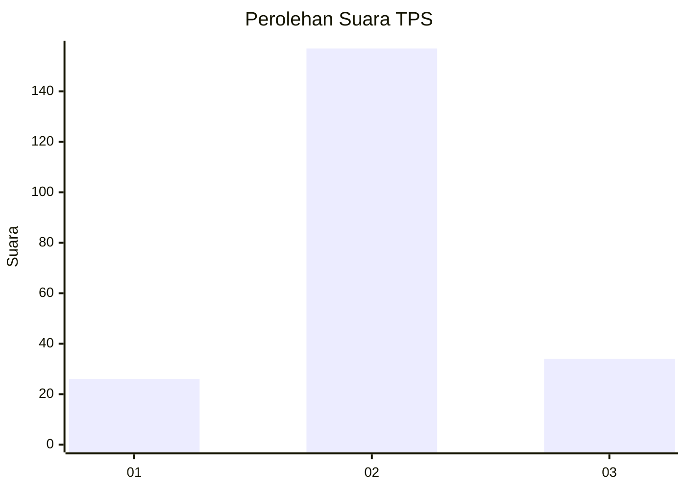
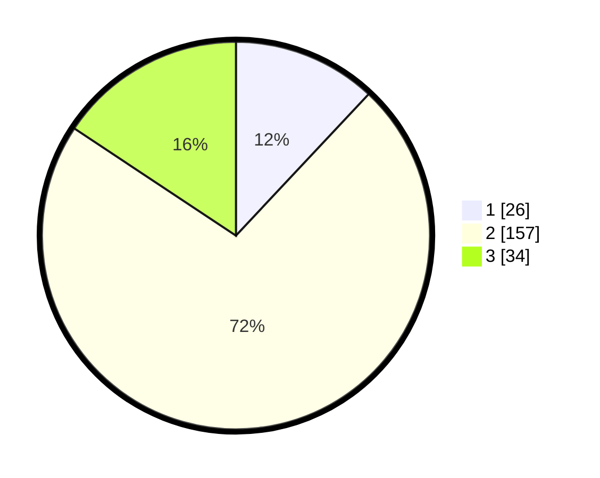

# Hasil

## Grafik

## Tabel

| No. | Nama Paslon    | Suara | Suara (raw) | Persentase |
|:--- |:-------------- | -----:| -----------:| ----------:|
| 1   | ANIES MUHAIMIN | 26    | [26][p-1]   | 11,98      |
| 2   | PRABOWO GIBRAN | 157   | [157][p-2]  | 72,35      |
| 3   | GANJAR MAHFUD  | 34    | [34][p-3]   | 15,67      |

[p-1]: https://github.com/gigit-pemilu/pemilu-2024-35-jawa-timur/blob/main/pilpres/hitung-suara/sub/35-jawa-timur/sub/05-blitar/sub/11-garum/sub/2008-sidodadi/sub/023-tps/sub/paslon-1.txt
[p-2]: https://github.com/gigit-pemilu/pemilu-2024-35-jawa-timur/blob/main/pilpres/hitung-suara/sub/35-jawa-timur/sub/05-blitar/sub/11-garum/sub/2008-sidodadi/sub/023-tps/sub/paslon-2.txt
[p-3]: https://github.com/gigit-pemilu/pemilu-2024-35-jawa-timur/blob/main/pilpres/hitung-suara/sub/35-jawa-timur/sub/05-blitar/sub/11-garum/sub/2008-sidodadi/sub/023-tps/sub/paslon-3.txt

## Foto C Plano

https://sirekap-obj-formc.kpu.go.id/5aac/pemilu/ppwp/35/05/11/20/08/3505112008023-20240215-202433--f89cb116-90c8-40ae-b103-882aac8b7340.jpg

https://sirekap-obj-formc.kpu.go.id/5aac/pemilu/ppwp/35/05/11/20/08/3505112008023-20240215-203014--623f1f62-f0a7-497e-aa6c-de24a77c1da0.jpg

https://sirekap-obj-formc.kpu.go.id/5aac/pemilu/ppwp/35/05/11/20/08/3505112008023-20240215-203304--f7d6a3f8-ae57-4fc4-bee9-13aa7c3f8df9.jpg

## Metadata

| Key        | Value               |
| ---------- | ------------------- |
| Time Stamp | 2024-02-19 06:16:00 |

