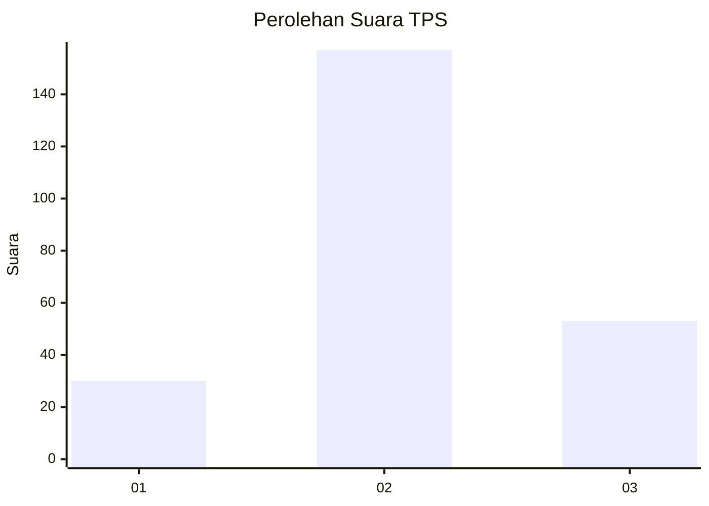
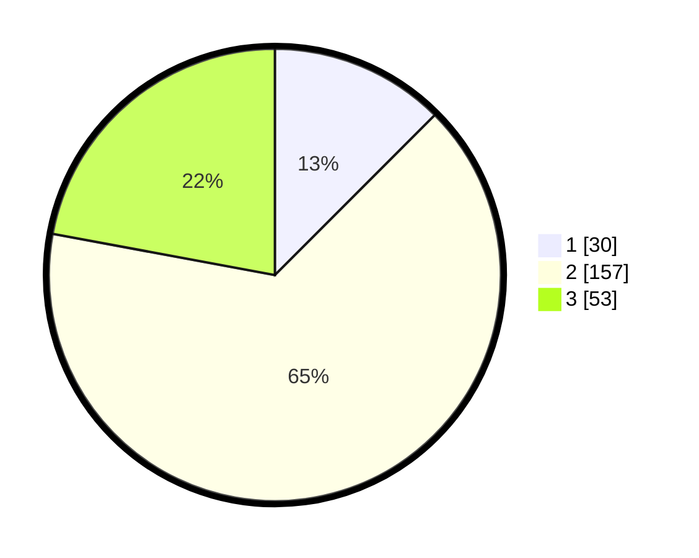

# Hasil

## Grafik

## Tabel

| No. | Nama Paslon    | Suara | Suara (raw) | Persentase |
|:--- |:-------------- | -----:| -----------:| ----------:|
| 1   | ANIES MUHAIMIN | 30    | [30][p-1]   | 12,50      |
| 2   | PRABOWO GIBRAN | 157   | [157][p-2]  | 65,42      |
| 3   | GANJAR MAHFUD  | 53    | [53][p-3]   | 22,08      |

[p-1]: https://github.com/gigit-pemilu/pemilu-2024/blob/main/pilpres/hitung-suara/sub/35-jawa-timur/sub/05-blitar/sub/11-garum/sub/2008-sidodadi/sub/024-tps/sub/paslon-1.txt
[p-2]: https://github.com/gigit-pemilu/pemilu-2024/blob/main/pilpres/hitung-suara/sub/35-jawa-timur/sub/05-blitar/sub/11-garum/sub/2008-sidodadi/sub/024-tps/sub/paslon-2.txt
[p-3]: https://github.com/gigit-pemilu/pemilu-2024/blob/main/pilpres/hitung-suara/sub/35-jawa-timur/sub/05-blitar/sub/11-garum/sub/2008-sidodadi/sub/024-tps/sub/paslon-3.txt

## Foto C Plano

https://sirekap-obj-formc.kpu.go.id/3a17/pemilu/ppwp/35/05/11/20/08/3505112008024-20240215-102042--38504e0a-b805-44c7-87d9-d091d71b17ab.jpg

https://sirekap-obj-formc.kpu.go.id/3a17/pemilu/ppwp/35/05/11/20/08/3505112008024-20240215-102050--4f1c3e70-6dba-40ba-b18a-a0786b64f66f.jpg

https://sirekap-obj-formc.kpu.go.id/3a17/pemilu/ppwp/35/05/11/20/08/3505112008024-20240215-102058--4f32375f-a0f7-442b-84bf-7d7e3b0f456b.jpg

## Metadata

| Key        | Value               |
| ---------- | ------------------- |
| Time Stamp | 2024-02-16 12:51:22 |

