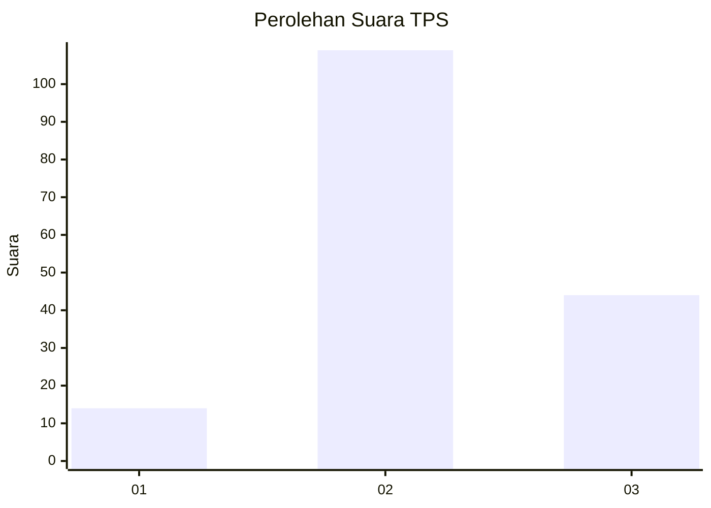
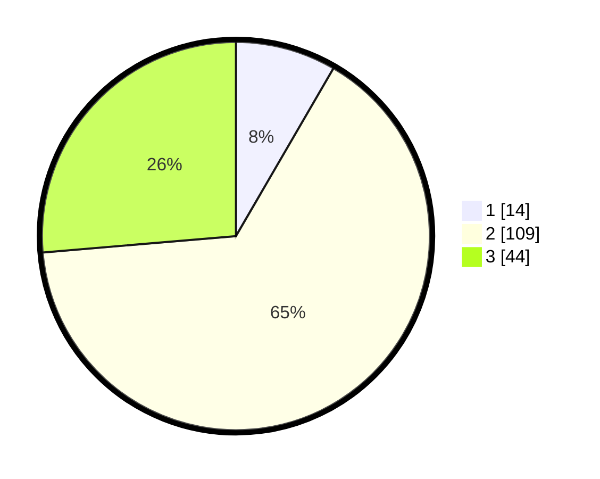

# Hasil

## Grafik

## Tabel

| No. | Nama Paslon    | Suara | Suara (raw) | Persentase |
|:--- |:-------------- | -----:| -----------:| ----------:|
| 1   | ANIES MUHAIMIN | 14    | [14][p-1]   | 8,38       |
| 2   | PRABOWO GIBRAN | 109   | [109][p-2]  | 65,27      |
| 3   | GANJAR MAHFUD  | 44    | [44][p-3]   | 26,35      |

[p-1]: https://github.com/gigit-pemilu/pemilu-2024-35-jawa-timur/blob/main/pilpres/hitung-suara/sub/35-jawa-timur/sub/05-blitar/sub/11-garum/sub/2008-sidodadi/sub/032-tps/sub/paslon-1.txt
[p-2]: https://github.com/gigit-pemilu/pemilu-2024-35-jawa-timur/blob/main/pilpres/hitung-suara/sub/35-jawa-timur/sub/05-blitar/sub/11-garum/sub/2008-sidodadi/sub/032-tps/sub/paslon-2.txt
[p-3]: https://github.com/gigit-pemilu/pemilu-2024-35-jawa-timur/blob/main/pilpres/hitung-suara/sub/35-jawa-timur/sub/05-blitar/sub/11-garum/sub/2008-sidodadi/sub/032-tps/sub/paslon-3.txt

## Foto C Plano

https://sirekap-obj-formc.kpu.go.id/dd33/pemilu/ppwp/35/05/11/20/08/3505112008032-20240215-131921--131a0dce-edf6-479d-9da8-52430c1e67b7.jpg

https://sirekap-obj-formc.kpu.go.id/dd33/pemilu/ppwp/35/05/11/20/08/3505112008032-20240215-132020--d37cb221-c0ba-47ba-bcb4-50ad774c23ea.jpg

https://sirekap-obj-formc.kpu.go.id/dd33/pemilu/ppwp/35/05/11/20/08/3505112008032-20240215-132104--f5d16588-3539-4be0-a779-b1f8a34484e6.jpg

## Metadata

| Key        | Value               |
| ---------- | ------------------- |
| Time Stamp | 2024-02-16 12:51:22 |

