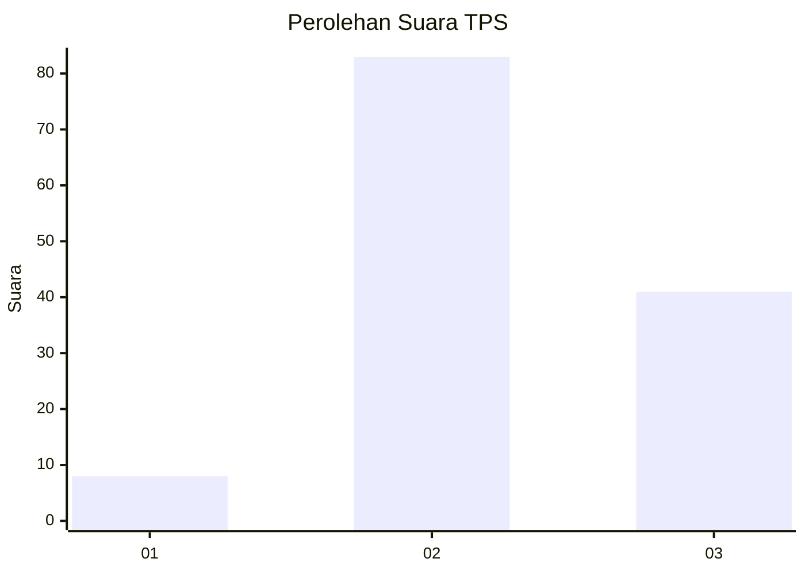
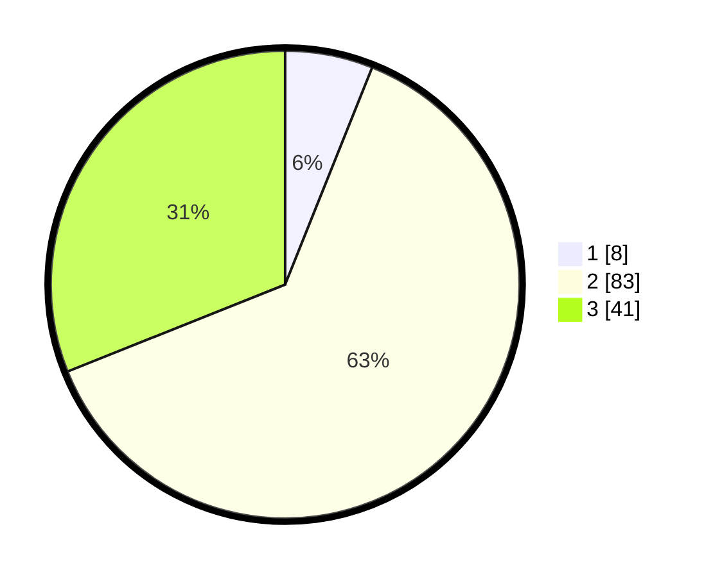

# Hasil

## Grafik

## Tabel

| No. | Nama Paslon    | Suara | Suara (raw) | Persentase |
|:--- |:-------------- | -----:| -----------:| ----------:|
| 1   | ANIES MUHAIMIN | 8     | [8][p-1]    | 6,06       |
| 2   | PRABOWO GIBRAN | 83    | [83][p-2]   | 62,88      |
| 3   | GANJAR MAHFUD  | 41    | [41][p-3]   | 31,06      |

[p-1]: https://github.com/gigit-pemilu/pemilu-2024-35-jawa-timur/blob/main/pilpres/hitung-suara/sub/35-jawa-timur/sub/05-blitar/sub/11-garum/sub/2008-sidodadi/sub/034-tps/sub/paslon-1.txt
[p-2]: https://github.com/gigit-pemilu/pemilu-2024-35-jawa-timur/blob/main/pilpres/hitung-suara/sub/35-jawa-timur/sub/05-blitar/sub/11-garum/sub/2008-sidodadi/sub/034-tps/sub/paslon-2.txt
[p-3]: https://github.com/gigit-pemilu/pemilu-2024-35-jawa-timur/blob/main/pilpres/hitung-suara/sub/35-jawa-timur/sub/05-blitar/sub/11-garum/sub/2008-sidodadi/sub/034-tps/sub/paslon-3.txt

## Foto C Plano

https://sirekap-obj-formc.kpu.go.id/de8e/pemilu/ppwp/35/05/11/20/08/3505112008034-20240214-155522--46d563a5-32b2-413a-a5ab-775c1dbc8c2d.jpg

https://sirekap-obj-formc.kpu.go.id/de8e/pemilu/ppwp/35/05/11/20/08/3505112008034-20240214-160105--8221e354-44b0-487e-a518-c10171a5bb49.jpg

https://sirekap-obj-formc.kpu.go.id/de8e/pemilu/ppwp/35/05/11/20/08/3505112008034-20240214-160105--b6b10830-2690-4ea7-960c-af41472a25b9.jpg

## Metadata

| Key        | Value               |
| ---------- | ------------------- |
| Time Stamp | 2024-02-14 21:46:01 |

