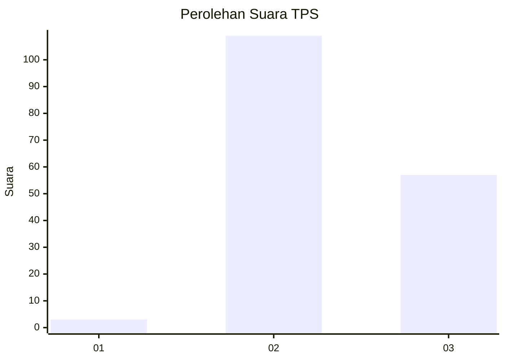
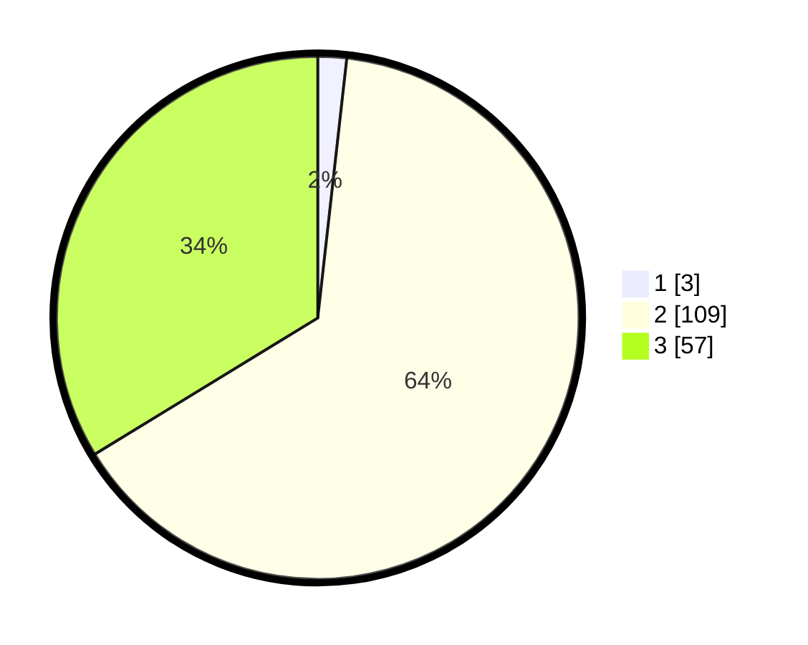

# Hasil

## Grafik

## Tabel

| No. | Nama Paslon    | Suara | Suara (raw) | Persentase |
|:--- |:-------------- | -----:| -----------:| ----------:|
| 1   | ANIES MUHAIMIN | 3     | [3][p-1]    | 1,78       |
| 2   | PRABOWO GIBRAN | 109   | [109][p-2]  | 64,50      |
| 3   | GANJAR MAHFUD  | 57    | [57][p-3]   | 33,73      |

[p-1]: https://github.com/gigit-pemilu/pemilu-2024/blob/main/pilpres/hitung-suara/sub/35-jawa-timur/sub/05-blitar/sub/11-garum/sub/2009-karangrejo/sub/013-tps/sub/paslon-1.txt
[p-2]: https://github.com/gigit-pemilu/pemilu-2024/blob/main/pilpres/hitung-suara/sub/35-jawa-timur/sub/05-blitar/sub/11-garum/sub/2009-karangrejo/sub/013-tps/sub/paslon-2.txt
[p-3]: https://github.com/gigit-pemilu/pemilu-2024/blob/main/pilpres/hitung-suara/sub/35-jawa-timur/sub/05-blitar/sub/11-garum/sub/2009-karangrejo/sub/013-tps/sub/paslon-3.txt

## Foto C Plano

https://sirekap-obj-formc.kpu.go.id/7238/pemilu/ppwp/35/05/11/20/09/3505112009013-20240215-053007--54f999f8-317c-4996-9795-96d4247ca69d.jpg

https://sirekap-obj-formc.kpu.go.id/7238/pemilu/ppwp/35/05/11/20/09/3505112009013-20240215-053055--502bae56-d72e-475c-ab40-7af1ff1838eb.jpg

https://sirekap-obj-formc.kpu.go.id/7238/pemilu/ppwp/35/05/11/20/09/3505112009013-20240215-053142--259eb744-4e57-499d-ac2f-11b72add23ae.jpg

## Metadata

| Key        | Value               |
| ---------- | ------------------- |
| Time Stamp | 2024-02-15 15:00:29 |

