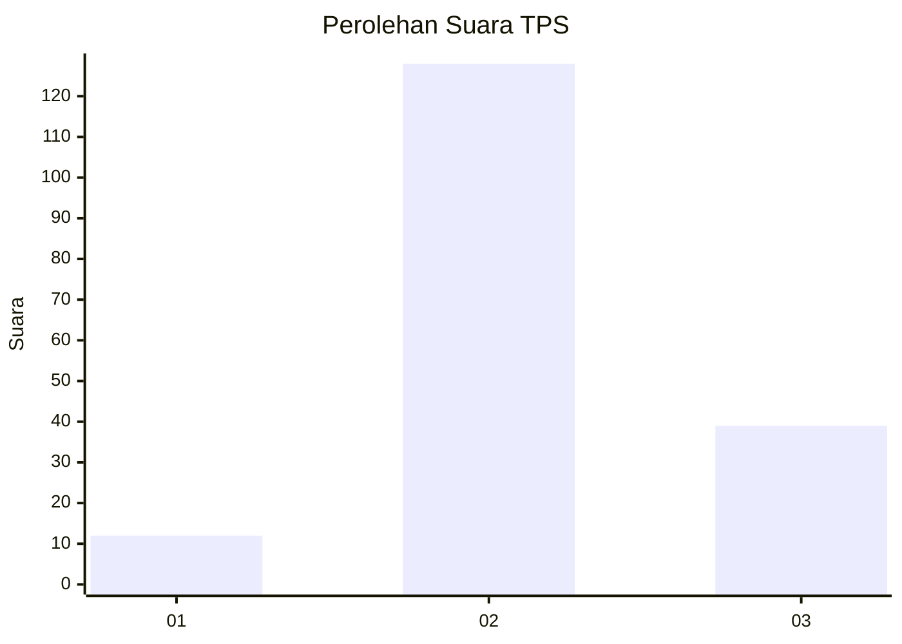

# Hasil

## Grafik

## Tabel

| No. | Nama Paslon    | Suara | Suara (raw) | Persentase |
|:--- |:-------------- | -----:| -----------:| ----------:|
| 1   | ANIES MUHAIMIN | 12    | [12][p-1]   | 6,70       |
| 2   | PRABOWO GIBRAN | 128   | [128][p-2]  | 71,51      |
| 3   | GANJAR MAHFUD  | 39    | [39][p-3]   | 21,79      |

[p-1]: https://github.com/gigit-pemilu/pemilu-2024/blob/main/pilpres/hitung-suara/sub/35-jawa-timur/sub/05-blitar/sub/11-garum/sub/2009-karangrejo/sub/018-tps/sub/paslon-1.txt
[p-2]: https://github.com/gigit-pemilu/pemilu-2024/blob/main/pilpres/hitung-suara/sub/35-jawa-timur/sub/05-blitar/sub/11-garum/sub/2009-karangrejo/sub/018-tps/sub/paslon-2.txt
[p-3]: https://github.com/gigit-pemilu/pemilu-2024/blob/main/pilpres/hitung-suara/sub/35-jawa-timur/sub/05-blitar/sub/11-garum/sub/2009-karangrejo/sub/018-tps/sub/paslon-3.txt

## Foto C Plano

https://sirekap-obj-formc.kpu.go.id/04c4/pemilu/ppwp/35/05/11/20/09/3505112009018-20240214-212801--c612d0f0-7679-4f25-a178-5a66ebe99348.jpg

https://sirekap-obj-formc.kpu.go.id/04c4/pemilu/ppwp/35/05/11/20/09/3505112009018-20240214-212932--1ae9065e-d623-4036-ade0-d97a149c0ae3.jpg

https://sirekap-obj-formc.kpu.go.id/04c4/pemilu/ppwp/35/05/11/20/09/3505112009018-20240214-213056--738eb4dd-adff-44de-85e4-044d47156f8f.jpg

## Metadata

| Key        | Value               |
| ---------- | ------------------- |
| Time Stamp | 2024-02-15 12:00:28 |

