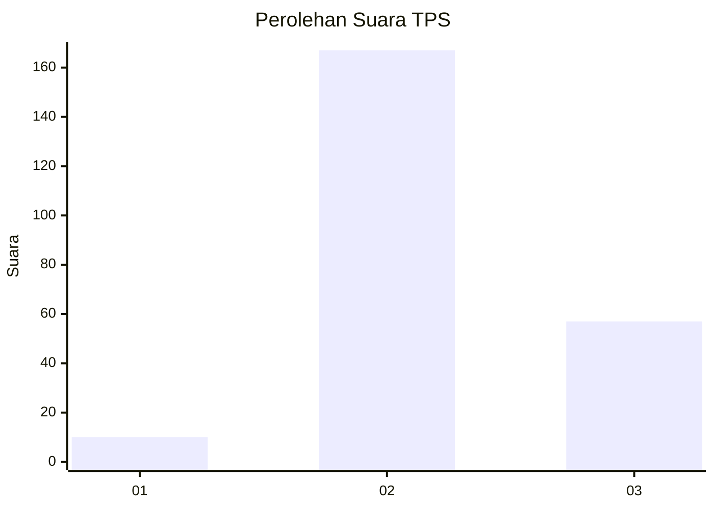
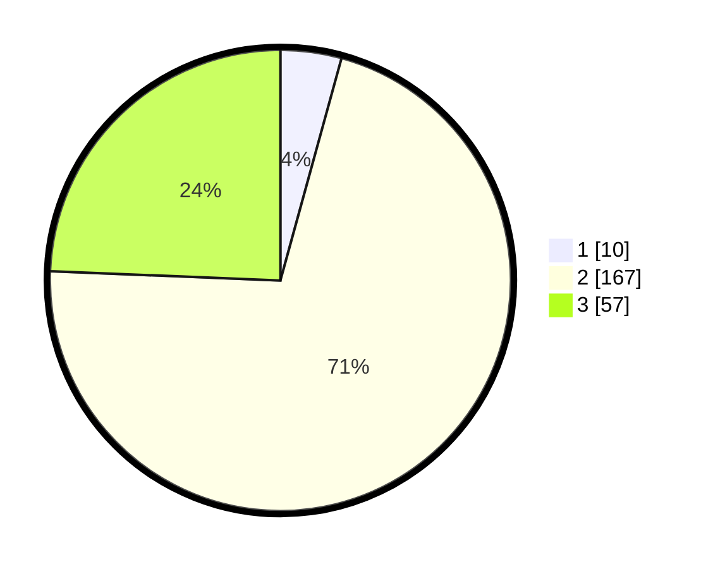

# Hasil

## Grafik

## Tabel

| No. | Nama Paslon    | Suara | Suara (raw) | Persentase |
|:--- |:-------------- | -----:| -----------:| ----------:|
| 1   | ANIES MUHAIMIN | 10    | [10][p-1]   | 4,27       |
| 2   | PRABOWO GIBRAN | 167   | [167][p-2]  | 71,37      |
| 3   | GANJAR MAHFUD  | 57    | [57][p-3]   | 24,36      |

[p-1]: https://github.com/gigit-pemilu/pemilu-2024/blob/main/pilpres/hitung-suara/sub/35-jawa-timur/sub/05-blitar/sub/11-garum/sub/2009-karangrejo/sub/021-tps/sub/paslon-1.txt
[p-2]: https://github.com/gigit-pemilu/pemilu-2024/blob/main/pilpres/hitung-suara/sub/35-jawa-timur/sub/05-blitar/sub/11-garum/sub/2009-karangrejo/sub/021-tps/sub/paslon-2.txt
[p-3]: https://github.com/gigit-pemilu/pemilu-2024/blob/main/pilpres/hitung-suara/sub/35-jawa-timur/sub/05-blitar/sub/11-garum/sub/2009-karangrejo/sub/021-tps/sub/paslon-3.txt

## Foto C Plano

https://sirekap-obj-formc.kpu.go.id/aaad/pemilu/ppwp/35/05/11/20/09/3505112009021-20240217-115044--6f53679e-e70d-4eca-b34f-dddd299a65d4.jpg

https://sirekap-obj-formc.kpu.go.id/aaad/pemilu/ppwp/35/05/11/20/09/3505112009021-20240214-225440--616b096a-a3c7-49fa-b4f7-2c9417faabd5.jpg

https://sirekap-obj-formc.kpu.go.id/aaad/pemilu/ppwp/35/05/11/20/09/3505112009021-20240214-225724--ea474aa8-6ab7-4599-9931-88a982de7fe0.jpg

## Metadata

| Key        | Value               |
| ---------- | ------------------- |
| Time Stamp | 2024-02-17 12:00:00 |

