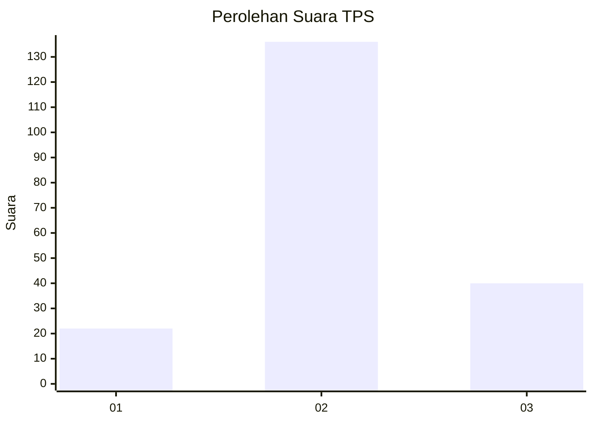
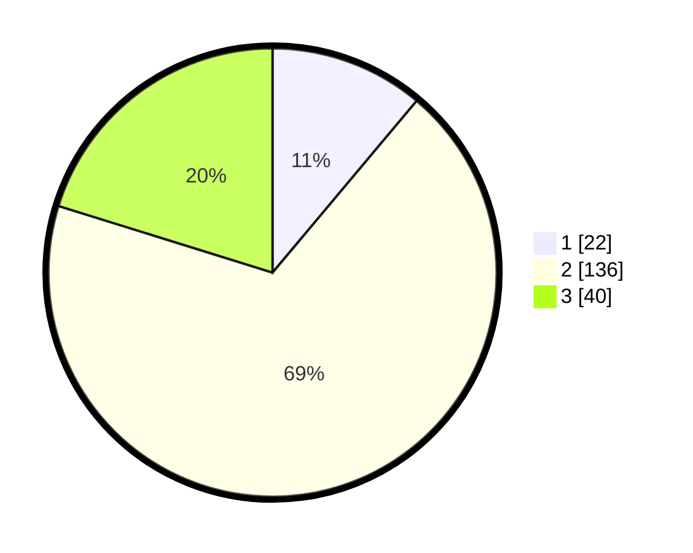

# Hasil

## Grafik

## Tabel

| No. | Nama Paslon    | Suara | Suara (raw) | Persentase |
|:--- |:-------------- | -----:| -----------:| ----------:|
| 1   | ANIES MUHAIMIN | 22    | [22][p-1]   | 11,11      |
| 2   | PRABOWO GIBRAN | 136   | [136][p-2]  | 68,69      |
| 3   | GANJAR MAHFUD  | 40    | [40][p-3]   | 20,20      |

[p-1]: https://github.com/gigit-pemilu/pemilu-2024/blob/main/pilpres/hitung-suara/sub/35-jawa-timur/sub/05-blitar/sub/11-garum/sub/2009-karangrejo/sub/022-tps/sub/paslon-1.txt
[p-2]: https://github.com/gigit-pemilu/pemilu-2024/blob/main/pilpres/hitung-suara/sub/35-jawa-timur/sub/05-blitar/sub/11-garum/sub/2009-karangrejo/sub/022-tps/sub/paslon-2.txt
[p-3]: https://github.com/gigit-pemilu/pemilu-2024/blob/main/pilpres/hitung-suara/sub/35-jawa-timur/sub/05-blitar/sub/11-garum/sub/2009-karangrejo/sub/022-tps/sub/paslon-3.txt

## Foto C Plano

https://sirekap-obj-formc.kpu.go.id/8d66/pemilu/ppwp/35/05/11/20/09/3505112009022-20240215-031454--29162da1-adab-4070-bcb4-c34982a27732.jpg

https://sirekap-obj-formc.kpu.go.id/8d66/pemilu/ppwp/35/05/11/20/09/3505112009022-20240215-031114--8d86def0-c7ff-4dc8-868d-5a50d3197a40.jpg

https://sirekap-obj-formc.kpu.go.id/8d66/pemilu/ppwp/35/05/11/20/09/3505112009022-20240215-055813--641a12e4-6205-494f-b167-fd0080e5ee7c.jpg

## Metadata

| Key        | Value               |
| ---------- | ------------------- |
| Time Stamp | 2024-02-15 12:00:28 |

