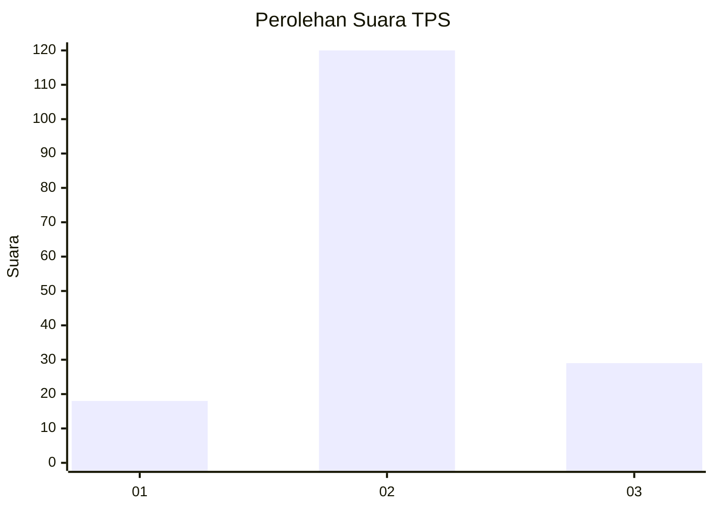
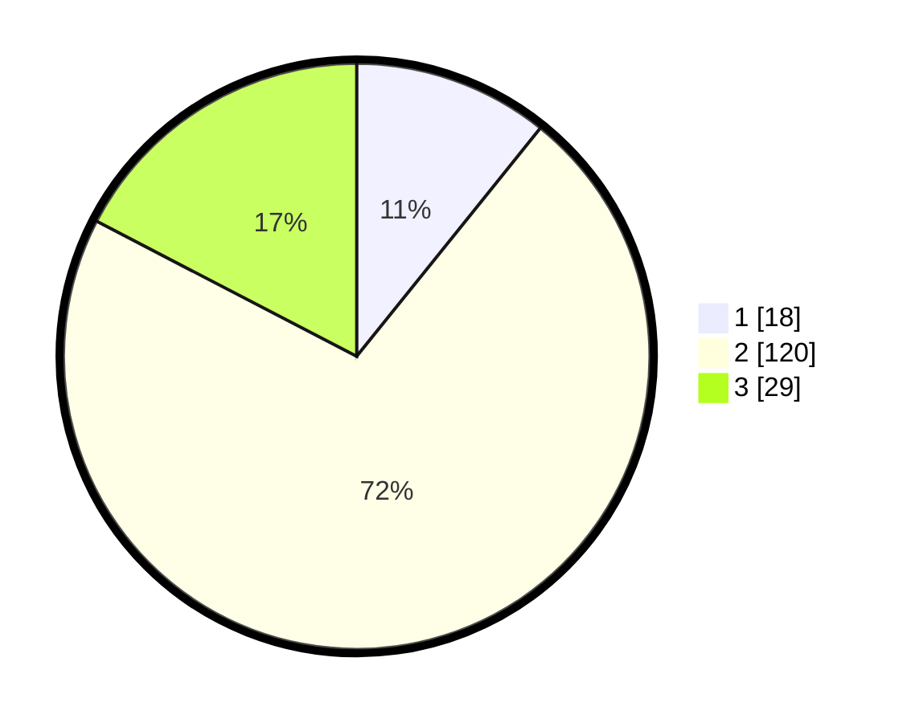

# Hasil

## Grafik

## Tabel

| No. | Nama Paslon    | Suara | Suara (raw) | Persentase |
|:--- |:-------------- | -----:| -----------:| ----------:|
| 1   | ANIES MUHAIMIN | 18    | [18][p-1]   | 10,78      |
| 2   | PRABOWO GIBRAN | 120   | [120][p-2]  | 71,86      |
| 3   | GANJAR MAHFUD  | 29    | [29][p-3]   | 17,37      |

[p-1]: https://github.com/gigit-pemilu/pemilu-2024-35-jawa-timur/blob/main/pilpres/hitung-suara/sub/35-jawa-timur/sub/05-blitar/sub/11-garum/sub/2009-karangrejo/sub/023-tps/sub/paslon-1.txt
[p-2]: https://github.com/gigit-pemilu/pemilu-2024-35-jawa-timur/blob/main/pilpres/hitung-suara/sub/35-jawa-timur/sub/05-blitar/sub/11-garum/sub/2009-karangrejo/sub/023-tps/sub/paslon-2.txt
[p-3]: https://github.com/gigit-pemilu/pemilu-2024-35-jawa-timur/blob/main/pilpres/hitung-suara/sub/35-jawa-timur/sub/05-blitar/sub/11-garum/sub/2009-karangrejo/sub/023-tps/sub/paslon-3.txt

## Foto C Plano

https://sirekap-obj-formc.kpu.go.id/be74/pemilu/ppwp/35/05/11/20/09/3505112009023-20240215-205740--6fe66103-d438-4599-9d95-95ccdbc405aa.jpg

https://sirekap-obj-formc.kpu.go.id/be74/pemilu/ppwp/35/05/11/20/09/3505112009023-20240215-205819--df450af0-37e1-4f4e-a2ad-6478d9a90c05.jpg

https://sirekap-obj-formc.kpu.go.id/be74/pemilu/ppwp/35/05/11/20/09/3505112009023-20240214-225843--67a2368e-f28d-4694-b6fd-1b0229b05f6b.jpg

## Metadata

| Key        | Value               |
| ---------- | ------------------- |
| Time Stamp | 2024-02-22 18:00:00 |

