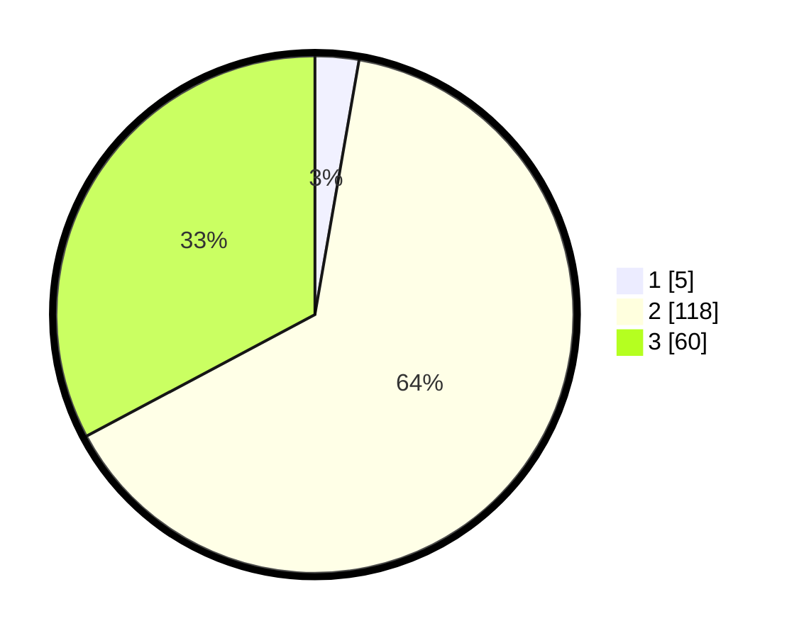

# Hasil

## Grafik

## Tabel

| No. | Nama Paslon    | Suara | Suara (raw) | Persentase |
|:--- |:-------------- | -----:| -----------:| ----------:|
| 1   | ANIES MUHAIMIN | 5     | [5][p-1]    | 2,73       |
| 2   | PRABOWO GIBRAN | 118   | [118][p-2]  | 64,48      |
| 3   | GANJAR MAHFUD  | 60    | [60][p-3]   | 32,79      |

[p-1]: https://github.com/gigit-pemilu/pemilu-2024/blob/main/pilpres/hitung-suara/sub/35-jawa-timur/sub/05-blitar/sub/11-garum/sub/2009-karangrejo/sub/026-tps/sub/paslon-1.txt
[p-2]: https://github.com/gigit-pemilu/pemilu-2024/blob/main/pilpres/hitung-suara/sub/35-jawa-timur/sub/05-blitar/sub/11-garum/sub/2009-karangrejo/sub/026-tps/sub/paslon-2.txt
[p-3]: https://github.com/gigit-pemilu/pemilu-2024/blob/main/pilpres/hitung-suara/sub/35-jawa-timur/sub/05-blitar/sub/11-garum/sub/2009-karangrejo/sub/026-tps/sub/paslon-3.txt

## Foto C Plano

https://sirekap-obj-formc.kpu.go.id/e73a/pemilu/ppwp/35/05/11/20/09/3505112009026-20240214-231738--5e836580-ebac-472c-96c3-1a8384d004a8.jpg

https://sirekap-obj-formc.kpu.go.id/e73a/pemilu/ppwp/35/05/11/20/09/3505112009026-20240214-231855--831aa37e-058a-42be-b37d-aec27af66bf0.jpg

https://sirekap-obj-formc.kpu.go.id/e73a/pemilu/ppwp/35/05/11/20/09/3505112009026-20240214-231939--17c6d2fe-4100-4373-9ce6-01dede06a996.jpg

## Metadata

| Key        | Value               |
| ---------- | ------------------- |
| Time Stamp | 2024-02-15 12:00:28 |

