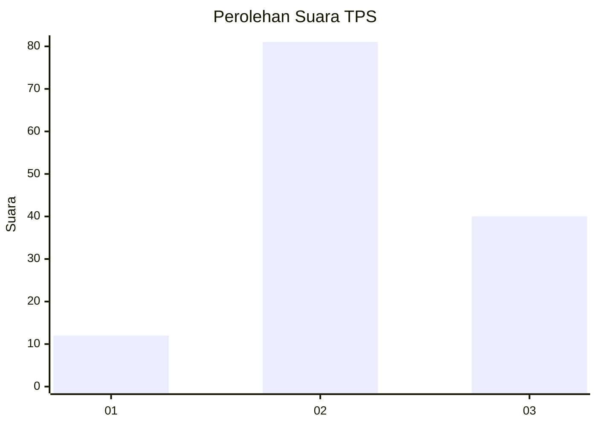
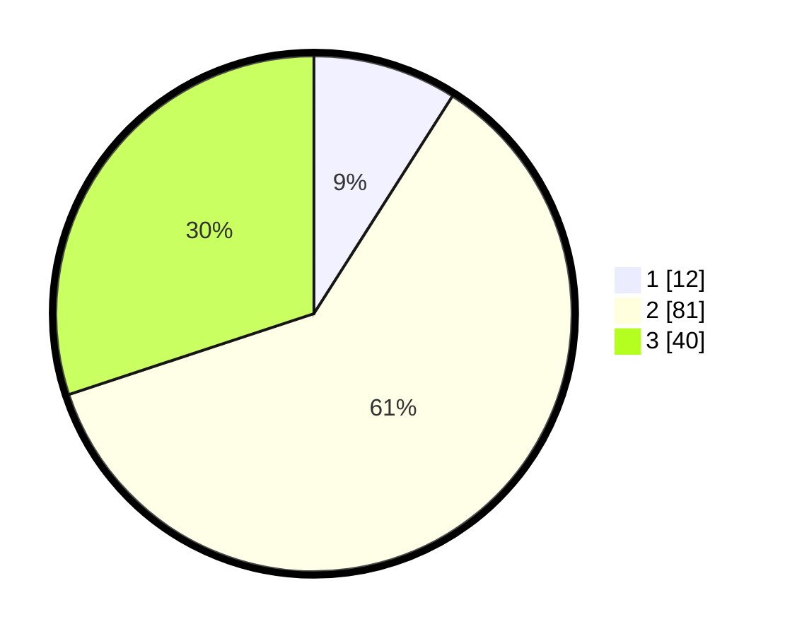

# Hasil

## Grafik

## Tabel

| No. | Nama Paslon    | Suara | Suara (raw) | Persentase |
|:--- |:-------------- | -----:| -----------:| ----------:|
| 1   | ANIES MUHAIMIN | 12    | [12][p-1]   | 9,02       |
| 2   | PRABOWO GIBRAN | 81    | [81][p-2]   | 60,90      |
| 3   | GANJAR MAHFUD  | 40    | [40][p-3]   | 30,08      |

[p-1]: https://github.com/gigit-pemilu/pemilu-2024/blob/main/pilpres/hitung-suara/sub/35-jawa-timur/sub/05-blitar/sub/11-garum/sub/2009-karangrejo/sub/027-tps/sub/paslon-1.txt
[p-2]: https://github.com/gigit-pemilu/pemilu-2024/blob/main/pilpres/hitung-suara/sub/35-jawa-timur/sub/05-blitar/sub/11-garum/sub/2009-karangrejo/sub/027-tps/sub/paslon-2.txt
[p-3]: https://github.com/gigit-pemilu/pemilu-2024/blob/main/pilpres/hitung-suara/sub/35-jawa-timur/sub/05-blitar/sub/11-garum/sub/2009-karangrejo/sub/027-tps/sub/paslon-3.txt

## Foto C Plano

https://sirekap-obj-formc.kpu.go.id/1a7e/pemilu/ppwp/35/05/11/20/09/3505112009027-20240214-220353--e7f18345-39ed-48ea-898c-ec88ad8bc31d.jpg

https://sirekap-obj-formc.kpu.go.id/1a7e/pemilu/ppwp/35/05/11/20/09/3505112009027-20240214-220804--55fc3e99-2221-4a21-8f6f-42f16953deb3.jpg

https://sirekap-obj-formc.kpu.go.id/1a7e/pemilu/ppwp/35/05/11/20/09/3505112009027-20240214-220631--219deef2-f777-4cb2-a1b4-4d3a4bf4e5b8.jpg

## Metadata

| Key        | Value               |
| ---------- | ------------------- |
| Time Stamp | 2024-02-15 12:00:28 |

