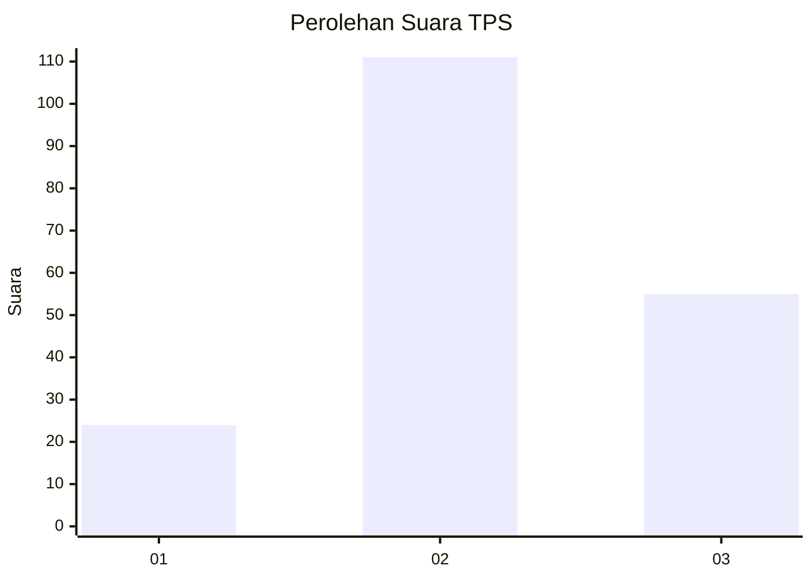
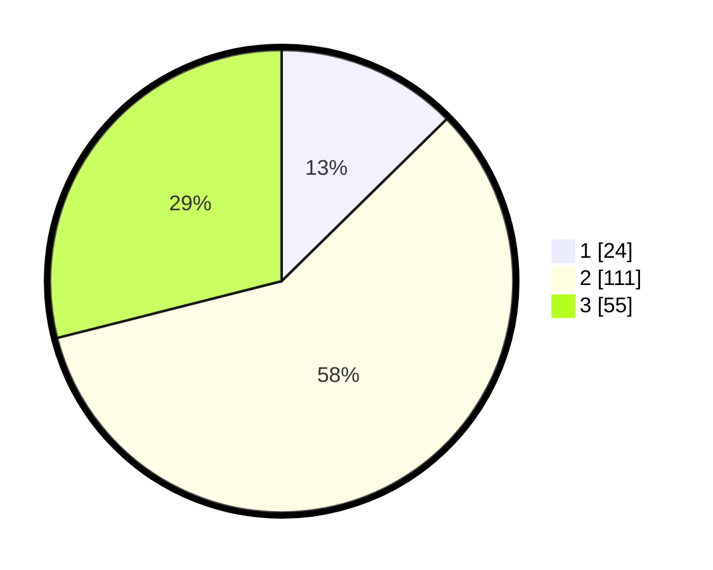

# Hasil

## Grafik

## Tabel

| No. | Nama Paslon    | Suara | Suara (raw) | Persentase |
|:--- |:-------------- | -----:| -----------:| ----------:|
| 1   | ANIES MUHAIMIN | 24    | [24][p-1]   | 12,63      |
| 2   | PRABOWO GIBRAN | 111   | [111][p-2]  | 58,42      |
| 3   | GANJAR MAHFUD  | 55    | [55][p-3]   | 28,95      |

[p-1]: https://github.com/gigit-pemilu/pemilu-2024/blob/main/pilpres/hitung-suara/sub/35-jawa-timur/sub/05-blitar/sub/11-garum/sub/2009-karangrejo/sub/029-tps/sub/paslon-1.txt
[p-2]: https://github.com/gigit-pemilu/pemilu-2024/blob/main/pilpres/hitung-suara/sub/35-jawa-timur/sub/05-blitar/sub/11-garum/sub/2009-karangrejo/sub/029-tps/sub/paslon-2.txt
[p-3]: https://github.com/gigit-pemilu/pemilu-2024/blob/main/pilpres/hitung-suara/sub/35-jawa-timur/sub/05-blitar/sub/11-garum/sub/2009-karangrejo/sub/029-tps/sub/paslon-3.txt

## Foto C Plano

https://sirekap-obj-formc.kpu.go.id/4cee/pemilu/ppwp/35/05/11/20/09/3505112009029-20240217-115100--8a83de18-c16e-4040-83e6-8fe7dac70044.jpg

https://sirekap-obj-formc.kpu.go.id/4cee/pemilu/ppwp/35/05/11/20/09/3505112009029-20240214-203836--1d4136ec-cdbb-4e94-95e9-c00ff0cbca19.jpg

https://sirekap-obj-formc.kpu.go.id/4cee/pemilu/ppwp/35/05/11/20/09/3505112009029-20240214-203943--79b8948f-132b-46c8-bec8-5f23bdffb7b3.jpg

## Metadata

| Key        | Value               |
| ---------- | ------------------- |
| Time Stamp | 2024-02-17 12:00:00 |

