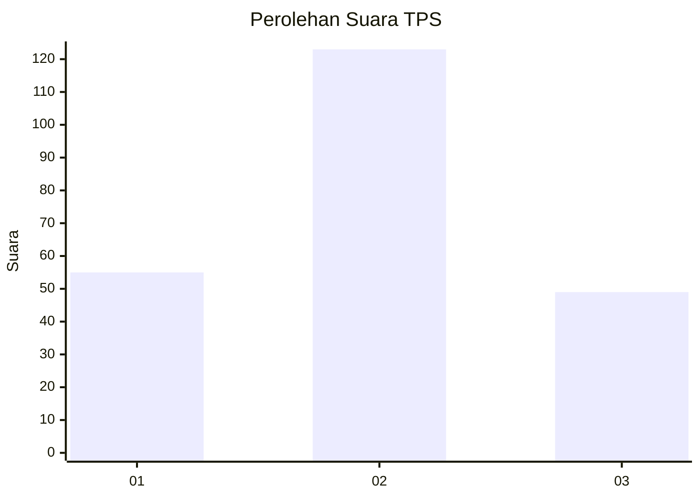
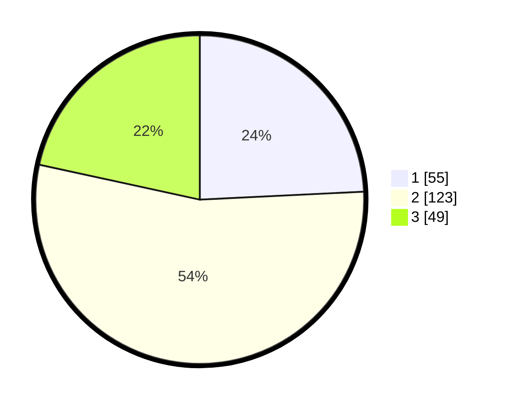

# Hasil

## Grafik

## Tabel

| No. | Nama Paslon    | Suara | Suara (raw) | Persentase |
|:--- |:-------------- | -----:| -----------:| ----------:|
| 1   | ANIES MUHAIMIN | 55    | [55][p-1]   | 24,23      |
| 2   | PRABOWO GIBRAN | 123   | [123][p-2]  | 54,19      |
| 3   | GANJAR MAHFUD  | 49    | [49][p-3]   | 21,59      |

[p-1]: https://github.com/gigit-pemilu/pemilu-2024/blob/main/pilpres/hitung-suara/sub/35-jawa-timur/sub/05-blitar/sub/12-sutojayan/sub/1002-kedungbunder/sub/001-tps/sub/paslon-1.txt
[p-2]: https://github.com/gigit-pemilu/pemilu-2024/blob/main/pilpres/hitung-suara/sub/35-jawa-timur/sub/05-blitar/sub/12-sutojayan/sub/1002-kedungbunder/sub/001-tps/sub/paslon-2.txt
[p-3]: https://github.com/gigit-pemilu/pemilu-2024/blob/main/pilpres/hitung-suara/sub/35-jawa-timur/sub/05-blitar/sub/12-sutojayan/sub/1002-kedungbunder/sub/001-tps/sub/paslon-3.txt

## Foto C Plano

https://sirekap-obj-formc.kpu.go.id/dac1/pemilu/ppwp/35/05/12/10/02/3505121002001-20240214-192448--dec4283c-1a0b-43e9-9755-3e0c3e1030b4.jpg

https://sirekap-obj-formc.kpu.go.id/dac1/pemilu/ppwp/35/05/12/10/02/3505121002001-20240214-192541--ed0706c8-95e8-4a5d-a0a1-a2d6b7caf3d4.jpg

https://sirekap-obj-formc.kpu.go.id/dac1/pemilu/ppwp/35/05/12/10/02/3505121002001-20240216-135402--f340e415-5d84-4e4d-9e2f-8efe89429640.jpg

## Metadata

| Key        | Value               |
| ---------- | ------------------- |
| Time Stamp | 2024-02-16 14:00:34 |

## DATA PEMILIH TETAP

Jumlah pemilih dalam DPT: **263**.
 * L: **124**.
 * P: **139**.

## DATA PENGGUNA HAK PILIH

Jumlah pengguna hak pilih dalam DPT: **225**.
 * L: **103**.
 * P: **122**.

Jumlah pengguna hak pilih dalam DPTb: **3**.
 * L: **1**.
 * P: **2**.

Jumlah pengguna hak pilih dalam DPK: **2**.
 * L: **1**.
 * P: **1**.

Jumlah pengguna hak pilih: **230**.
 * L: **105**.
 * P: **125**.

## JUMLAH SUARA SAH DAN TIDAK SAH

JUMLAH SELURUH SUARA SAH: **227**.

JUMLAH SUARA TIDAK SAH: **3**.

JUMLAH SELURUH SUARA SAH DAN SUARA TIDAK SAH: **230**.

