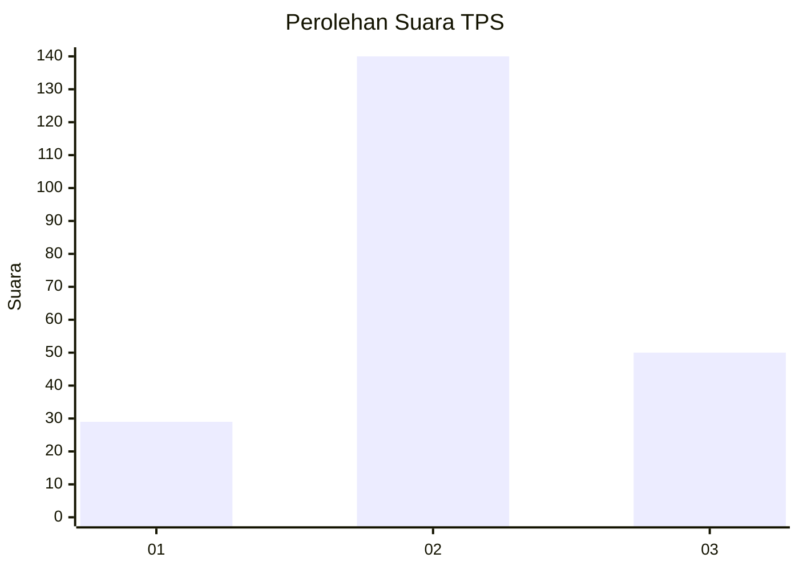
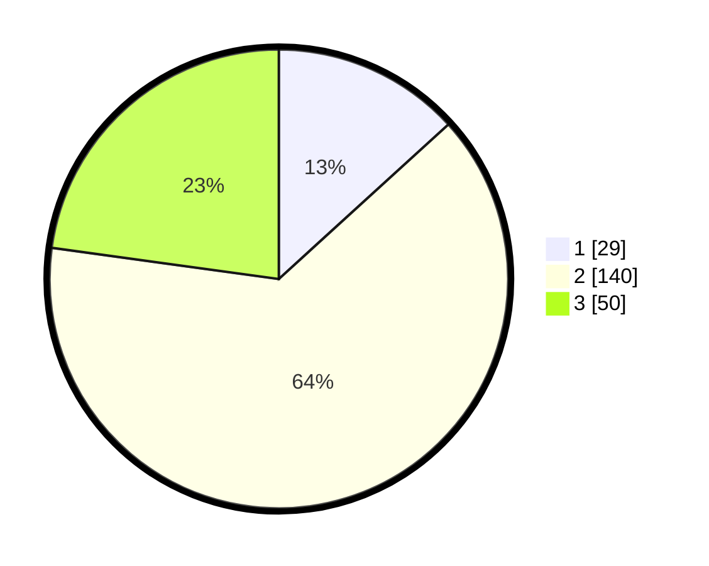

# Hasil

## Grafik

## Tabel

| No. | Nama Paslon    | Suara | Suara (raw) | Persentase |
|:--- |:-------------- | -----:| -----------:| ----------:|
| 1   | ANIES MUHAIMIN | 29    | [29][p-1]   | 13,24      |
| 2   | PRABOWO GIBRAN | 140   | [140][p-2]  | 63,93      |
| 3   | GANJAR MAHFUD  | 50    | [50][p-3]   | 22,83      |

[p-1]: https://github.com/gigit-pemilu/pemilu-2024/blob/main/pilpres/hitung-suara/sub/35-jawa-timur/sub/05-blitar/sub/12-sutojayan/sub/1002-kedungbunder/sub/004-tps/sub/paslon-1.txt
[p-2]: https://github.com/gigit-pemilu/pemilu-2024/blob/main/pilpres/hitung-suara/sub/35-jawa-timur/sub/05-blitar/sub/12-sutojayan/sub/1002-kedungbunder/sub/004-tps/sub/paslon-2.txt
[p-3]: https://github.com/gigit-pemilu/pemilu-2024/blob/main/pilpres/hitung-suara/sub/35-jawa-timur/sub/05-blitar/sub/12-sutojayan/sub/1002-kedungbunder/sub/004-tps/sub/paslon-3.txt

## Foto C Plano

https://sirekap-obj-formc.kpu.go.id/c54a/pemilu/ppwp/35/05/12/10/02/3505121002004-20240215-143532--24d4937f-5f32-4f21-8f30-4cb8a85197b6.jpg

https://sirekap-obj-formc.kpu.go.id/c54a/pemilu/ppwp/35/05/12/10/02/3505121002004-20240215-143555--6e3140ac-24eb-41de-b2bb-781b4fcd70f5.jpg

https://sirekap-obj-formc.kpu.go.id/c54a/pemilu/ppwp/35/05/12/10/02/3505121002004-20240215-143544--7361ef68-9db8-4b0a-943d-403c1ccc00e4.jpg

## Metadata

| Key        | Value               |
| ---------- | ------------------- |
| Time Stamp | 2024-02-16 16:25:10 |

## DATA PEMILIH TETAP

Jumlah pemilih dalam DPT: **260**.
 * L: **126**.
 * P: **134**.

## DATA PENGGUNA HAK PILIH

Jumlah pengguna hak pilih dalam DPT: **221**.
 * L: **107**.
 * P: **114**.

Jumlah pengguna hak pilih dalam DPTb: **0**.
 * L: **0**.
 * P: **0**.

Jumlah pengguna hak pilih dalam DPK: **4**.
 * L: **2**.
 * P: **2**.

Jumlah pengguna hak pilih: **225**.
 * L: **109**.
 * P: **116**.

## JUMLAH SUARA SAH DAN TIDAK SAH

JUMLAH SELURUH SUARA SAH: **219**.

JUMLAH SUARA TIDAK SAH: **6**.

JUMLAH SELURUH SUARA SAH DAN SUARA TIDAK SAH: **225**.

