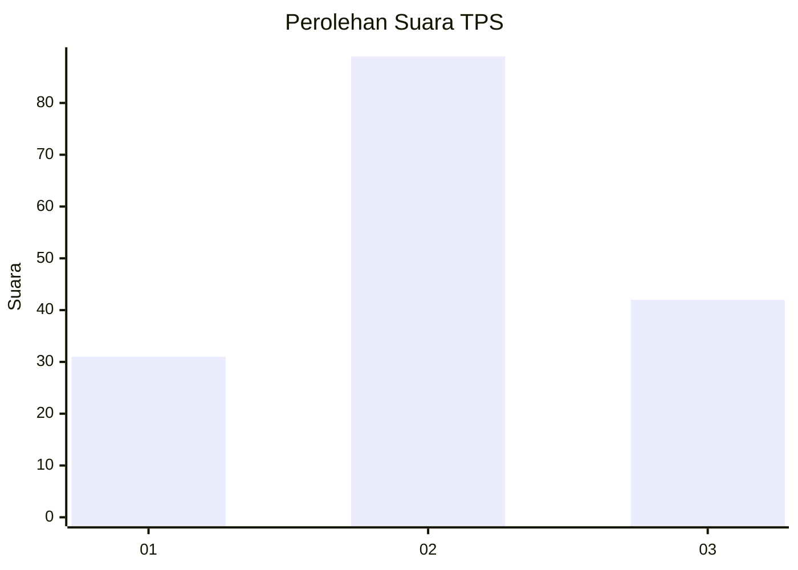
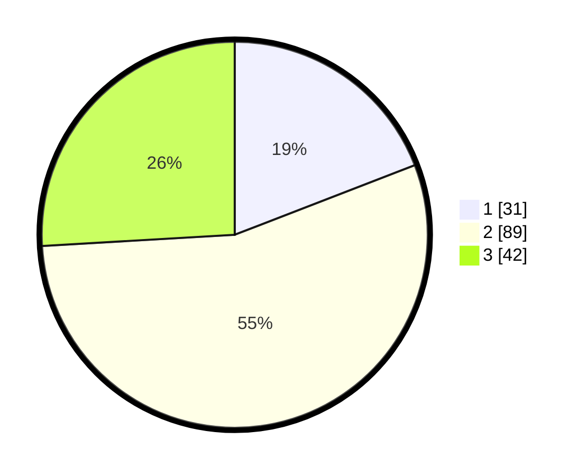

# Hasil

## Grafik

## Tabel

| No. | Nama Paslon    | Suara | Suara (raw) | Persentase |
|:--- |:-------------- | -----:| -----------:| ----------:|
| 1   | ANIES MUHAIMIN | 31    | [31][p-1]   | 19,14      |
| 2   | PRABOWO GIBRAN | 89    | [89][p-2]   | 54,94      |
| 3   | GANJAR MAHFUD  | 42    | [42][p-3]   | 25,93      |

[p-1]: https://github.com/gigit-pemilu/pemilu-2024-35-jawa-timur/blob/main/pilpres/hitung-suara/sub/35-jawa-timur/sub/05-blitar/sub/12-sutojayan/sub/1004-kalipang/sub/009-tps/sub/paslon-1.txt
[p-2]: https://github.com/gigit-pemilu/pemilu-2024-35-jawa-timur/blob/main/pilpres/hitung-suara/sub/35-jawa-timur/sub/05-blitar/sub/12-sutojayan/sub/1004-kalipang/sub/009-tps/sub/paslon-2.txt
[p-3]: https://github.com/gigit-pemilu/pemilu-2024-35-jawa-timur/blob/main/pilpres/hitung-suara/sub/35-jawa-timur/sub/05-blitar/sub/12-sutojayan/sub/1004-kalipang/sub/009-tps/sub/paslon-3.txt

## Foto C Plano

https://sirekap-obj-formc.kpu.go.id/e8b7/pemilu/ppwp/35/05/12/10/04/3505121004009-20240217-220954--48a0af9f-6ba7-4285-92b1-f8eec389288e.jpg

https://sirekap-obj-formc.kpu.go.id/e8b7/pemilu/ppwp/35/05/12/10/04/3505121004009-20240217-221109--e95d6551-cf73-4aab-b8dc-922f52322987.jpg

https://sirekap-obj-formc.kpu.go.id/e8b7/pemilu/ppwp/35/05/12/10/04/3505121004009-20240215-015956--3b853566-5e4a-4a7d-9ca4-6affcd8a6560.jpg

## Metadata

| Key        | Value               |
| ---------- | ------------------- |
| Time Stamp | 2024-02-25 18:00:00 |

