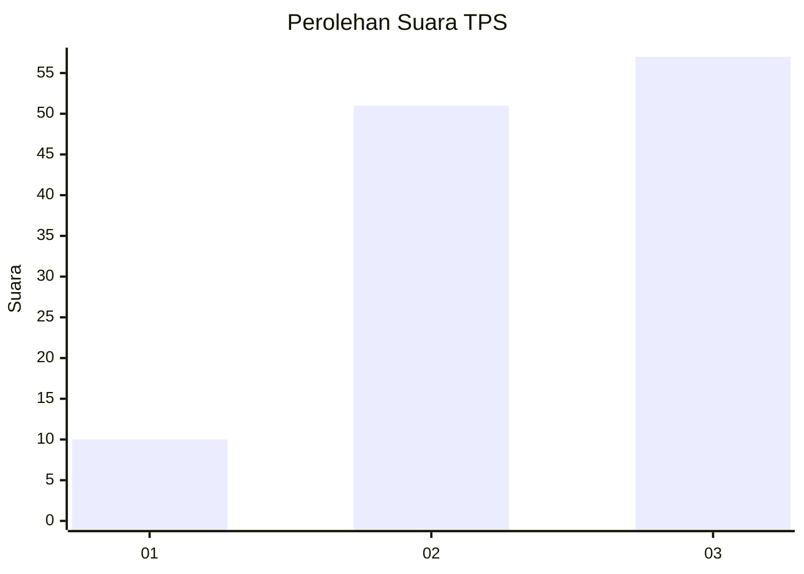
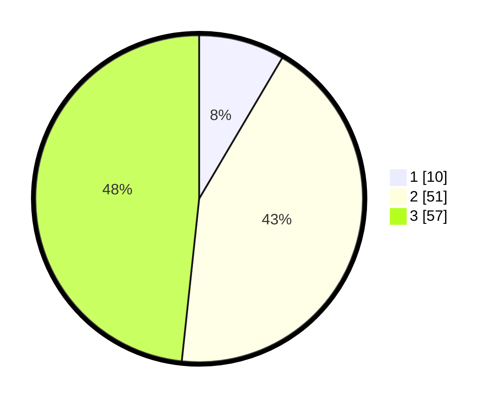

# Hasil

## Grafik

## Tabel

| No. | Nama Paslon    | Suara | Suara (raw) | Persentase |
|:--- |:-------------- | -----:| -----------:| ----------:|
| 1   | ANIES MUHAIMIN | 10    | [10][p-1]   | 8,47       |
| 2   | PRABOWO GIBRAN | 51    | [51][p-2]   | 43,22      |
| 3   | GANJAR MAHFUD  | 57    | [57][p-3]   | 48,31      |

[p-1]: https://github.com/gigit-pemilu/pemilu-2024-35-jawa-timur/blob/main/pilpres/hitung-suara/sub/35-jawa-timur/sub/05-blitar/sub/13-panggungrejo/sub/2001-serang/sub/005-tps/sub/paslon-1.txt
[p-2]: https://github.com/gigit-pemilu/pemilu-2024-35-jawa-timur/blob/main/pilpres/hitung-suara/sub/35-jawa-timur/sub/05-blitar/sub/13-panggungrejo/sub/2001-serang/sub/005-tps/sub/paslon-2.txt
[p-3]: https://github.com/gigit-pemilu/pemilu-2024-35-jawa-timur/blob/main/pilpres/hitung-suara/sub/35-jawa-timur/sub/05-blitar/sub/13-panggungrejo/sub/2001-serang/sub/005-tps/sub/paslon-3.txt

## Foto C Plano

https://sirekap-obj-formc.kpu.go.id/41e8/pemilu/ppwp/35/05/13/20/01/3505132001005-20240217-145151--6e3e618d-ac3d-4dcf-8516-a68355989686.jpg

https://sirekap-obj-formc.kpu.go.id/41e8/pemilu/ppwp/35/05/13/20/01/3505132001005-20240219-120925--1a9e27e0-4eca-45ee-8d3e-a76632264f7b.jpg

https://sirekap-obj-formc.kpu.go.id/41e8/pemilu/ppwp/35/05/13/20/01/3505132001005-20240217-145321--c07e6843-1ade-4742-a10a-a83eb8d16e6f.jpg

## Metadata

| Key        | Value               |
| ---------- | ------------------- |
| Time Stamp | 2024-02-21 22:00:00 |

