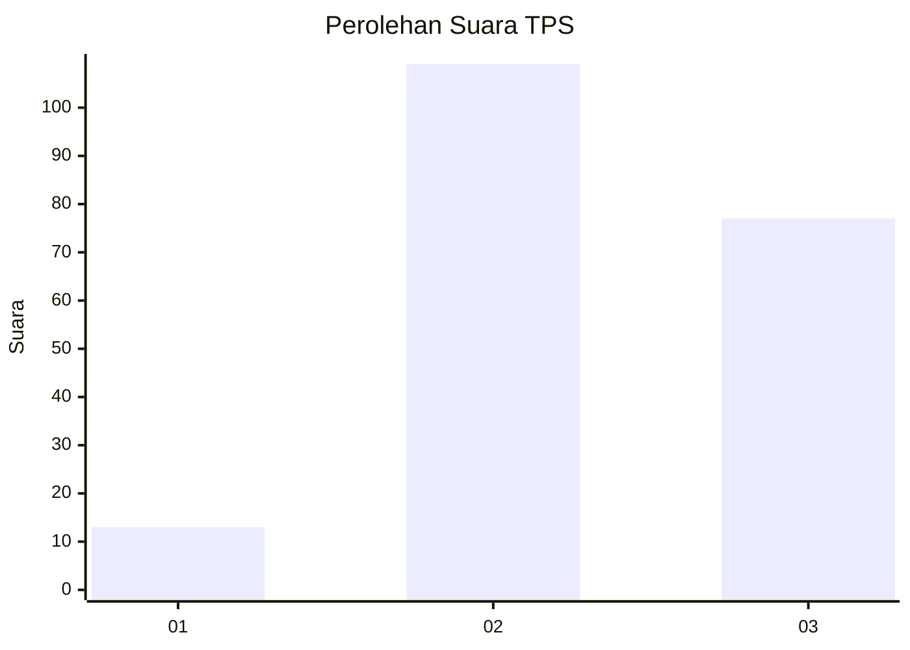
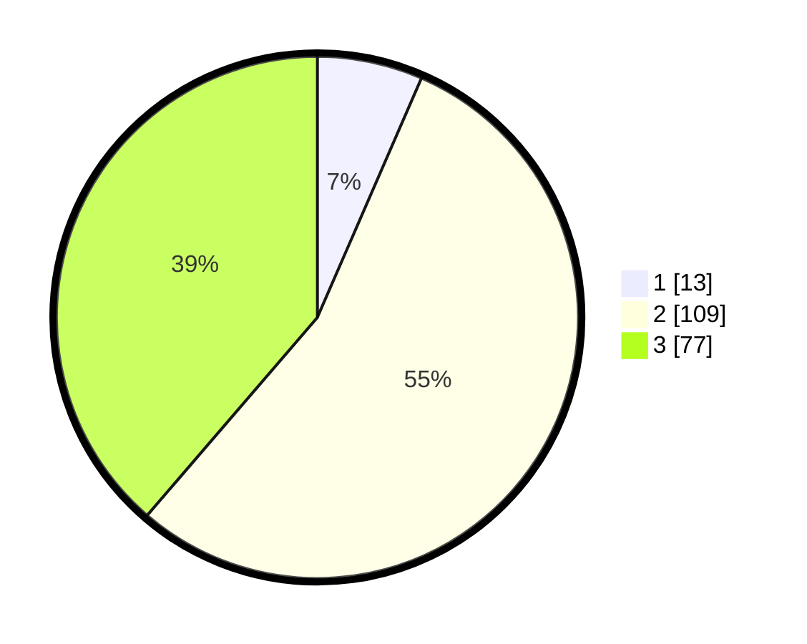

# Hasil

## Grafik

## Tabel

| No. | Nama Paslon    | Suara | Suara (raw) | Persentase |
|:--- |:-------------- | -----:| -----------:| ----------:|
| 1   | ANIES MUHAIMIN | 13    | [13][p-1]   | 6,53       |
| 2   | PRABOWO GIBRAN | 109   | [109][p-2]  | 54,77      |
| 3   | GANJAR MAHFUD  | 77    | [77][p-3]   | 38,69      |

[p-1]: https://github.com/gigit-pemilu/pemilu-2024-35-jawa-timur/blob/main/pilpres/hitung-suara/sub/35-jawa-timur/sub/05-blitar/sub/13-panggungrejo/sub/2002-kalitengah/sub/011-tps/sub/paslon-1.txt
[p-2]: https://github.com/gigit-pemilu/pemilu-2024-35-jawa-timur/blob/main/pilpres/hitung-suara/sub/35-jawa-timur/sub/05-blitar/sub/13-panggungrejo/sub/2002-kalitengah/sub/011-tps/sub/paslon-2.txt
[p-3]: https://github.com/gigit-pemilu/pemilu-2024-35-jawa-timur/blob/main/pilpres/hitung-suara/sub/35-jawa-timur/sub/05-blitar/sub/13-panggungrejo/sub/2002-kalitengah/sub/011-tps/sub/paslon-3.txt

## Foto C Plano

https://sirekap-obj-formc.kpu.go.id/6042/pemilu/ppwp/35/05/13/20/02/3505132002011-20240220-085951--dbdab4ff-4b86-4b19-8c88-da4ae45c4ce8.jpg

https://sirekap-obj-formc.kpu.go.id/6042/pemilu/ppwp/35/05/13/20/02/3505132002011-20240219-163443--7e2943c0-96d6-45d9-b59e-93e2cce3096d.jpg

https://sirekap-obj-formc.kpu.go.id/6042/pemilu/ppwp/35/05/13/20/02/3505132002011-20240220-083334--5b79840b-8403-44fc-ab66-9eaabe9d5e33.jpg

## Metadata

| Key        | Value               |
| ---------- | ------------------- |
| Time Stamp | 2024-02-20 10:00:00 |

