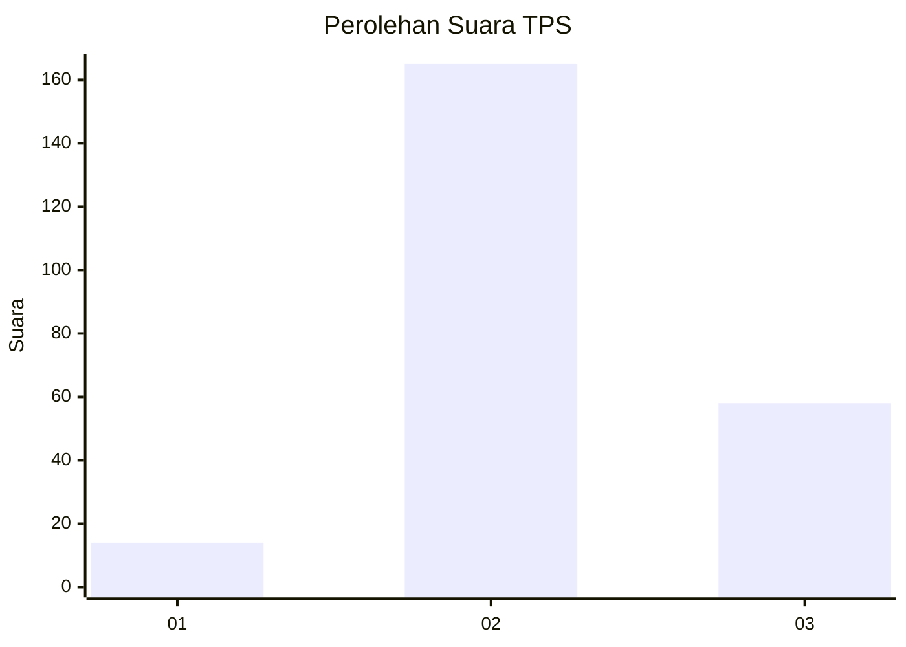
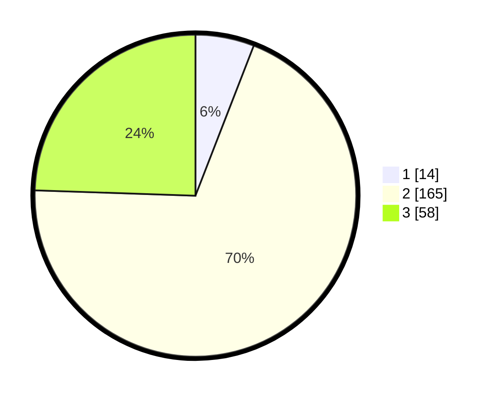

# Hasil

## Grafik

## Tabel

| No. | Nama Paslon    | Suara | Suara (raw) | Persentase |
|:--- |:-------------- | -----:| -----------:| ----------:|
| 1   | ANIES MUHAIMIN | 14    | [14][p-1]   | 5,91       |
| 2   | PRABOWO GIBRAN | 165   | [165][p-2]  | 69,62      |
| 3   | GANJAR MAHFUD  | 58    | [58][p-3]   | 24,47      |

[p-1]: https://github.com/gigit-pemilu/pemilu-2024/blob/main/pilpres/hitung-suara/sub/35-jawa-timur/sub/05-blitar/sub/13-panggungrejo/sub/2007-bumiayu/sub/001-tps/sub/paslon-1.txt
[p-2]: https://github.com/gigit-pemilu/pemilu-2024/blob/main/pilpres/hitung-suara/sub/35-jawa-timur/sub/05-blitar/sub/13-panggungrejo/sub/2007-bumiayu/sub/001-tps/sub/paslon-2.txt
[p-3]: https://github.com/gigit-pemilu/pemilu-2024/blob/main/pilpres/hitung-suara/sub/35-jawa-timur/sub/05-blitar/sub/13-panggungrejo/sub/2007-bumiayu/sub/001-tps/sub/paslon-3.txt

## Foto C Plano

https://sirekap-obj-formc.kpu.go.id/a886/pemilu/ppwp/35/05/13/20/07/3505132007001-20240215-044332--20627cc4-0a9d-4bc6-b5f7-5582c46fdde2.jpg

https://sirekap-obj-formc.kpu.go.id/a886/pemilu/ppwp/35/05/13/20/07/3505132007001-20240215-044430--3f861a06-d2f9-47bb-8721-96bb848fe8f9.jpg

https://sirekap-obj-formc.kpu.go.id/a886/pemilu/ppwp/35/05/13/20/07/3505132007001-20240215-044607--b35adfd3-aa46-4b32-8c59-0d85880578b1.jpg

## Metadata

| Key        | Value               |
| ---------- | ------------------- |
| Time Stamp | 2024-02-19 06:16:00 |

