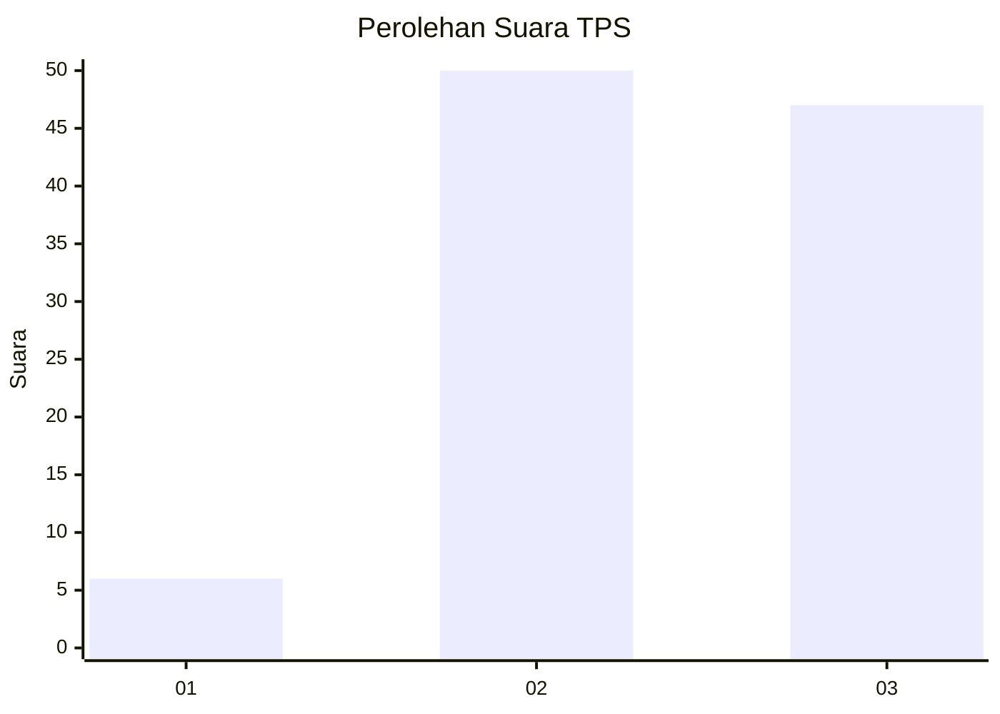
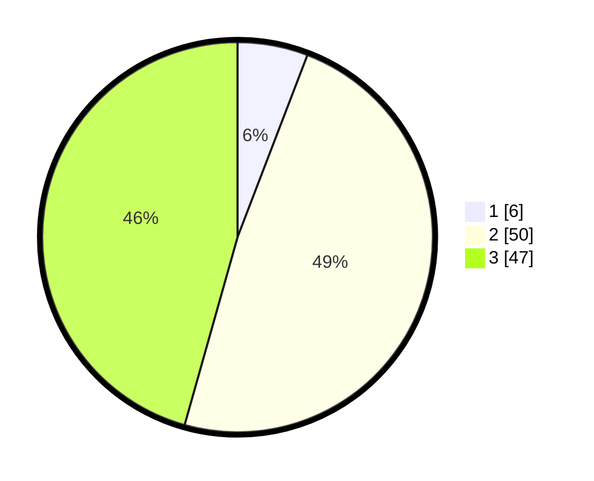

# Hasil

## Grafik

## Tabel

| No. | Nama Paslon    | Suara | Suara (raw) | Persentase |
|:--- |:-------------- | -----:| -----------:| ----------:|
| 1   | ANIES MUHAIMIN | 6     | [6][p-1]    | 5,83       |
| 2   | PRABOWO GIBRAN | 50    | [50][p-2]   | 48,54      |
| 3   | GANJAR MAHFUD  | 47    | [47][p-3]   | 45,63      |

[p-1]: https://github.com/gigit-pemilu/pemilu-2024/blob/main/pilpres/hitung-suara/sub/35-jawa-timur/sub/05-blitar/sub/13-panggungrejo/sub/2010-balerejo/sub/003-tps/sub/paslon-1.txt
[p-2]: https://github.com/gigit-pemilu/pemilu-2024/blob/main/pilpres/hitung-suara/sub/35-jawa-timur/sub/05-blitar/sub/13-panggungrejo/sub/2010-balerejo/sub/003-tps/sub/paslon-2.txt
[p-3]: https://github.com/gigit-pemilu/pemilu-2024/blob/main/pilpres/hitung-suara/sub/35-jawa-timur/sub/05-blitar/sub/13-panggungrejo/sub/2010-balerejo/sub/003-tps/sub/paslon-3.txt

## Foto C Plano

https://sirekap-obj-formc.kpu.go.id/b3c4/pemilu/ppwp/35/05/13/20/10/3505132010003-20240219-113717--fd56d504-b7e9-484a-8cf7-e549125bf12e.jpg

https://sirekap-obj-formc.kpu.go.id/b3c4/pemilu/ppwp/35/05/13/20/10/3505132010003-20240219-113801--e2d145b9-81d1-4fb9-8cd9-f591e13cfb2c.jpg

https://sirekap-obj-formc.kpu.go.id/b3c4/pemilu/ppwp/35/05/13/20/10/3505132010003-20240219-113834--f155241d-0e0d-43f8-a64e-8c2ebde93d05.jpg

## Metadata

| Key        | Value               |
| ---------- | ------------------- |
| Time Stamp | 2024-02-19 12:00:00 |

## DATA PEMILIH TETAP

Jumlah pemilih dalam DPT: **555**.
 * L: **55**.
 * P: **55**.

## DATA PENGGUNA HAK PILIH

Jumlah pengguna hak pilih dalam DPT: **550**.
 * L: **200**.
 * P: **5**.

Jumlah pengguna hak pilih dalam DPTb: **500**.
 * L: **777**.
 * P: **777**.

Jumlah pengguna hak pilih dalam DPK: **0**.
 * L: **0**.
 * P: **0**.

Jumlah pengguna hak pilih: **726**.
 * L: **111**.
 * P: **175**.

## JUMLAH SUARA SAH DAN TIDAK SAH

JUMLAH SELURUH SUARA SAH: **728**.

JUMLAH SUARA TIDAK SAH: **4**.

JUMLAH SELURUH SUARA SAH DAN SUARA TIDAK SAH: **227**.

