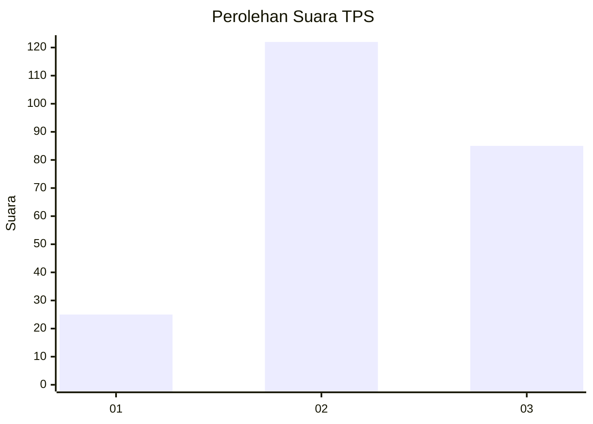
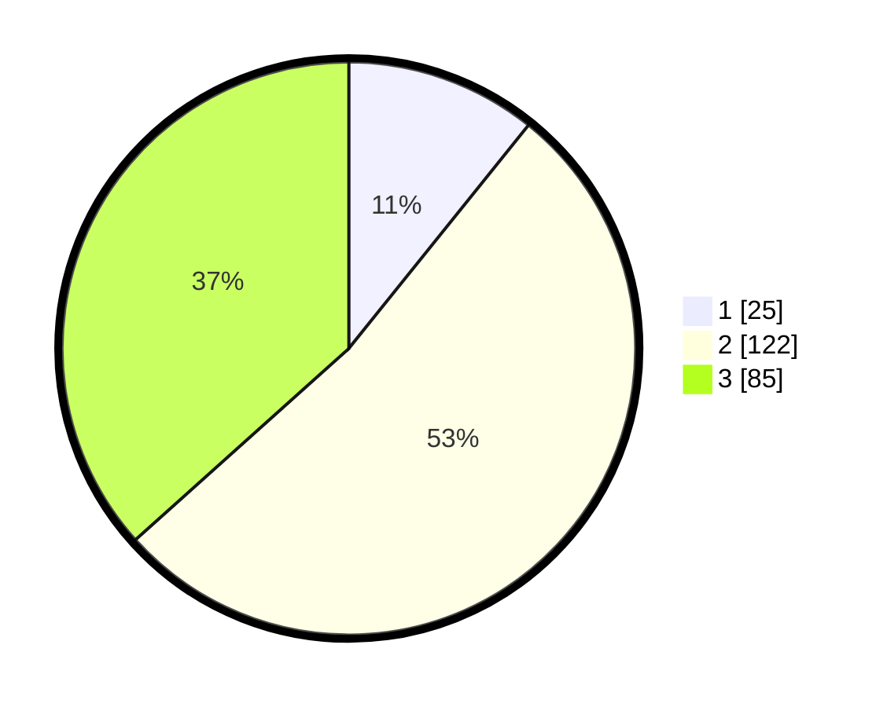

# Hasil

## Grafik

## Tabel

| No. | Nama Paslon    | Suara | Suara (raw) | Persentase |
|:--- |:-------------- | -----:| -----------:| ----------:|
| 1   | ANIES MUHAIMIN | 25    | [25][p-1]   | 10,78      |
| 2   | PRABOWO GIBRAN | 122   | [122][p-2]  | 52,59      |
| 3   | GANJAR MAHFUD  | 85    | [85][p-3]   | 36,64      |

[p-1]: https://github.com/gigit-pemilu/pemilu-2024/blob/main/pilpres/hitung-suara/sub/35-jawa-timur/sub/05-blitar/sub/14-talun/sub/1008-talun/sub/014-tps/sub/paslon-1.txt
[p-2]: https://github.com/gigit-pemilu/pemilu-2024/blob/main/pilpres/hitung-suara/sub/35-jawa-timur/sub/05-blitar/sub/14-talun/sub/1008-talun/sub/014-tps/sub/paslon-2.txt
[p-3]: https://github.com/gigit-pemilu/pemilu-2024/blob/main/pilpres/hitung-suara/sub/35-jawa-timur/sub/05-blitar/sub/14-talun/sub/1008-talun/sub/014-tps/sub/paslon-3.txt

## Foto C Plano

https://sirekap-obj-formc.kpu.go.id/00ce/pemilu/ppwp/35/05/14/10/08/3505141008014-20240218-113437--3597ebe6-a1e9-44b3-9134-9764957cb9e6.jpg

https://sirekap-obj-formc.kpu.go.id/00ce/pemilu/ppwp/35/05/14/10/08/3505141008014-20240218-112521--ebedbe0a-8cca-4be4-8015-b6ac1a5cf6fa.jpg

https://sirekap-obj-formc.kpu.go.id/00ce/pemilu/ppwp/35/05/14/10/08/3505141008014-20240217-215609--4cc63aaf-5aaf-40ac-b6e9-b674b8576337.jpg

## Metadata

| Key        | Value               |
| ---------- | ------------------- |
| Time Stamp | 2024-02-22 18:00:00 |

