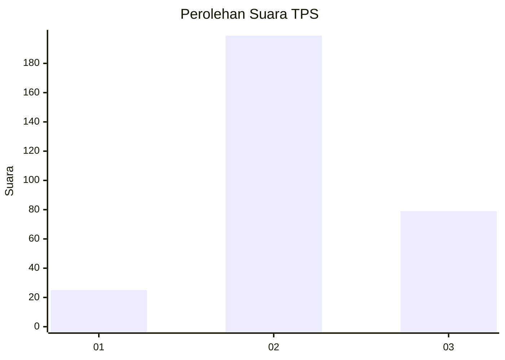
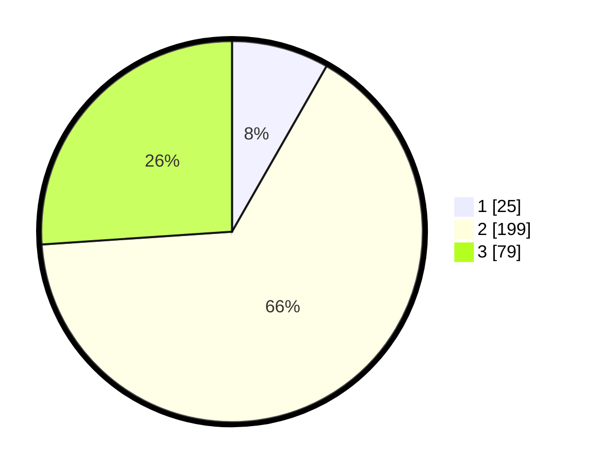

# Hasil

## Grafik

## Tabel

| No. | Nama Paslon    | Suara | Suara (raw) | Persentase |
|:--- |:-------------- | -----:| -----------:| ----------:|
| 1   | ANIES MUHAIMIN | 25    | [25][p-1]   | 8,25       |
| 2   | PRABOWO GIBRAN | 199   | [199][p-2]  | 65,68      |
| 3   | GANJAR MAHFUD  | 79    | [79][p-3]   | 26,07      |

[p-1]: https://github.com/gigit-pemilu/pemilu-2024/blob/main/pilpres/hitung-suara/sub/35-jawa-timur/sub/05-blitar/sub/14-talun/sub/1009-kamulan/sub/003-tps/sub/paslon-1.txt
[p-2]: https://github.com/gigit-pemilu/pemilu-2024/blob/main/pilpres/hitung-suara/sub/35-jawa-timur/sub/05-blitar/sub/14-talun/sub/1009-kamulan/sub/003-tps/sub/paslon-2.txt
[p-3]: https://github.com/gigit-pemilu/pemilu-2024/blob/main/pilpres/hitung-suara/sub/35-jawa-timur/sub/05-blitar/sub/14-talun/sub/1009-kamulan/sub/003-tps/sub/paslon-3.txt

## Foto C Plano

https://sirekap-obj-formc.kpu.go.id/7fe0/pemilu/ppwp/35/05/14/10/09/3505141009003-20240214-234657--3ccef7c5-82cd-40c5-a067-eb242f2bd523.jpg

https://sirekap-obj-formc.kpu.go.id/7fe0/pemilu/ppwp/35/05/14/10/09/3505141009003-20240216-091000--91ec9086-21ec-4f2f-8f49-42483240b5be.jpg

https://sirekap-obj-formc.kpu.go.id/7fe0/pemilu/ppwp/35/05/14/10/09/3505141009003-20240216-090952--7cd8a40a-c766-4c6e-b7f9-583590272188.jpg

## Metadata

| Key        | Value               |
| ---------- | ------------------- |
| Time Stamp | 2024-02-16 09:30:28 |

