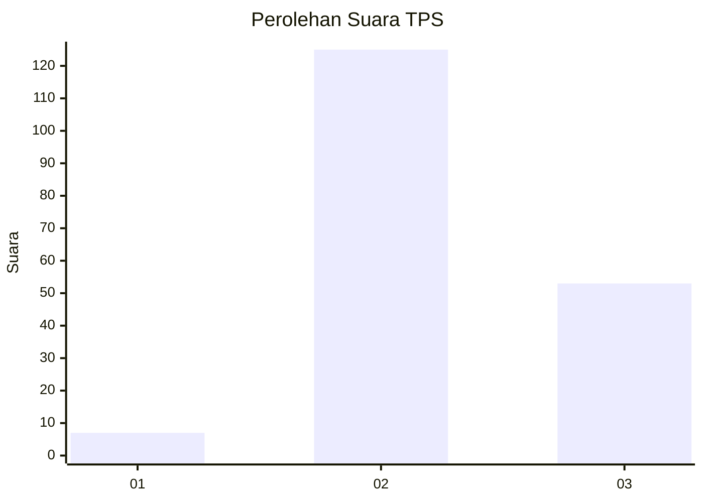
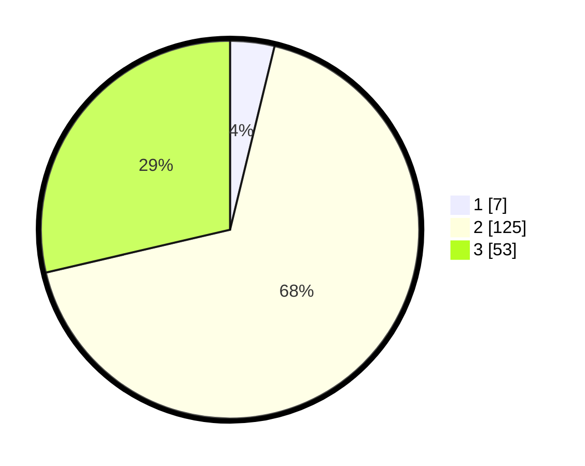

# Hasil

## Grafik

## Tabel

| No. | Nama Paslon    | Suara | Suara (raw) | Persentase |
|:--- |:-------------- | -----:| -----------:| ----------:|
| 1   | ANIES MUHAIMIN | 7     | [7][p-1]    | 3,78       |
| 2   | PRABOWO GIBRAN | 125   | [125][p-2]  | 67,57      |
| 3   | GANJAR MAHFUD  | 53    | [53][p-3]   | 28,65      |

[p-1]: https://github.com/gigit-pemilu/pemilu-2024-35-jawa-timur/blob/main/pilpres/hitung-suara/sub/35-jawa-timur/sub/05-blitar/sub/14-talun/sub/2002-kendalrejo/sub/001-tps/sub/paslon-1.txt
[p-2]: https://github.com/gigit-pemilu/pemilu-2024-35-jawa-timur/blob/main/pilpres/hitung-suara/sub/35-jawa-timur/sub/05-blitar/sub/14-talun/sub/2002-kendalrejo/sub/001-tps/sub/paslon-2.txt
[p-3]: https://github.com/gigit-pemilu/pemilu-2024-35-jawa-timur/blob/main/pilpres/hitung-suara/sub/35-jawa-timur/sub/05-blitar/sub/14-talun/sub/2002-kendalrejo/sub/001-tps/sub/paslon-3.txt

## Foto C Plano

https://sirekap-obj-formc.kpu.go.id/60df/pemilu/ppwp/35/05/14/20/02/3505142002001-20240214-232820--a83e0bfb-bee1-442c-a455-d2b133d655b1.jpg

https://sirekap-obj-formc.kpu.go.id/60df/pemilu/ppwp/35/05/14/20/02/3505142002001-20240214-232953--1e6309ca-4f98-4ff3-8bef-713c503ccf65.jpg

https://sirekap-obj-formc.kpu.go.id/60df/pemilu/ppwp/35/05/14/20/02/3505142002001-20240214-233051--6f5567d9-e38c-4d62-a9f8-f66913562c0c.jpg

## Metadata

| Key        | Value               |
| ---------- | ------------------- |
| Time Stamp | 2024-02-21 01:00:00 |

