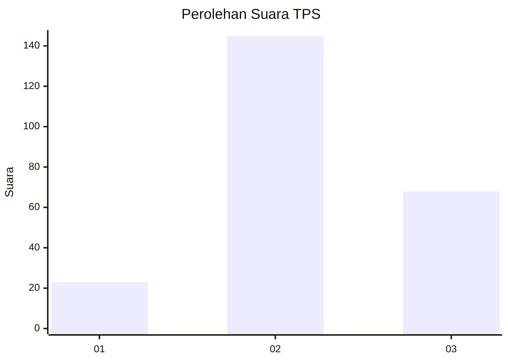
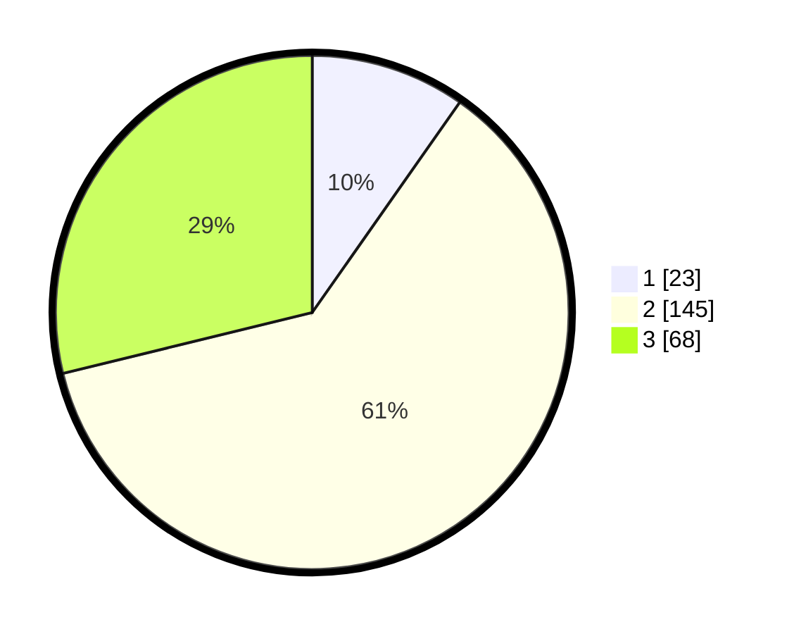

# Hasil

## Grafik

## Tabel

| No. | Nama Paslon    | Suara | Suara (raw) | Persentase |
|:--- |:-------------- | -----:| -----------:| ----------:|
| 1   | ANIES MUHAIMIN | 23    | [23][p-1]   | 9,75       |
| 2   | PRABOWO GIBRAN | 145   | [145][p-2]  | 61,44      |
| 3   | GANJAR MAHFUD  | 68    | [68][p-3]   | 28,81      |

[p-1]: https://github.com/gigit-pemilu/pemilu-2024/blob/main/pilpres/hitung-suara/sub/35-jawa-timur/sub/05-blitar/sub/14-talun/sub/2002-kendalrejo/sub/008-tps/sub/paslon-1.txt
[p-2]: https://github.com/gigit-pemilu/pemilu-2024/blob/main/pilpres/hitung-suara/sub/35-jawa-timur/sub/05-blitar/sub/14-talun/sub/2002-kendalrejo/sub/008-tps/sub/paslon-2.txt
[p-3]: https://github.com/gigit-pemilu/pemilu-2024/blob/main/pilpres/hitung-suara/sub/35-jawa-timur/sub/05-blitar/sub/14-talun/sub/2002-kendalrejo/sub/008-tps/sub/paslon-3.txt

## Foto C Plano

https://sirekap-obj-formc.kpu.go.id/7cfc/pemilu/ppwp/35/05/14/20/02/3505142002008-20240215-004229--b213276b-0d0c-4746-a0bd-80f4953061ea.jpg

https://sirekap-obj-formc.kpu.go.id/7cfc/pemilu/ppwp/35/05/14/20/02/3505142002008-20240215-004304--94d990c4-cd04-4d3a-811e-71fdce61cbda.jpg

https://sirekap-obj-formc.kpu.go.id/7cfc/pemilu/ppwp/35/05/14/20/02/3505142002008-20240215-004329--231db5c6-1b4e-4984-8707-29a36baf1788.jpg

## Metadata

| Key        | Value               |
| ---------- | ------------------- |
| Time Stamp | 2024-02-15 22:30:27 |

