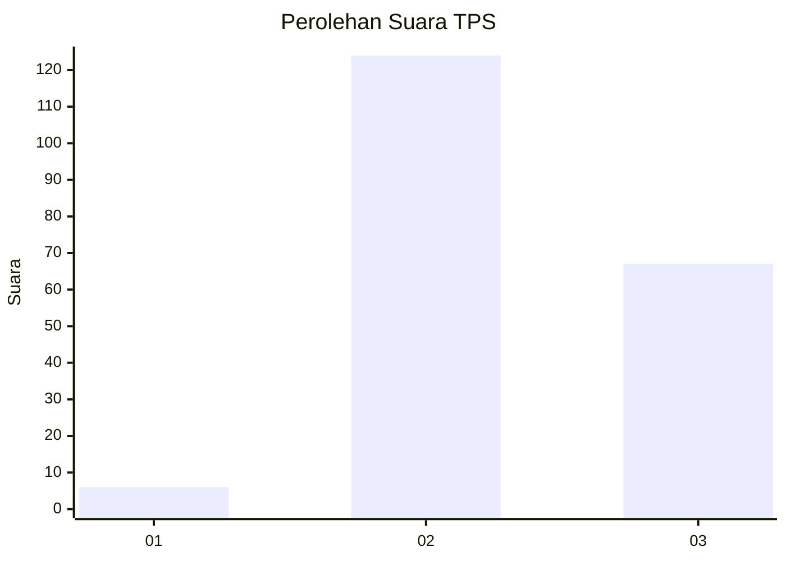
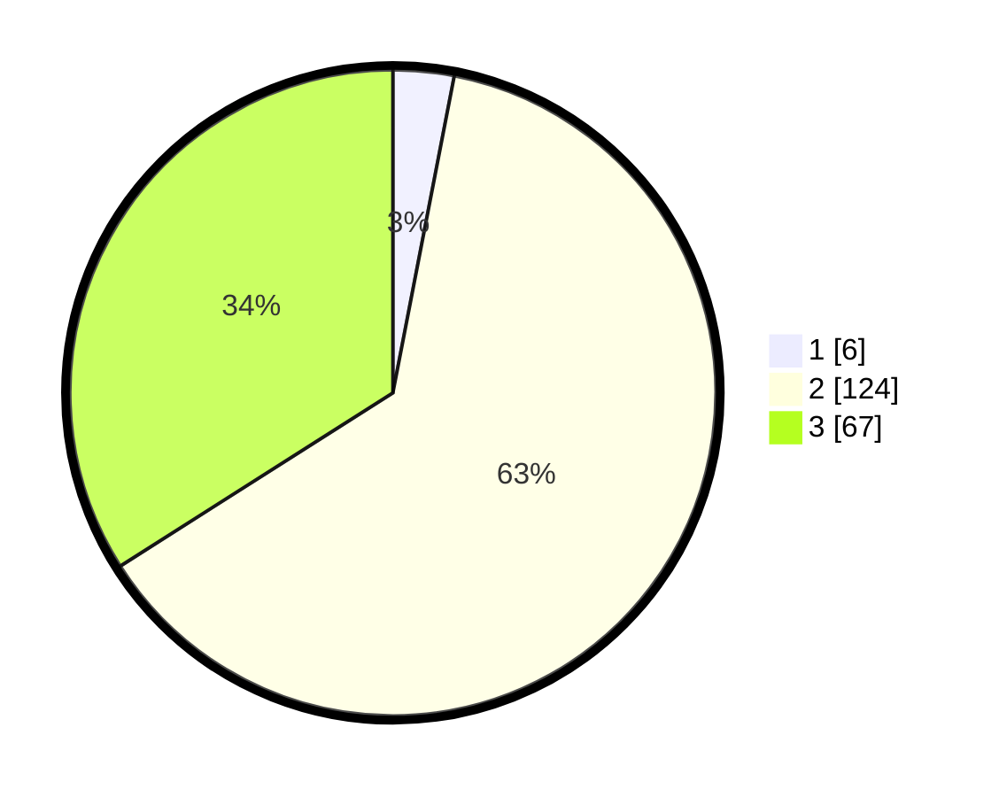

# Hasil

## Grafik

## Tabel

| No. | Nama Paslon    | Suara | Suara (raw) | Persentase |
|:--- |:-------------- | -----:| -----------:| ----------:|
| 1   | ANIES MUHAIMIN | 6     | [6][p-1]    | 3,05       |
| 2   | PRABOWO GIBRAN | 124   | [124][p-2]  | 62,94      |
| 3   | GANJAR MAHFUD  | 67    | [67][p-3]   | 34,01      |

[p-1]: https://github.com/gigit-pemilu/pemilu-2024/blob/main/pilpres/hitung-suara/sub/35-jawa-timur/sub/05-blitar/sub/14-talun/sub/2010-duren/sub/008-tps/sub/paslon-1.txt
[p-2]: https://github.com/gigit-pemilu/pemilu-2024/blob/main/pilpres/hitung-suara/sub/35-jawa-timur/sub/05-blitar/sub/14-talun/sub/2010-duren/sub/008-tps/sub/paslon-2.txt
[p-3]: https://github.com/gigit-pemilu/pemilu-2024/blob/main/pilpres/hitung-suara/sub/35-jawa-timur/sub/05-blitar/sub/14-talun/sub/2010-duren/sub/008-tps/sub/paslon-3.txt

## Foto C Plano

https://sirekap-obj-formc.kpu.go.id/6909/pemilu/ppwp/35/05/14/20/10/3505142010008-20240214-222459--d84a2f23-868f-43d5-913b-da4cf7b502f9.jpg

https://sirekap-obj-formc.kpu.go.id/6909/pemilu/ppwp/35/05/14/20/10/3505142010008-20240214-230238--47e2da2f-9555-44b8-8997-6b9dbd68db38.jpg

https://sirekap-obj-formc.kpu.go.id/6909/pemilu/ppwp/35/05/14/20/10/3505142010008-20240216-102620--87e620b5-7ba2-44d6-a72b-e1b83d4a59de.jpg

## Metadata

| Key        | Value               |
| ---------- | ------------------- |
| Time Stamp | 2024-02-16 10:30:29 |

