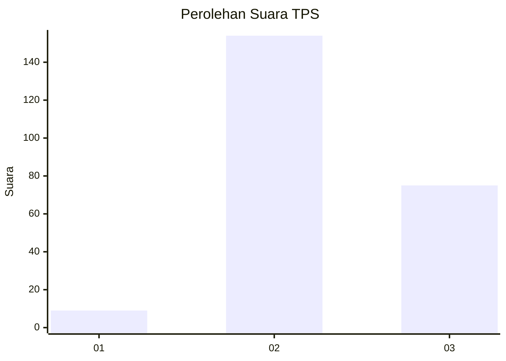
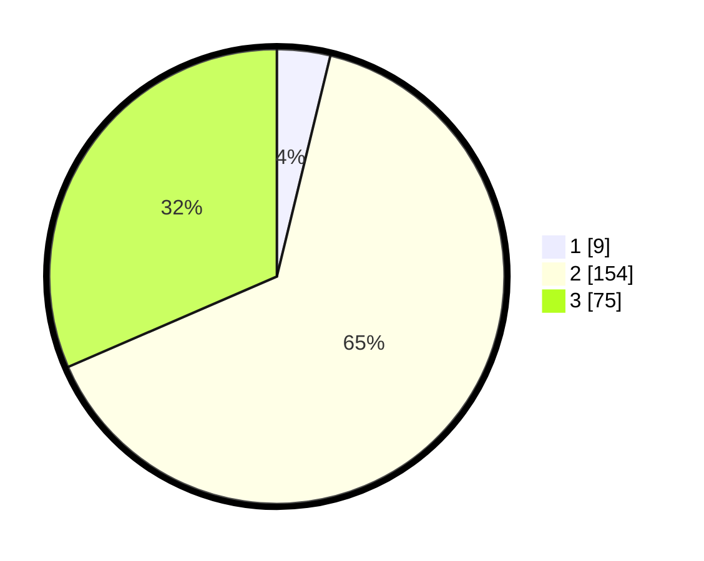

# Hasil

## Grafik

## Tabel

| No. | Nama Paslon    | Suara | Suara (raw) | Persentase |
|:--- |:-------------- | -----:| -----------:| ----------:|
| 1   | ANIES MUHAIMIN | 9     | [9][p-1]    | 3,78       |
| 2   | PRABOWO GIBRAN | 154   | [154][p-2]  | 64,71      |
| 3   | GANJAR MAHFUD  | 75    | [75][p-3]   | 31,51      |

[p-1]: https://github.com/gigit-pemilu/pemilu-2024/blob/main/pilpres/hitung-suara/sub/35-jawa-timur/sub/05-blitar/sub/15-gandusari/sub/2004-sukosewu/sub/001-tps/sub/paslon-1.txt
[p-2]: https://github.com/gigit-pemilu/pemilu-2024/blob/main/pilpres/hitung-suara/sub/35-jawa-timur/sub/05-blitar/sub/15-gandusari/sub/2004-sukosewu/sub/001-tps/sub/paslon-2.txt
[p-3]: https://github.com/gigit-pemilu/pemilu-2024/blob/main/pilpres/hitung-suara/sub/35-jawa-timur/sub/05-blitar/sub/15-gandusari/sub/2004-sukosewu/sub/001-tps/sub/paslon-3.txt

## Foto C Plano

https://sirekap-obj-formc.kpu.go.id/0071/pemilu/ppwp/35/05/15/20/04/3505152004001-20240215-014744--4bbca899-63ab-4c9c-b9a8-d422586104b8.jpg

https://sirekap-obj-formc.kpu.go.id/0071/pemilu/ppwp/35/05/15/20/04/3505152004001-20240215-014829--7f940a0c-58e7-4730-b969-beb0adb89a09.jpg

https://sirekap-obj-formc.kpu.go.id/0071/pemilu/ppwp/35/05/15/20/04/3505152004001-20240217-164128--4457354b-99bb-46b1-a4b6-531410bce95b.jpg

## Metadata

| Key        | Value               |
| ---------- | ------------------- |
| Time Stamp | 2024-02-24 22:31:28 |

