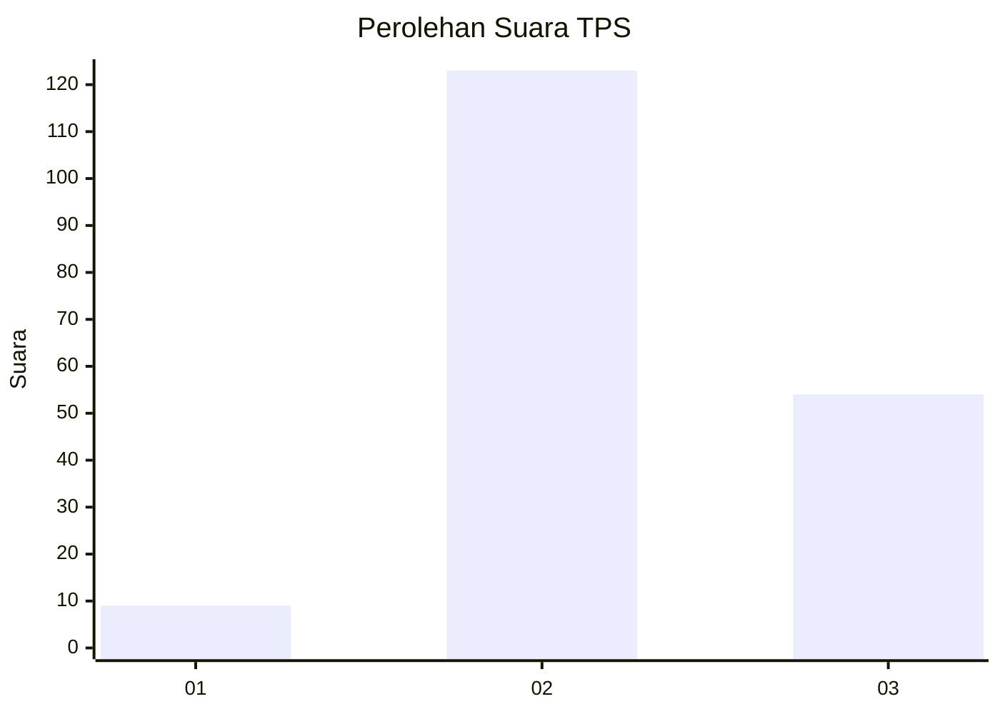

# Hasil

## Grafik

## Tabel

| No. | Nama Paslon    | Suara | Suara (raw) | Persentase |
|:--- |:-------------- | -----:| -----------:| ----------:|
| 1   | ANIES MUHAIMIN | 9     | [9][p-1]    | 4,84       |
| 2   | PRABOWO GIBRAN | 123   | [123][p-2]  | 66,13      |
| 3   | GANJAR MAHFUD  | 54    | [54][p-3]   | 29,03      |

[p-1]: https://github.com/gigit-pemilu/pemilu-2024-35-jawa-timur/blob/main/pilpres/hitung-suara/sub/35-jawa-timur/sub/05-blitar/sub/16-binangun/sub/2001-kedungwungu/sub/008-tps/sub/paslon-1.txt
[p-2]: https://github.com/gigit-pemilu/pemilu-2024-35-jawa-timur/blob/main/pilpres/hitung-suara/sub/35-jawa-timur/sub/05-blitar/sub/16-binangun/sub/2001-kedungwungu/sub/008-tps/sub/paslon-2.txt
[p-3]: https://github.com/gigit-pemilu/pemilu-2024-35-jawa-timur/blob/main/pilpres/hitung-suara/sub/35-jawa-timur/sub/05-blitar/sub/16-binangun/sub/2001-kedungwungu/sub/008-tps/sub/paslon-3.txt

## Foto C Plano

https://sirekap-obj-formc.kpu.go.id/0b9d/pemilu/ppwp/35/05/16/20/01/3505162001008-20240217-093146--82f8bda0-b90d-4b6a-9c61-1534d215b80e.jpg

https://sirekap-obj-formc.kpu.go.id/0b9d/pemilu/ppwp/35/05/16/20/01/3505162001008-20240214-212436--e9b8e52e-6888-4f66-a95f-67fecbaa7c48.jpg

https://sirekap-obj-formc.kpu.go.id/0b9d/pemilu/ppwp/35/05/16/20/01/3505162001008-20240214-141601--8c9ca2ae-ab73-4c78-9448-6c70a504a1f4.jpg

## Metadata

| Key        | Value               |
| ---------- | ------------------- |
| Time Stamp | 2024-02-17 10:00:02 |

