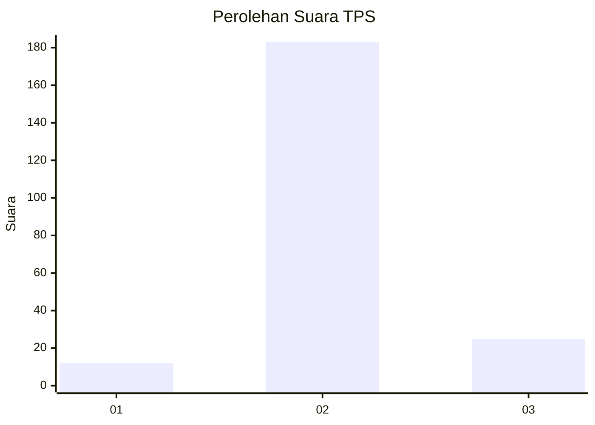
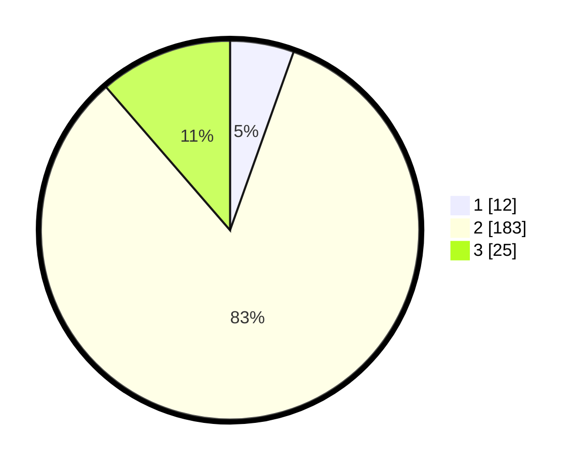

# Hasil

## Grafik

## Tabel

| No. | Nama Paslon    | Suara | Suara (raw) | Persentase |
|:--- |:-------------- | -----:| -----------:| ----------:|
| 1   | ANIES MUHAIMIN | 12    | [12][p-1]   | 5,45       |
| 2   | PRABOWO GIBRAN | 183   | [183][p-2]  | 83,18      |
| 3   | GANJAR MAHFUD  | 25    | [25][p-3]   | 11,36      |

[p-1]: https://github.com/gigit-pemilu/pemilu-2024-35-jawa-timur/blob/main/pilpres/hitung-suara/sub/35-jawa-timur/sub/05-blitar/sub/16-binangun/sub/2004-binangun/sub/005-tps/sub/paslon-1.txt
[p-2]: https://github.com/gigit-pemilu/pemilu-2024-35-jawa-timur/blob/main/pilpres/hitung-suara/sub/35-jawa-timur/sub/05-blitar/sub/16-binangun/sub/2004-binangun/sub/005-tps/sub/paslon-2.txt
[p-3]: https://github.com/gigit-pemilu/pemilu-2024-35-jawa-timur/blob/main/pilpres/hitung-suara/sub/35-jawa-timur/sub/05-blitar/sub/16-binangun/sub/2004-binangun/sub/005-tps/sub/paslon-3.txt

## Foto C Plano

https://sirekap-obj-formc.kpu.go.id/bac8/pemilu/ppwp/35/05/16/20/04/3505162004005-20240214-194802--6bf77eb7-9843-4f3e-ac2f-2dd4ece0a2b1.jpg

https://sirekap-obj-formc.kpu.go.id/bac8/pemilu/ppwp/35/05/16/20/04/3505162004005-20240214-194912--a1a0b888-b808-47bb-b1e0-06de76e7db0c.jpg

https://sirekap-obj-formc.kpu.go.id/bac8/pemilu/ppwp/35/05/16/20/04/3505162004005-20240215-204729--9e910fc8-d316-4408-8bd5-43428b997436.jpg

## Metadata

| Key        | Value               |
| ---------- | ------------------- |
| Time Stamp | 2024-02-15 21:01:18 |

