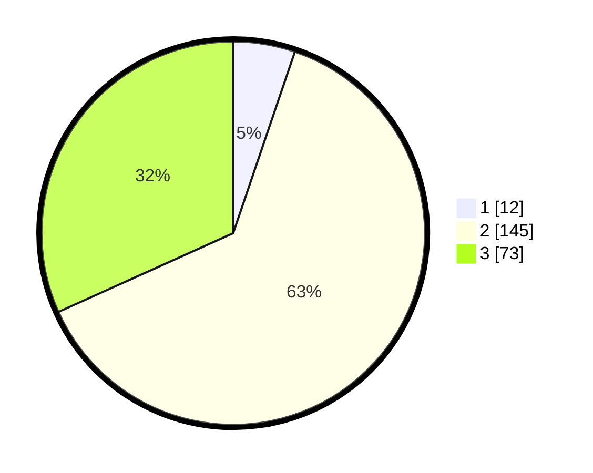

# Hasil

## Grafik

## Tabel

| No. | Nama Paslon    | Suara | Suara (raw) | Persentase |
|:--- |:-------------- | -----:| -----------:| ----------:|
| 1   | ANIES MUHAIMIN | 12    | [12][p-1]   | 5,22       |
| 2   | PRABOWO GIBRAN | 145   | [145][p-2]  | 63,04      |
| 3   | GANJAR MAHFUD  | 73    | [73][p-3]   | 31,74      |

[p-1]: https://github.com/gigit-pemilu/pemilu-2024-35-jawa-timur/blob/main/pilpres/hitung-suara/sub/35-jawa-timur/sub/05-blitar/sub/18-doko/sub/2001-slorok/sub/005-tps/sub/paslon-1.txt
[p-2]: https://github.com/gigit-pemilu/pemilu-2024-35-jawa-timur/blob/main/pilpres/hitung-suara/sub/35-jawa-timur/sub/05-blitar/sub/18-doko/sub/2001-slorok/sub/005-tps/sub/paslon-2.txt
[p-3]: https://github.com/gigit-pemilu/pemilu-2024-35-jawa-timur/blob/main/pilpres/hitung-suara/sub/35-jawa-timur/sub/05-blitar/sub/18-doko/sub/2001-slorok/sub/005-tps/sub/paslon-3.txt

## Foto C Plano

https://sirekap-obj-formc.kpu.go.id/6795/pemilu/ppwp/35/05/18/20/01/3505182001005-20240215-103657--3c698cc4-41de-40a1-9548-f911adc2c9e5.jpg

https://sirekap-obj-formc.kpu.go.id/6795/pemilu/ppwp/35/05/18/20/01/3505182001005-20240217-124304--1c247bea-ecaa-4294-8584-ea46ae882924.jpg

https://sirekap-obj-formc.kpu.go.id/6795/pemilu/ppwp/35/05/18/20/01/3505182001005-20240217-124647--68e30694-adc0-4dbe-be57-eb7b1802ecf3.jpg

## Metadata

| Key        | Value               |
| ---------- | ------------------- |
| Time Stamp | 2024-02-19 06:16:00 |

