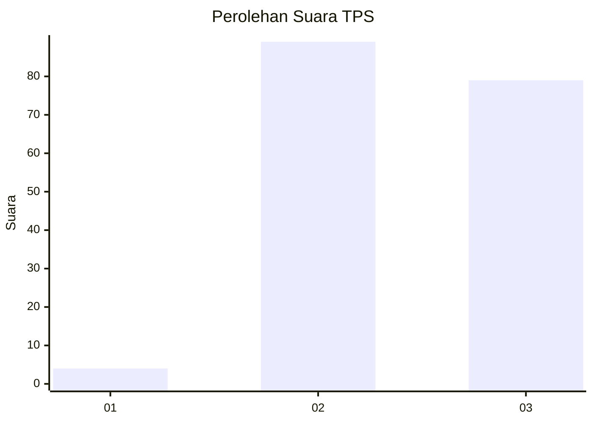
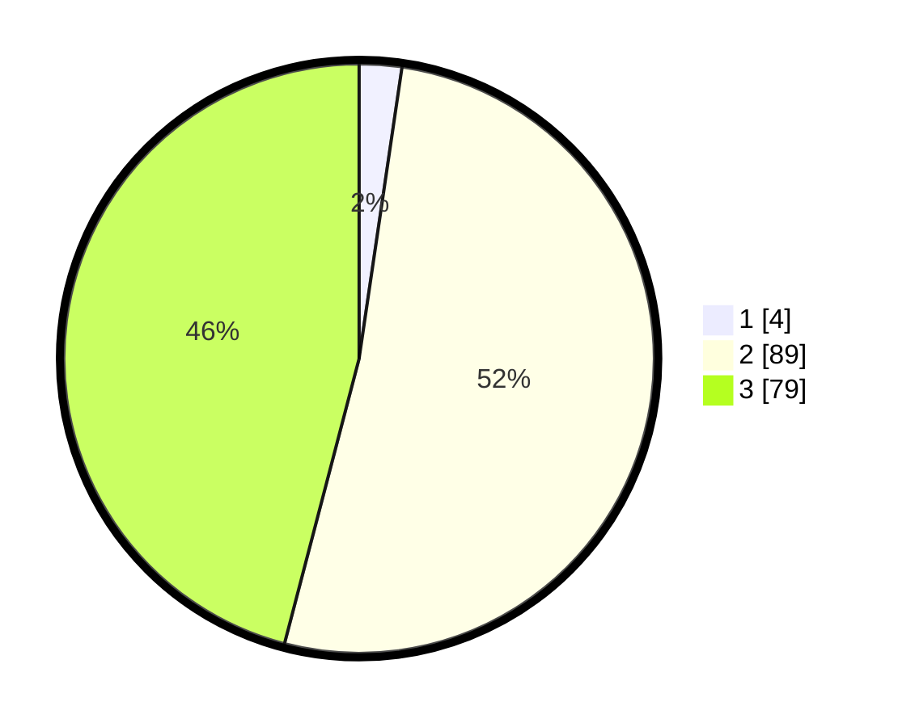

# Hasil

## Grafik

## Tabel

| No. | Nama Paslon    | Suara | Suara (raw) | Persentase |
|:--- |:-------------- | -----:| -----------:| ----------:|
| 1   | ANIES MUHAIMIN | 4     | [4][p-1]    | 2,33       |
| 2   | PRABOWO GIBRAN | 89    | [89][p-2]   | 51,74      |
| 3   | GANJAR MAHFUD  | 79    | [79][p-3]   | 45,93      |

[p-1]: https://github.com/gigit-pemilu/pemilu-2024-35-jawa-timur/blob/main/pilpres/hitung-suara/sub/35-jawa-timur/sub/05-blitar/sub/18-doko/sub/2004-sumberurip/sub/005-tps/sub/paslon-1.txt
[p-2]: https://github.com/gigit-pemilu/pemilu-2024-35-jawa-timur/blob/main/pilpres/hitung-suara/sub/35-jawa-timur/sub/05-blitar/sub/18-doko/sub/2004-sumberurip/sub/005-tps/sub/paslon-2.txt
[p-3]: https://github.com/gigit-pemilu/pemilu-2024-35-jawa-timur/blob/main/pilpres/hitung-suara/sub/35-jawa-timur/sub/05-blitar/sub/18-doko/sub/2004-sumberurip/sub/005-tps/sub/paslon-3.txt

## Foto C Plano

https://sirekap-obj-formc.kpu.go.id/6ed3/pemilu/ppwp/35/05/18/20/04/3505182004005-20240214-192757--2a252d49-5f43-4d7c-a5b0-c87c08214355.jpg

https://sirekap-obj-formc.kpu.go.id/6ed3/pemilu/ppwp/35/05/18/20/04/3505182004005-20240216-190628--1e76caa9-159b-4177-ab3d-b57a0bacaa51.jpg

https://sirekap-obj-formc.kpu.go.id/6ed3/pemilu/ppwp/35/05/18/20/04/3505182004005-20240216-122622--bbaf03bc-a900-44ad-b131-05259bdf130c.jpg

## Metadata

| Key        | Value               |
| ---------- | ------------------- |
| Time Stamp | 2024-02-19 06:16:00 |

