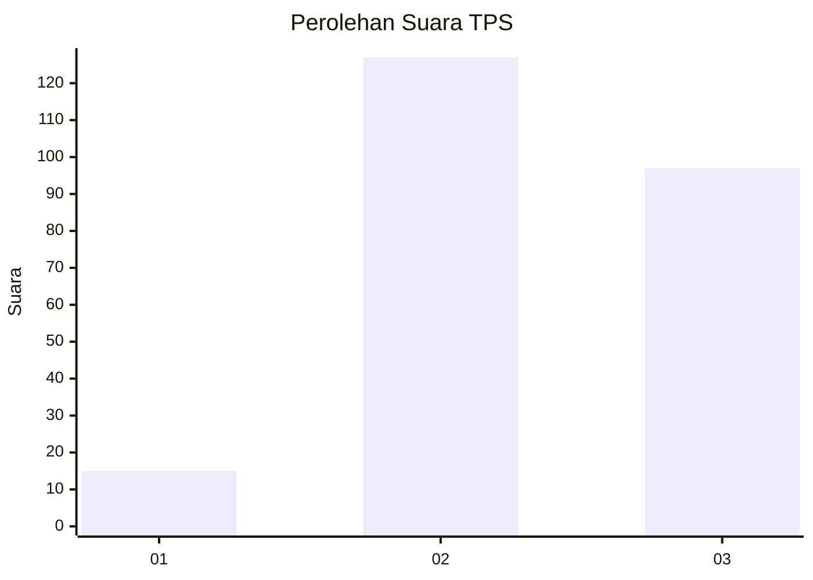
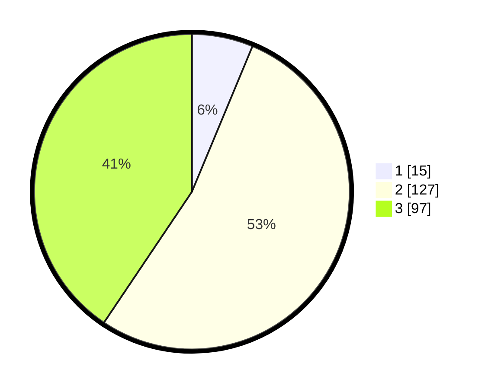

# Hasil

## Grafik

## Tabel

| No. | Nama Paslon    | Suara | Suara (raw) | Persentase |
|:--- |:-------------- | -----:| -----------:| ----------:|
| 1   | ANIES MUHAIMIN | 15    | [15][p-1]   | 6,28       |
| 2   | PRABOWO GIBRAN | 127   | [127][p-2]  | 53,14      |
| 3   | GANJAR MAHFUD  | 97    | [97][p-3]   | 40,59      |

[p-1]: https://github.com/gigit-pemilu/pemilu-2024-35-jawa-timur/blob/main/pilpres/hitung-suara/sub/35-jawa-timur/sub/05-blitar/sub/18-doko/sub/2004-sumberurip/sub/008-tps/sub/paslon-1.txt
[p-2]: https://github.com/gigit-pemilu/pemilu-2024-35-jawa-timur/blob/main/pilpres/hitung-suara/sub/35-jawa-timur/sub/05-blitar/sub/18-doko/sub/2004-sumberurip/sub/008-tps/sub/paslon-2.txt
[p-3]: https://github.com/gigit-pemilu/pemilu-2024-35-jawa-timur/blob/main/pilpres/hitung-suara/sub/35-jawa-timur/sub/05-blitar/sub/18-doko/sub/2004-sumberurip/sub/008-tps/sub/paslon-3.txt

## Foto C Plano

https://sirekap-obj-formc.kpu.go.id/7828/pemilu/ppwp/35/05/18/20/04/3505182004008-20240217-120110--1c26148e-bf95-423c-9eba-8ea0d42fee49.jpg

https://sirekap-obj-formc.kpu.go.id/7828/pemilu/ppwp/35/05/18/20/04/3505182004008-20240217-115910--4fc6e1ac-c2eb-42fd-abae-bb08bed48585.jpg

https://sirekap-obj-formc.kpu.go.id/7828/pemilu/ppwp/35/05/18/20/04/3505182004008-20240217-120215--f48a1708-5ded-4f54-8b1f-3bcc0c8303a5.jpg

## Metadata

| Key        | Value               |
| ---------- | ------------------- |
| Time Stamp | 2024-02-19 06:16:00 |

