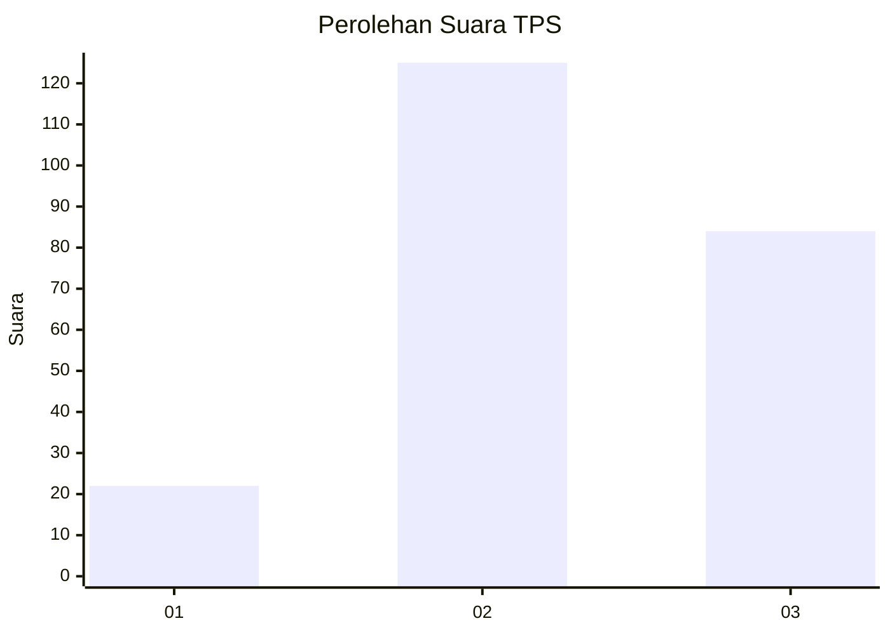
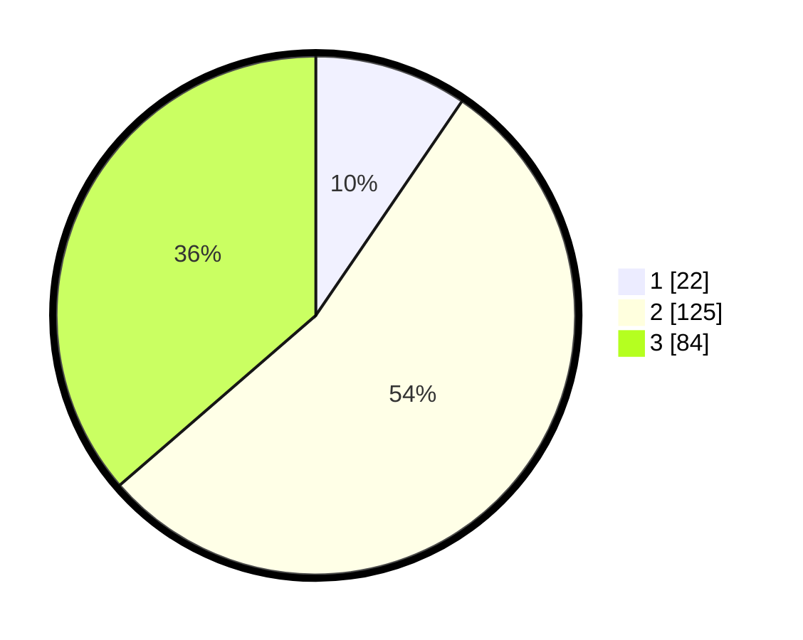

# Hasil

## Grafik

## Tabel

| No. | Nama Paslon    | Suara | Suara (raw) | Persentase |
|:--- |:-------------- | -----:| -----------:| ----------:|
| 1   | ANIES MUHAIMIN | 22    | [22][p-1]   | 9,52       |
| 2   | PRABOWO GIBRAN | 125   | [125][p-2]  | 54,11      |
| 3   | GANJAR MAHFUD  | 84    | [84][p-3]   | 36,36      |

[p-1]: https://github.com/gigit-pemilu/pemilu-2024/blob/main/pilpres/hitung-suara/sub/35-jawa-timur/sub/05-blitar/sub/18-doko/sub/2009-resapombo/sub/013-tps/sub/paslon-1.txt
[p-2]: https://github.com/gigit-pemilu/pemilu-2024/blob/main/pilpres/hitung-suara/sub/35-jawa-timur/sub/05-blitar/sub/18-doko/sub/2009-resapombo/sub/013-tps/sub/paslon-2.txt
[p-3]: https://github.com/gigit-pemilu/pemilu-2024/blob/main/pilpres/hitung-suara/sub/35-jawa-timur/sub/05-blitar/sub/18-doko/sub/2009-resapombo/sub/013-tps/sub/paslon-3.txt

## Foto C Plano

https://sirekap-obj-formc.kpu.go.id/b5c2/pemilu/ppwp/35/05/18/20/09/3505182009013-20240217-123035--6fedc7eb-5223-4752-be00-914ef2bd699a.jpg

https://sirekap-obj-formc.kpu.go.id/b5c2/pemilu/ppwp/35/05/18/20/09/3505182009013-20240217-124134--2ae75f22-da82-4b42-819a-cb54321f09d7.jpg

https://sirekap-obj-formc.kpu.go.id/b5c2/pemilu/ppwp/35/05/18/20/09/3505182009013-20240217-124252--f0890640-7551-4415-869f-857845eb3535.jpg

## Metadata

| Key        | Value               |
| ---------- | ------------------- |
| Time Stamp | 2024-02-19 06:16:00 |

