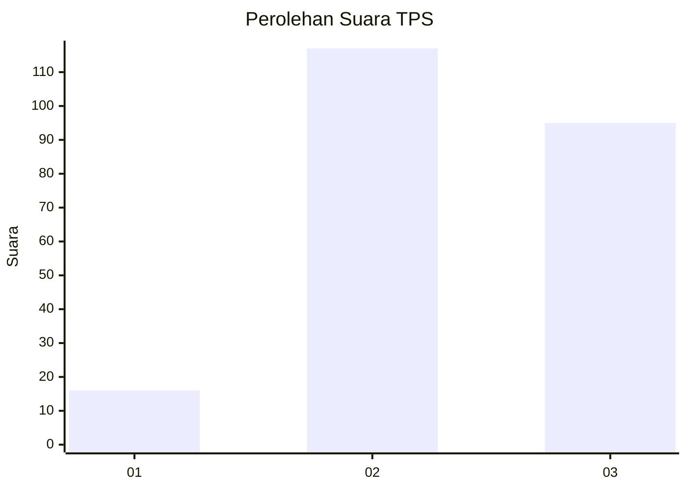
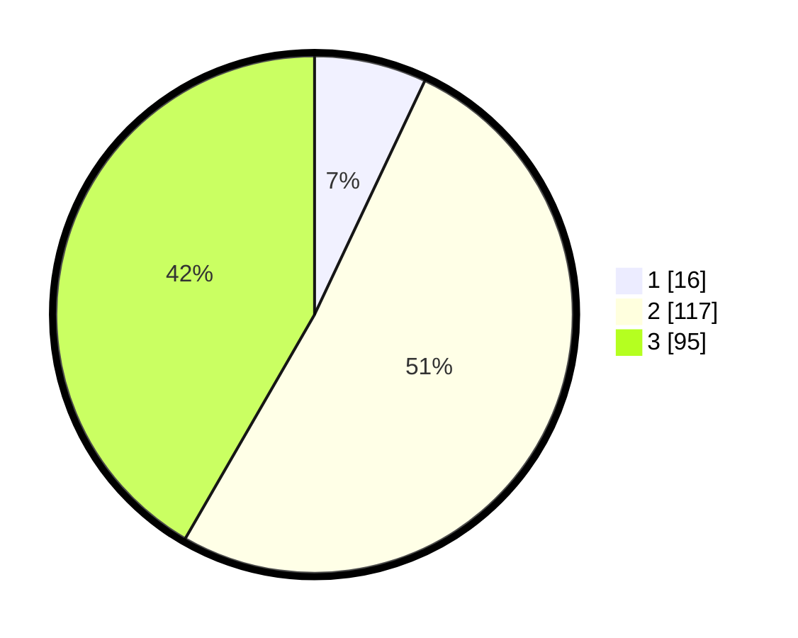

# Hasil

## Grafik

## Tabel

| No. | Nama Paslon    | Suara | Suara (raw) | Persentase |
|:--- |:-------------- | -----:| -----------:| ----------:|
| 1   | ANIES MUHAIMIN | 16    | [16][p-1]   | 7,02       |
| 2   | PRABOWO GIBRAN | 117   | [117][p-2]  | 51,32      |
| 3   | GANJAR MAHFUD  | 95    | [95][p-3]   | 41,67      |

[p-1]: https://github.com/gigit-pemilu/pemilu-2024-35-jawa-timur/blob/main/pilpres/hitung-suara/sub/35-jawa-timur/sub/05-blitar/sub/18-doko/sub/2009-resapombo/sub/016-tps/sub/paslon-1.txt
[p-2]: https://github.com/gigit-pemilu/pemilu-2024-35-jawa-timur/blob/main/pilpres/hitung-suara/sub/35-jawa-timur/sub/05-blitar/sub/18-doko/sub/2009-resapombo/sub/016-tps/sub/paslon-2.txt
[p-3]: https://github.com/gigit-pemilu/pemilu-2024-35-jawa-timur/blob/main/pilpres/hitung-suara/sub/35-jawa-timur/sub/05-blitar/sub/18-doko/sub/2009-resapombo/sub/016-tps/sub/paslon-3.txt

## Foto C Plano

https://sirekap-obj-formc.kpu.go.id/f9e9/pemilu/ppwp/35/05/18/20/09/3505182009016-20240214-190154--a40e2dc5-1623-43cd-b4b9-71af06237d49.jpg

https://sirekap-obj-formc.kpu.go.id/f9e9/pemilu/ppwp/35/05/18/20/09/3505182009016-20240217-121903--43447a25-2903-4293-b6b5-9d3984dc59e6.jpg

https://sirekap-obj-formc.kpu.go.id/f9e9/pemilu/ppwp/35/05/18/20/09/3505182009016-20240214-185048--196d080a-8e9b-4760-b222-062457851de9.jpg

## Metadata

| Key        | Value               |
| ---------- | ------------------- |
| Time Stamp | 2024-02-22 18:00:00 |

