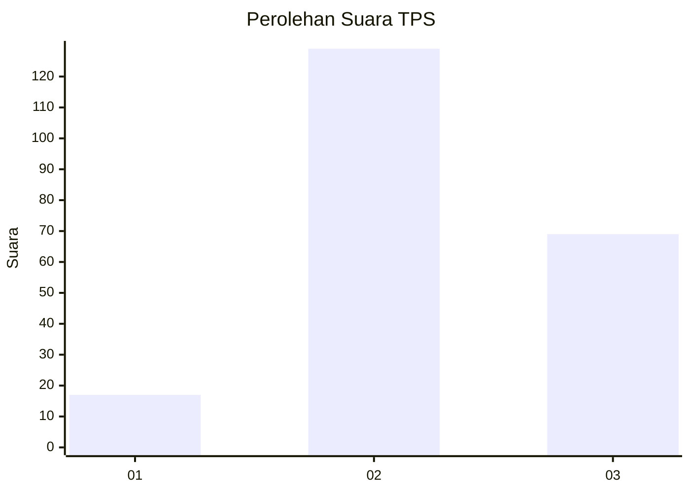
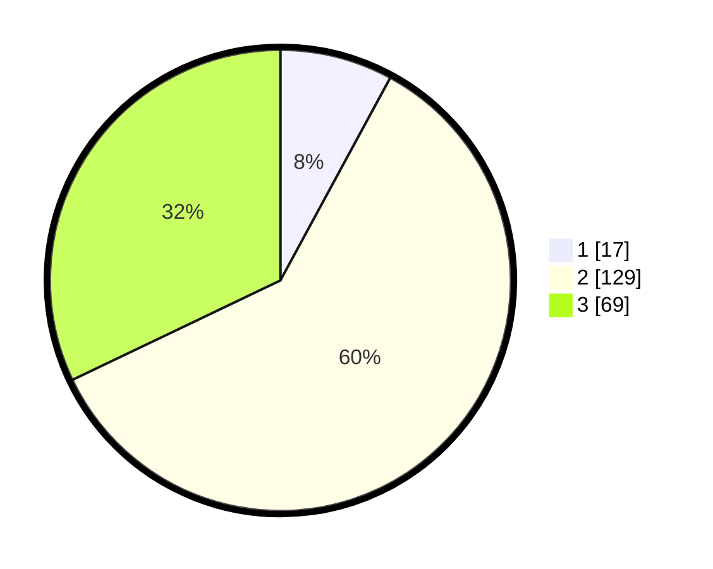

# Hasil

## Grafik

## Tabel

| No. | Nama Paslon    | Suara | Suara (raw) | Persentase |
|:--- |:-------------- | -----:| -----------:| ----------:|
| 1   | ANIES MUHAIMIN | 17    | [17][p-1]   | 7,91       |
| 2   | PRABOWO GIBRAN | 129   | [129][p-2]  | 60,00      |
| 3   | GANJAR MAHFUD  | 69    | [69][p-3]   | 32,09      |

[p-1]: https://github.com/gigit-pemilu/pemilu-2024/blob/main/pilpres/hitung-suara/sub/35-jawa-timur/sub/05-blitar/sub/19-kesamben/sub/2004-pagerwojo/sub/003-tps/sub/paslon-1.txt
[p-2]: https://github.com/gigit-pemilu/pemilu-2024/blob/main/pilpres/hitung-suara/sub/35-jawa-timur/sub/05-blitar/sub/19-kesamben/sub/2004-pagerwojo/sub/003-tps/sub/paslon-2.txt
[p-3]: https://github.com/gigit-pemilu/pemilu-2024/blob/main/pilpres/hitung-suara/sub/35-jawa-timur/sub/05-blitar/sub/19-kesamben/sub/2004-pagerwojo/sub/003-tps/sub/paslon-3.txt

## Foto C Plano

https://sirekap-obj-formc.kpu.go.id/734b/pemilu/ppwp/35/05/19/20/04/3505192004003-20240214-231018--5009bfef-a863-4ddd-b748-9639976d4e3f.jpg

https://sirekap-obj-formc.kpu.go.id/734b/pemilu/ppwp/35/05/19/20/04/3505192004003-20240214-231050--6991ebaa-575c-46a3-ba87-914f75b935cc.jpg

https://sirekap-obj-formc.kpu.go.id/734b/pemilu/ppwp/35/05/19/20/04/3505192004003-20240214-231058--5e4c9e13-ca68-4b6c-aed8-e3e7a17eaf1c.jpg

## Metadata

| Key        | Value               |
| ---------- | ------------------- |
| Time Stamp | 2024-02-15 12:00:28 |

