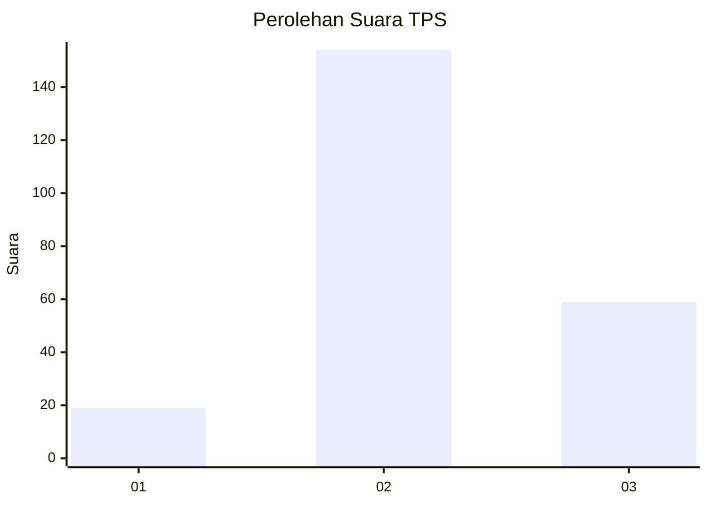
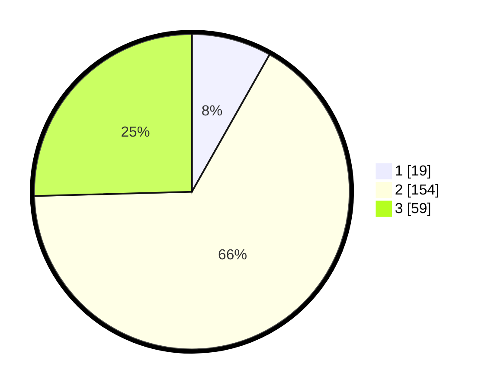

# Hasil

## Grafik

## Tabel

| No. | Nama Paslon    | Suara | Suara (raw) | Persentase |
|:--- |:-------------- | -----:| -----------:| ----------:|
| 1   | ANIES MUHAIMIN | 19    | [19][p-1]   | 8,19       |
| 2   | PRABOWO GIBRAN | 154   | [154][p-2]  | 66,38      |
| 3   | GANJAR MAHFUD  | 59    | [59][p-3]   | 25,43      |

[p-1]: https://github.com/gigit-pemilu/pemilu-2024/blob/main/pilpres/hitung-suara/sub/35-jawa-timur/sub/05-blitar/sub/19-kesamben/sub/2004-pagerwojo/sub/013-tps/sub/paslon-1.txt
[p-2]: https://github.com/gigit-pemilu/pemilu-2024/blob/main/pilpres/hitung-suara/sub/35-jawa-timur/sub/05-blitar/sub/19-kesamben/sub/2004-pagerwojo/sub/013-tps/sub/paslon-2.txt
[p-3]: https://github.com/gigit-pemilu/pemilu-2024/blob/main/pilpres/hitung-suara/sub/35-jawa-timur/sub/05-blitar/sub/19-kesamben/sub/2004-pagerwojo/sub/013-tps/sub/paslon-3.txt

## Foto C Plano

https://sirekap-obj-formc.kpu.go.id/3ba2/pemilu/ppwp/35/05/19/20/04/3505192004013-20240214-141024--05c136d4-c4ff-4134-a0bf-ba7c8e138320.jpg

https://sirekap-obj-formc.kpu.go.id/3ba2/pemilu/ppwp/35/05/19/20/04/3505192004013-20240214-141140--8fa2c62c-c8ed-4a7e-ab27-ae221ee719cc.jpg

https://sirekap-obj-formc.kpu.go.id/3ba2/pemilu/ppwp/35/05/19/20/04/3505192004013-20240214-141215--aabbf6ee-a75e-4be1-8497-3580a6290c4f.jpg

## Metadata

| Key        | Value               |
| ---------- | ------------------- |
| Time Stamp | 2024-02-15 00:41:44 |

