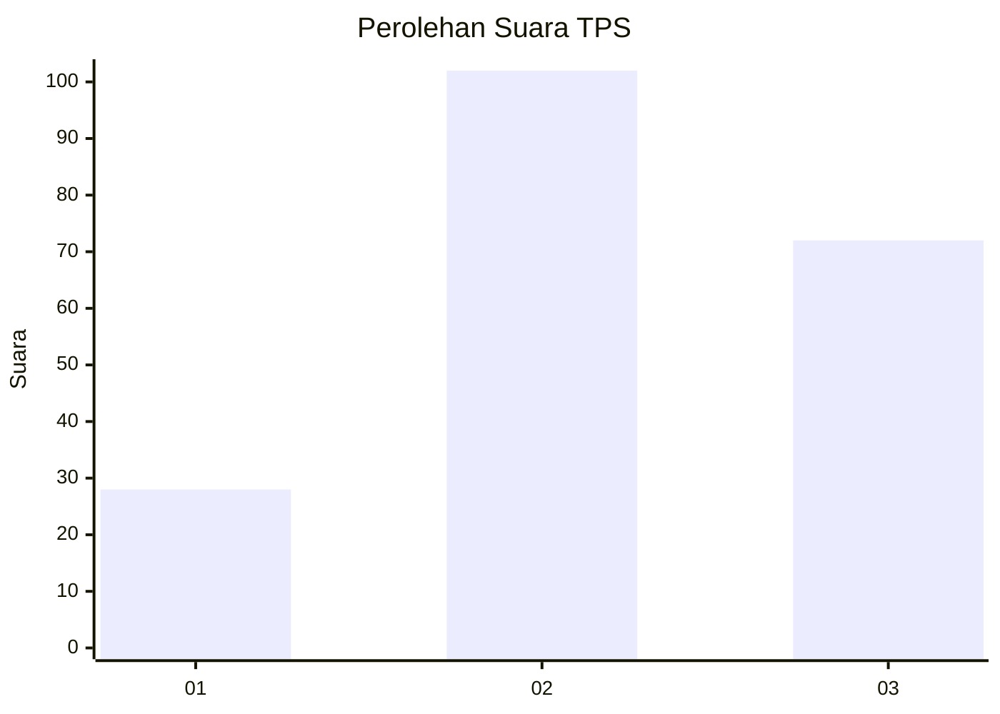
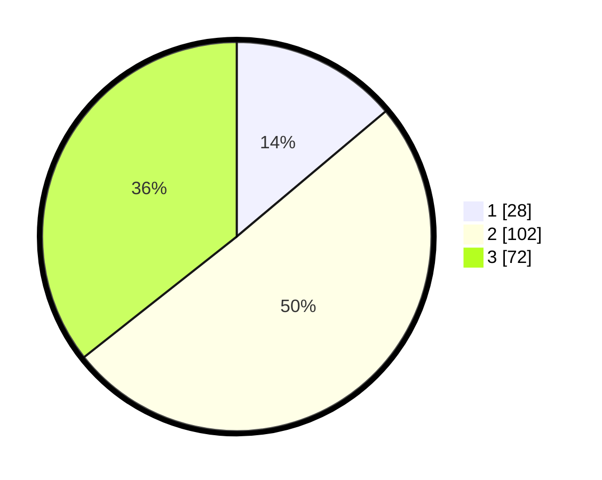

# Hasil

## Grafik

## Tabel

| No. | Nama Paslon    | Suara | Suara (raw) | Persentase |
|:--- |:-------------- | -----:| -----------:| ----------:|
| 1   | ANIES MUHAIMIN | 28    | [28][p-1]   | 13,86      |
| 2   | PRABOWO GIBRAN | 102   | [102][p-2]  | 50,50      |
| 3   | GANJAR MAHFUD  | 72    | [72][p-3]   | 35,64      |

[p-1]: https://github.com/gigit-pemilu/pemilu-2024/blob/main/pilpres/hitung-suara/sub/35-jawa-timur/sub/05-blitar/sub/19-kesamben/sub/2004-pagerwojo/sub/016-tps/sub/paslon-1.txt
[p-2]: https://github.com/gigit-pemilu/pemilu-2024/blob/main/pilpres/hitung-suara/sub/35-jawa-timur/sub/05-blitar/sub/19-kesamben/sub/2004-pagerwojo/sub/016-tps/sub/paslon-2.txt
[p-3]: https://github.com/gigit-pemilu/pemilu-2024/blob/main/pilpres/hitung-suara/sub/35-jawa-timur/sub/05-blitar/sub/19-kesamben/sub/2004-pagerwojo/sub/016-tps/sub/paslon-3.txt

## Foto C Plano

https://sirekap-obj-formc.kpu.go.id/e83e/pemilu/ppwp/35/05/19/20/04/3505192004016-20240214-225157--208750a0-563d-4481-b0f1-517addbc7f92.jpg

https://sirekap-obj-formc.kpu.go.id/e83e/pemilu/ppwp/35/05/19/20/04/3505192004016-20240214-225423--ab2e009b-4b77-4f86-a256-6450bcb6b51a.jpg

https://sirekap-obj-formc.kpu.go.id/e83e/pemilu/ppwp/35/05/19/20/04/3505192004016-20240214-225536--852ecfa1-a209-41e0-a934-17c7c24166f6.jpg

## Metadata

| Key        | Value               |
| ---------- | ------------------- |
| Time Stamp | 2024-02-16 12:51:22 |

