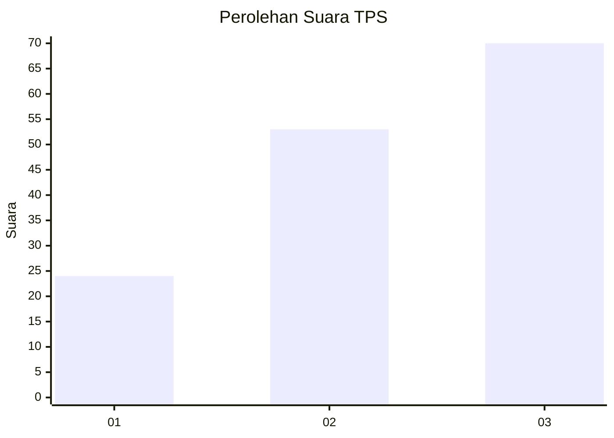
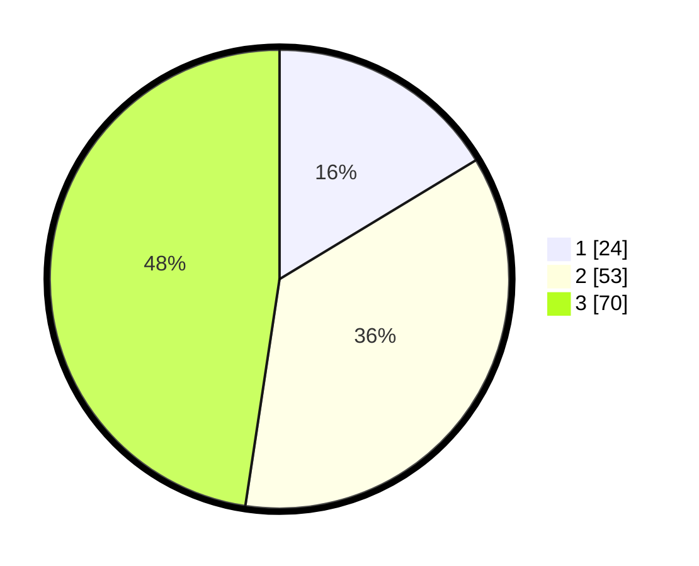

# Hasil

## Grafik

## Tabel

| No. | Nama Paslon    | Suara | Suara (raw) | Persentase |
|:--- |:-------------- | -----:| -----------:| ----------:|
| 1   | ANIES MUHAIMIN | 24    | [24][p-1]   | 16,33      |
| 2   | PRABOWO GIBRAN | 53    | [53][p-2]   | 36,05      |
| 3   | GANJAR MAHFUD  | 70    | [70][p-3]   | 47,62      |

[p-1]: https://github.com/gigit-pemilu/pemilu-2024/blob/main/pilpres/hitung-suara/sub/35-jawa-timur/sub/05-blitar/sub/19-kesamben/sub/2004-pagerwojo/sub/020-tps/sub/paslon-1.txt
[p-2]: https://github.com/gigit-pemilu/pemilu-2024/blob/main/pilpres/hitung-suara/sub/35-jawa-timur/sub/05-blitar/sub/19-kesamben/sub/2004-pagerwojo/sub/020-tps/sub/paslon-2.txt
[p-3]: https://github.com/gigit-pemilu/pemilu-2024/blob/main/pilpres/hitung-suara/sub/35-jawa-timur/sub/05-blitar/sub/19-kesamben/sub/2004-pagerwojo/sub/020-tps/sub/paslon-3.txt

## Foto C Plano

https://sirekap-obj-formc.kpu.go.id/751f/pemilu/ppwp/35/05/19/20/04/3505192004020-20240215-011209--1d46e789-c9e0-49b5-a17c-151df5c7e7c3.jpg

https://sirekap-obj-formc.kpu.go.id/751f/pemilu/ppwp/35/05/19/20/04/3505192004020-20240215-011512--84f907f5-53e1-45e2-8f27-4b89226d23c6.jpg

https://sirekap-obj-formc.kpu.go.id/751f/pemilu/ppwp/35/05/19/20/04/3505192004020-20240215-011826--4bb9fecd-df3f-431a-96a3-6a7f25f2d061.jpg

## Metadata

| Key        | Value               |
| ---------- | ------------------- |
| Time Stamp | 2024-02-15 12:00:28 |

