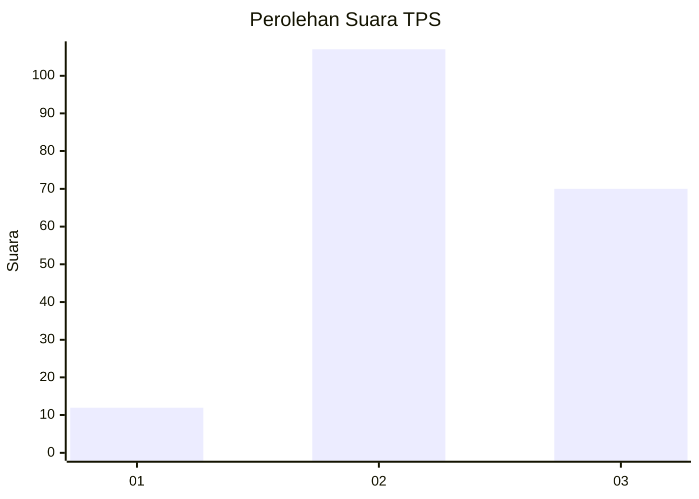
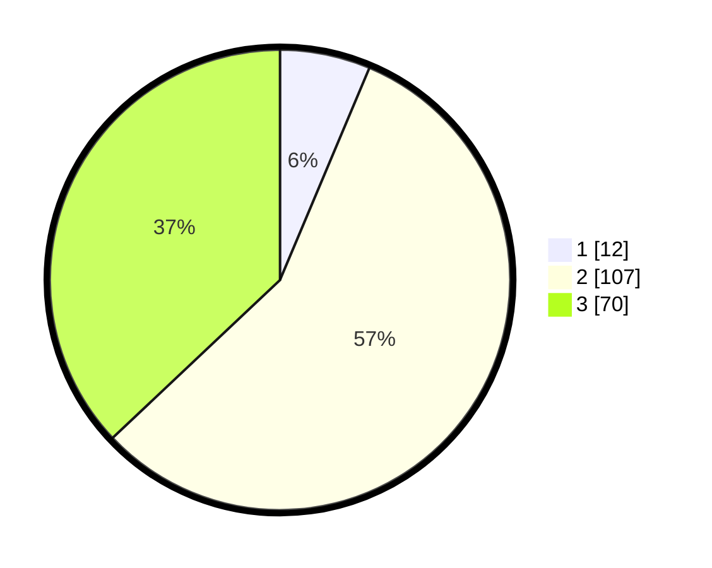

# Hasil

## Grafik

## Tabel

| No. | Nama Paslon    | Suara | Suara (raw) | Persentase |
|:--- |:-------------- | -----:| -----------:| ----------:|
| 1   | ANIES MUHAIMIN | 12    | [12][p-1]   | 6,35       |
| 2   | PRABOWO GIBRAN | 107   | [107][p-2]  | 56,61      |
| 3   | GANJAR MAHFUD  | 70    | [70][p-3]   | 37,04      |

[p-1]: https://github.com/gigit-pemilu/pemilu-2024/blob/main/pilpres/hitung-suara/sub/35-jawa-timur/sub/05-blitar/sub/19-kesamben/sub/2005-pagergunung/sub/001-tps/sub/paslon-1.txt
[p-2]: https://github.com/gigit-pemilu/pemilu-2024/blob/main/pilpres/hitung-suara/sub/35-jawa-timur/sub/05-blitar/sub/19-kesamben/sub/2005-pagergunung/sub/001-tps/sub/paslon-2.txt
[p-3]: https://github.com/gigit-pemilu/pemilu-2024/blob/main/pilpres/hitung-suara/sub/35-jawa-timur/sub/05-blitar/sub/19-kesamben/sub/2005-pagergunung/sub/001-tps/sub/paslon-3.txt

## Foto C Plano

https://sirekap-obj-formc.kpu.go.id/cb28/pemilu/ppwp/35/05/19/20/05/3505192005001-20240214-230802--d7b985b7-164b-4faa-b753-563ca756dc06.jpg

https://sirekap-obj-formc.kpu.go.id/cb28/pemilu/ppwp/35/05/19/20/05/3505192005001-20240214-230905--1ad1327d-c9b2-463e-9fde-09a789470390.jpg

https://sirekap-obj-formc.kpu.go.id/cb28/pemilu/ppwp/35/05/19/20/05/3505192005001-20240214-230951--b2e5e11a-04bf-4e74-8c85-49e1050974dd.jpg

## Metadata

| Key        | Value               |
| ---------- | ------------------- |
| Time Stamp | 2024-02-16 10:00:28 |

