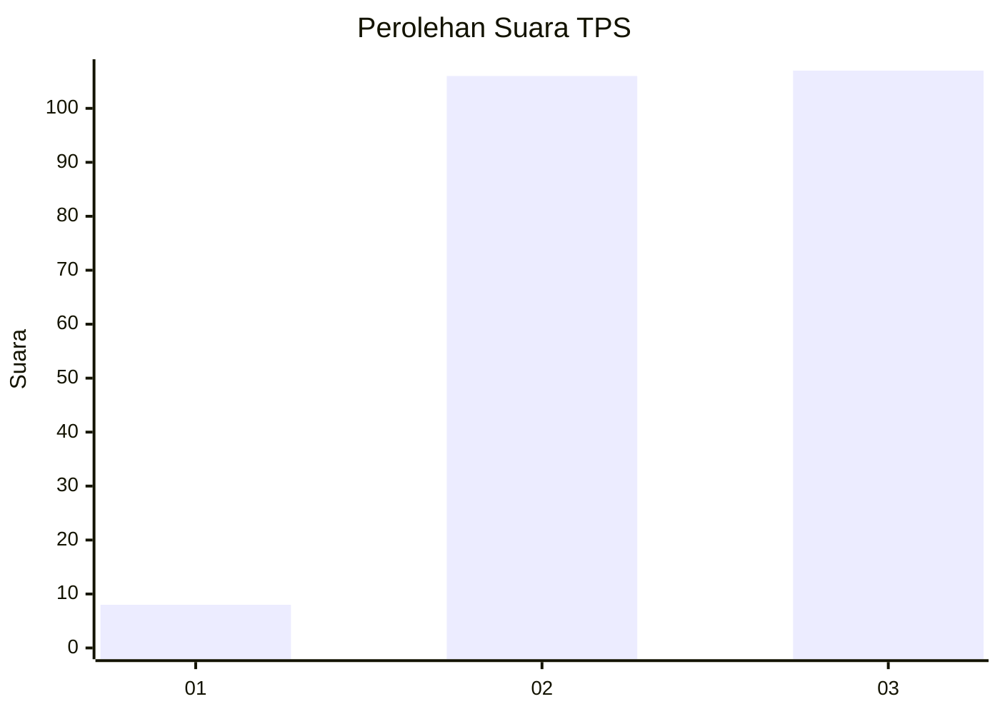
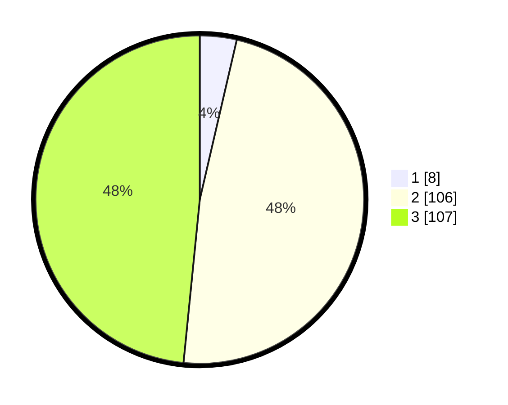

# Hasil

## Grafik

## Tabel

| No. | Nama Paslon    | Suara | Suara (raw) | Persentase |
|:--- |:-------------- | -----:| -----------:| ----------:|
| 1   | ANIES MUHAIMIN | 8     | [8][p-1]    | 3,62       |
| 2   | PRABOWO GIBRAN | 106   | [106][p-2]  | 47,96      |
| 3   | GANJAR MAHFUD  | 107   | [107][p-3]  | 48,42      |

[p-1]: https://github.com/gigit-pemilu/pemilu-2024-35-jawa-timur/blob/main/pilpres/hitung-suara/sub/35-jawa-timur/sub/05-blitar/sub/19-kesamben/sub/2008-tapakrejo/sub/003-tps/sub/paslon-1.txt
[p-2]: https://github.com/gigit-pemilu/pemilu-2024-35-jawa-timur/blob/main/pilpres/hitung-suara/sub/35-jawa-timur/sub/05-blitar/sub/19-kesamben/sub/2008-tapakrejo/sub/003-tps/sub/paslon-2.txt
[p-3]: https://github.com/gigit-pemilu/pemilu-2024-35-jawa-timur/blob/main/pilpres/hitung-suara/sub/35-jawa-timur/sub/05-blitar/sub/19-kesamben/sub/2008-tapakrejo/sub/003-tps/sub/paslon-3.txt

## Foto C Plano

https://sirekap-obj-formc.kpu.go.id/889c/pemilu/ppwp/35/05/19/20/08/3505192008003-20240214-191054--74d5fc93-b5f9-4b40-a040-c89271d70342.jpg

https://sirekap-obj-formc.kpu.go.id/889c/pemilu/ppwp/35/05/19/20/08/3505192008003-20240215-021427--8d19dd41-def2-43f5-b373-0b2a78063ffc.jpg

https://sirekap-obj-formc.kpu.go.id/889c/pemilu/ppwp/35/05/19/20/08/3505192008003-20240215-021529--a654e1dc-4c97-41da-96f8-5f2468784561.jpg

## Metadata

| Key        | Value               |
| ---------- | ------------------- |
| Time Stamp | 2024-02-15 15:00:29 |

