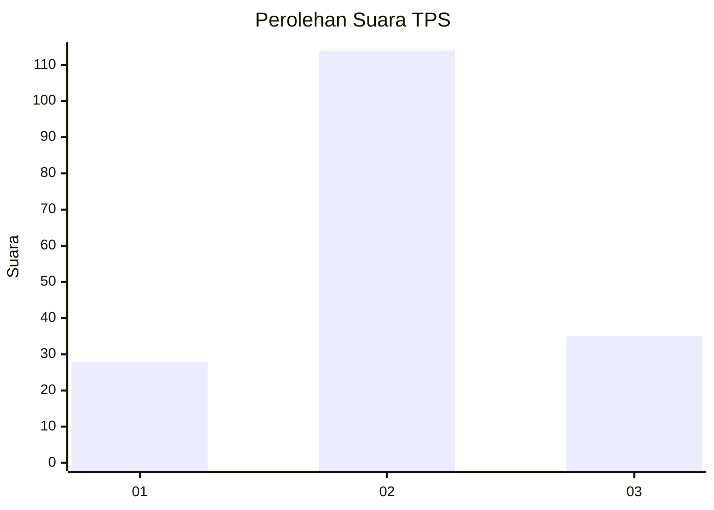
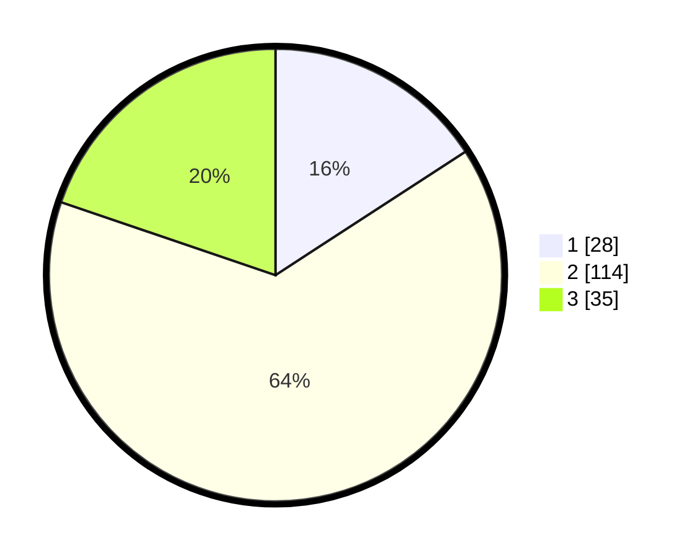

# Hasil

## Grafik

## Tabel

| No. | Nama Paslon    | Suara | Suara (raw) | Persentase |
|:--- |:-------------- | -----:| -----------:| ----------:|
| 1   | ANIES MUHAIMIN | 28    | [28][p-1]   | 15,82      |
| 2   | PRABOWO GIBRAN | 114   | [114][p-2]  | 64,41      |
| 3   | GANJAR MAHFUD  | 35    | [35][p-3]   | 19,77      |

[p-1]: https://github.com/gigit-pemilu/pemilu-2024/blob/main/pilpres/hitung-suara/sub/35-jawa-timur/sub/05-blitar/sub/20-wates/sub/2003-sumberarum/sub/001-tps/sub/paslon-1.txt
[p-2]: https://github.com/gigit-pemilu/pemilu-2024/blob/main/pilpres/hitung-suara/sub/35-jawa-timur/sub/05-blitar/sub/20-wates/sub/2003-sumberarum/sub/001-tps/sub/paslon-2.txt
[p-3]: https://github.com/gigit-pemilu/pemilu-2024/blob/main/pilpres/hitung-suara/sub/35-jawa-timur/sub/05-blitar/sub/20-wates/sub/2003-sumberarum/sub/001-tps/sub/paslon-3.txt

## Foto C Plano

https://sirekap-obj-formc.kpu.go.id/3d11/pemilu/ppwp/35/05/20/20/03/3505202003001-20240218-182940--0e6ed9dd-0fd2-48a6-817f-b07e01379f91.jpg

https://sirekap-obj-formc.kpu.go.id/3d11/pemilu/ppwp/35/05/20/20/03/3505202003001-20240218-132454--a9c0b314-a0bb-4c20-8360-c662454733ac.jpg

https://sirekap-obj-formc.kpu.go.id/3d11/pemilu/ppwp/35/05/20/20/03/3505202003001-20240218-132525--acaf1ba4-087f-47fc-ac39-f604fd2d3a85.jpg

## Metadata

| Key        | Value               |
| ---------- | ------------------- |
| Time Stamp | 2024-02-22 18:00:00 |

