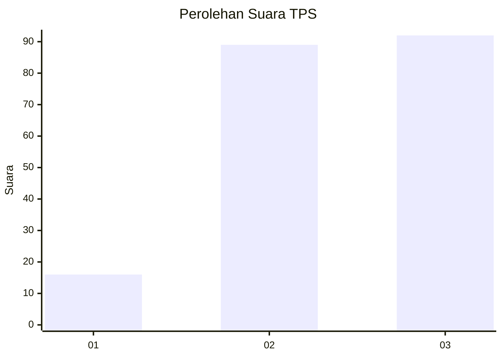
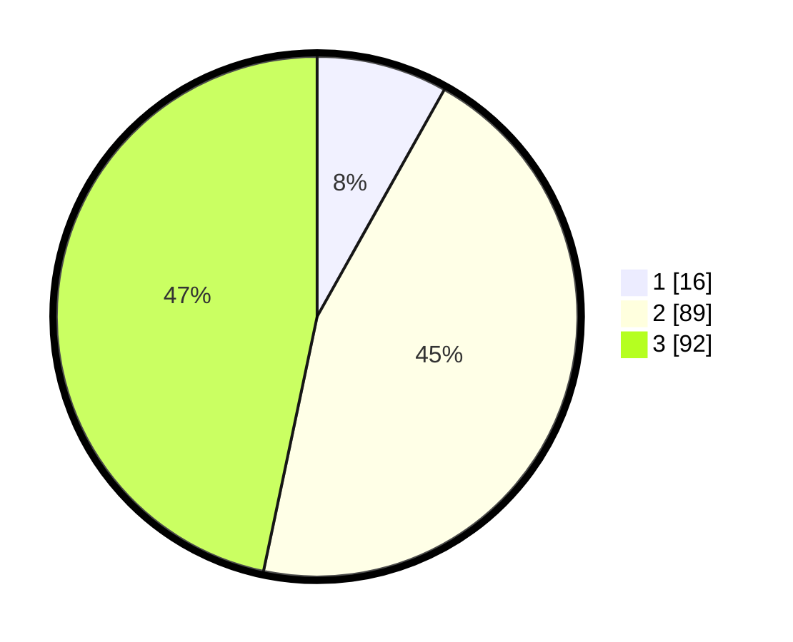

# Hasil

## Grafik

## Tabel

| No. | Nama Paslon    | Suara | Suara (raw) | Persentase |
|:--- |:-------------- | -----:| -----------:| ----------:|
| 1   | ANIES MUHAIMIN | 16    | [16][p-1]   | 8,12       |
| 2   | PRABOWO GIBRAN | 89    | [89][p-2]   | 45,18      |
| 3   | GANJAR MAHFUD  | 92    | [92][p-3]   | 46,70      |

[p-1]: https://github.com/gigit-pemilu/pemilu-2024-35-jawa-timur/blob/main/pilpres/hitung-suara/sub/35-jawa-timur/sub/05-blitar/sub/20-wates/sub/2006-sukorejo/sub/005-tps/sub/paslon-1.txt
[p-2]: https://github.com/gigit-pemilu/pemilu-2024-35-jawa-timur/blob/main/pilpres/hitung-suara/sub/35-jawa-timur/sub/05-blitar/sub/20-wates/sub/2006-sukorejo/sub/005-tps/sub/paslon-2.txt
[p-3]: https://github.com/gigit-pemilu/pemilu-2024-35-jawa-timur/blob/main/pilpres/hitung-suara/sub/35-jawa-timur/sub/05-blitar/sub/20-wates/sub/2006-sukorejo/sub/005-tps/sub/paslon-3.txt

## Foto C Plano

https://sirekap-obj-formc.kpu.go.id/e4c0/pemilu/ppwp/35/05/20/20/06/3505202006005-20240214-193748--f8e80eb3-db8b-49cf-b960-ef77058a96ba.jpg

https://sirekap-obj-formc.kpu.go.id/e4c0/pemilu/ppwp/35/05/20/20/06/3505202006005-20240214-193851--60b431a4-7aa8-451c-bd0f-76bb72f0ef9b.jpg

https://sirekap-obj-formc.kpu.go.id/e4c0/pemilu/ppwp/35/05/20/20/06/3505202006005-20240214-230203--39547625-427b-417e-a2d2-ca89c35381e7.jpg

## Metadata

| Key        | Value               |
| ---------- | ------------------- |
| Time Stamp | 2024-02-15 12:00:28 |

