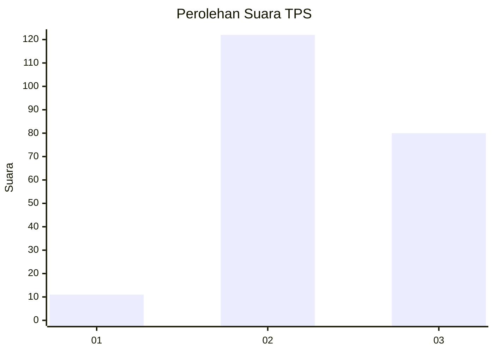
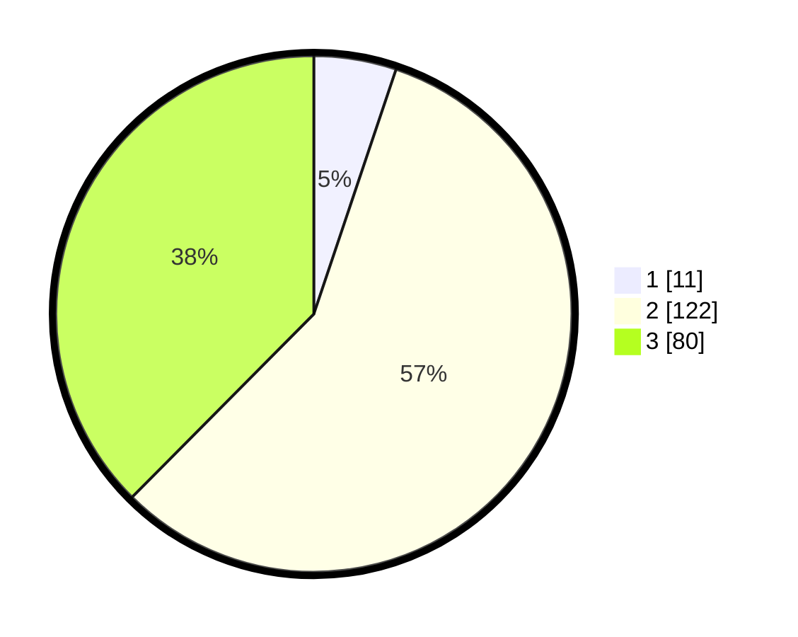

# Hasil

## Grafik

## Tabel

| No. | Nama Paslon    | Suara | Suara (raw) | Persentase |
|:--- |:-------------- | -----:| -----------:| ----------:|
| 1   | ANIES MUHAIMIN | 11    | [11][p-1]   | 5,16       |
| 2   | PRABOWO GIBRAN | 122   | [122][p-2]  | 57,28      |
| 3   | GANJAR MAHFUD  | 80    | [80][p-3]   | 37,56      |

[p-1]: https://github.com/gigit-pemilu/pemilu-2024/blob/main/pilpres/hitung-suara/sub/35-jawa-timur/sub/05-blitar/sub/20-wates/sub/2007-wates/sub/004-tps/sub/paslon-1.txt
[p-2]: https://github.com/gigit-pemilu/pemilu-2024/blob/main/pilpres/hitung-suara/sub/35-jawa-timur/sub/05-blitar/sub/20-wates/sub/2007-wates/sub/004-tps/sub/paslon-2.txt
[p-3]: https://github.com/gigit-pemilu/pemilu-2024/blob/main/pilpres/hitung-suara/sub/35-jawa-timur/sub/05-blitar/sub/20-wates/sub/2007-wates/sub/004-tps/sub/paslon-3.txt

## Foto C Plano

https://sirekap-obj-formc.kpu.go.id/33dc/pemilu/ppwp/35/05/20/20/07/3505202007004-20240215-092608--5e139d56-7919-4939-b474-7a774ca2df3a.jpg

https://sirekap-obj-formc.kpu.go.id/33dc/pemilu/ppwp/35/05/20/20/07/3505202007004-20240215-000204--eeaf1510-6e49-4de0-9386-11379f77a4ad.jpg

https://sirekap-obj-formc.kpu.go.id/33dc/pemilu/ppwp/35/05/20/20/07/3505202007004-20240214-212733--75709c4f-666d-4f46-a3c4-c5e8d6827756.jpg

## Metadata

| Key        | Value               |
| ---------- | ------------------- |
| Time Stamp | 2024-02-15 19:30:26 |

