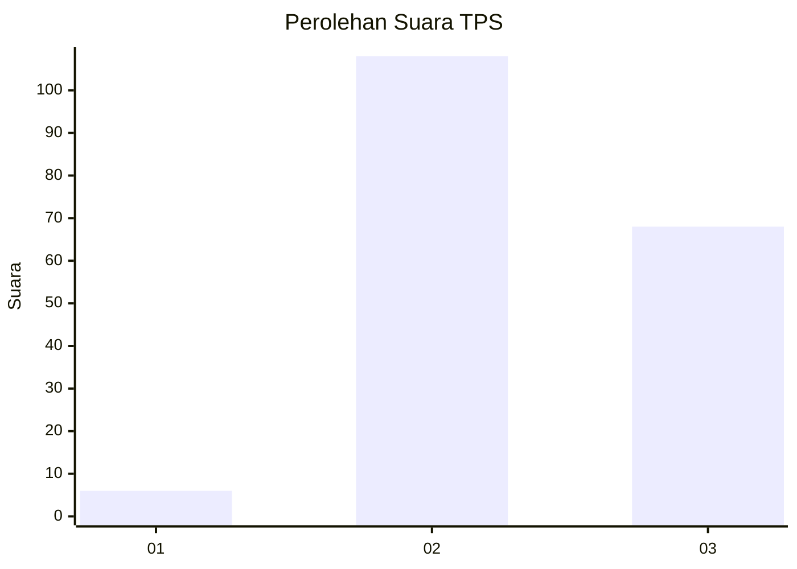
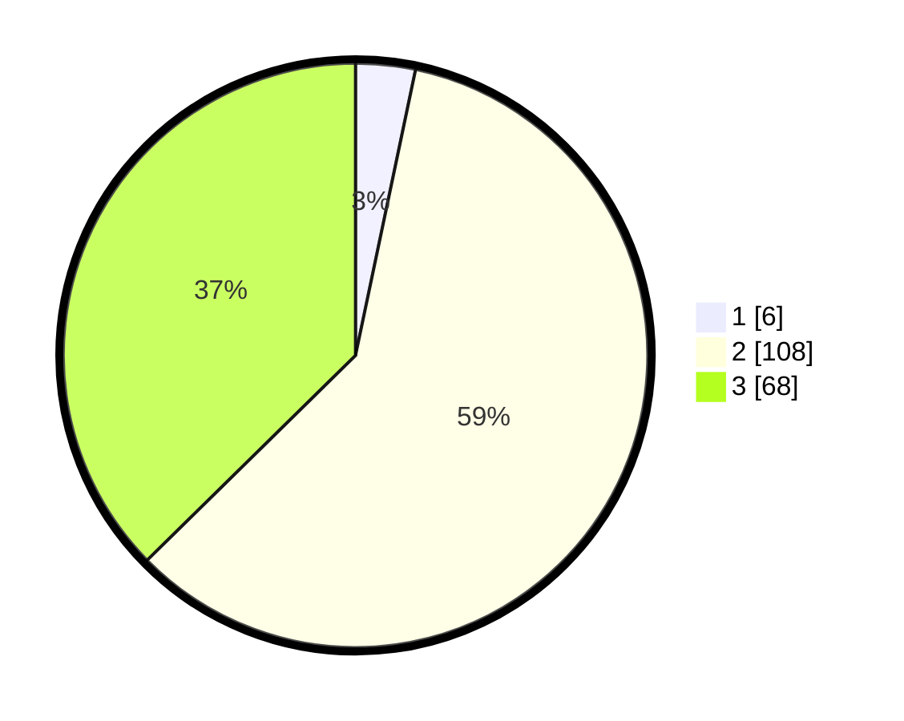

# Hasil

## Grafik

## Tabel

| No. | Nama Paslon    | Suara | Suara (raw) | Persentase |
|:--- |:-------------- | -----:| -----------:| ----------:|
| 1   | ANIES MUHAIMIN | 6     | [6][p-1]    | 3,30       |
| 2   | PRABOWO GIBRAN | 108   | [108][p-2]  | 59,34      |
| 3   | GANJAR MAHFUD  | 68    | [68][p-3]   | 37,36      |

[p-1]: https://github.com/gigit-pemilu/pemilu-2024/blob/main/pilpres/hitung-suara/sub/35-jawa-timur/sub/05-blitar/sub/20-wates/sub/2007-wates/sub/007-tps/sub/paslon-1.txt
[p-2]: https://github.com/gigit-pemilu/pemilu-2024/blob/main/pilpres/hitung-suara/sub/35-jawa-timur/sub/05-blitar/sub/20-wates/sub/2007-wates/sub/007-tps/sub/paslon-2.txt
[p-3]: https://github.com/gigit-pemilu/pemilu-2024/blob/main/pilpres/hitung-suara/sub/35-jawa-timur/sub/05-blitar/sub/20-wates/sub/2007-wates/sub/007-tps/sub/paslon-3.txt

## Foto C Plano

https://sirekap-obj-formc.kpu.go.id/3509/pemilu/ppwp/35/05/20/20/07/3505202007007-20240214-185800--7b5fbc6f-3498-4d0c-bcff-9facf81fffca.jpg

https://sirekap-obj-formc.kpu.go.id/3509/pemilu/ppwp/35/05/20/20/07/3505202007007-20240214-185952--5cc44568-1616-4dc8-ad22-30b9f219cb5c.jpg

https://sirekap-obj-formc.kpu.go.id/3509/pemilu/ppwp/35/05/20/20/07/3505202007007-20240214-190128--f7bdd7c4-dbd3-4718-9c3b-e423ccd9f70e.jpg

## Metadata

| Key        | Value               |
| ---------- | ------------------- |
| Time Stamp | 2024-02-15 15:00:29 |

